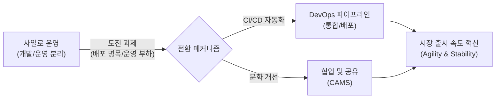
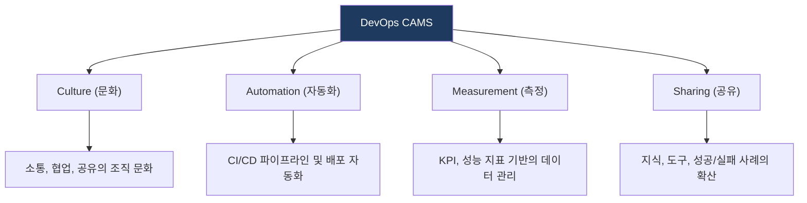

# DevOps
**Development and Operations**

## 1. 개발과 운영의 경계를 허무는 문화와 기술, DevOps의 개요

**정의**: 소프트웨어 개발(Development)과 운영(Operations) 사이의 소통, 협업, 통합을 강조하여 품질 높고 빠른 배포를 가능케 하는 조직적 문화이자 방법론.

**특징**:  
 **(CI/CD 자동화)** 지속적 통합/배포 파이프라인 자동화로 릴리스 주기를 단축하고 품질을 확보.  
 **(CAMS 가치)** Culture·Automation·Measurement·Sharing의 4가지 핵심 가치로 DevOps 문화를 구현.  
 **(협업 문화)** 개발·운영 경계를 허물어 공동 책임과 빠른 피드백 루프를 실현.  

---

## 2. DevOps의 파이프라인 및 핵심 기술 요소

### 가. DevOps 무한 루프 (Lifecycle)

| 단계 | 주요 활동 | 핵심 도구 (예시) |
|---|---|---|
| **CI (Continuous Integration)** | 코드 통합, 빌드, 단위 테스트 자동화 | Jenkins, GitLab CI, GitHub Actions |
| **CD (Continuous Deployment)** | 운영 환경 배포 자동화, 릴리스 전략 적용 | ArgoCD, Spinnaker, Terraform |
| **IaC (Infrastructure as Code)** | 코드를 통한 인프라 프로비저닝 및 관리 | Terraform, Ansible, CloudFormation |
| **Monitoring / Logging** | 서비스 가용성 및 성능 실시간 추적 | Prometheus, Grafana, ELK Stack |

---

### 나. DevOps 성공을 위한 CAMS 모델

| 핵심 가치 | 상세 설명 | 실무 적용 방안 |
|---|---|---|
| **Culture** | 사일로(Silo) 현상 타파 및 공통의 목표 수립 | Cross-functional 팀 구성 |
| **Automation** | 인적 오류 방지 및 배포 속도 혁신 | 파이프라인 기반 자동 배포 체계 구축 |
| **Measurement** | 객관적 데이터 기반의 의사결정 | 리드 타임, 배포 빈도, MTTR 측정 |
| **Sharing** | 조직 전체의 역량 상향 평준화 | 사내 기술 블로그, 위키, Post-mortem 공유 |

---

## 3. DevOps 도입의 기대효과 및 활용 전략

| 구분 | 주요 기대효과 | 활용 및 실무 적용 방안 |
|---|---|---|
| **민첩성 (Agility)** | 시장 출시 속도(Time-to-Market) 단축 | 잦은 소규모 배포를 통해 고객 요구에 빠르게 대응 |
| **안정성 (Reliability)** | 결함 조기 발견 및 복구 시간 단축 | 자동화된 테스트와 모니터링을 통해 서비스 가용성 극대화 |
| **효율성 (Efficiency)** | 반복 업무 제거 및 리소스 최적화 | 클라우드 네이티브 환경(K8s 등)과 연계하여 운영 부담 완화 |
