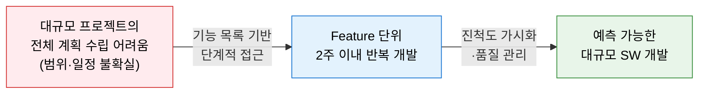
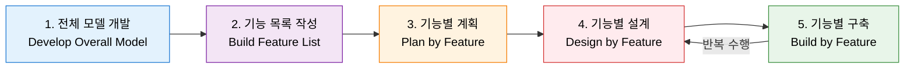
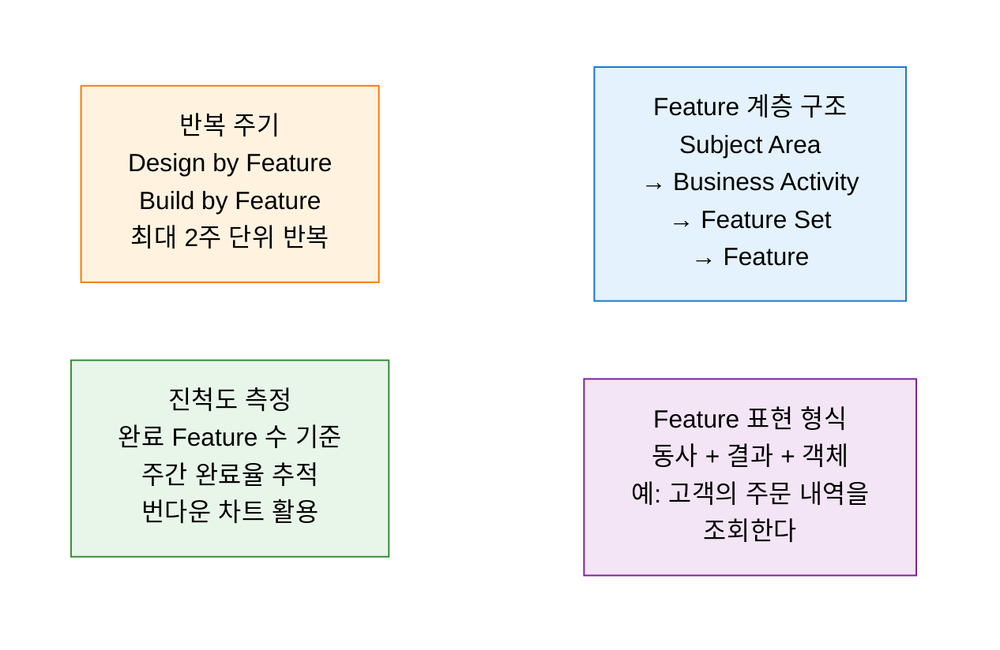

# FDD
**Feature-Driven Development — 기능 주도 개발**

## 1. 기능 목록 중심으로 반복 개발하는 대규모 프로젝트 애자일 방법론, FDD의 개요

**정의**: Jeff De Luca가 제안한 애자일 기반 소프트웨어 개발 방법론으로, 고객이 가치 있게 여기는 **기능(Feature)** 목록을 중심으로 전체 모델 수립→기능 목록 작성→계획→설계→구축의 **5단계 프로세스** 를 통해 대규모 프로젝트를 체계적으로 관리하는 방법론.

**특징**:  
 **(기능(Feature))** "동사 + 결과 + 객체" 형식으로 표현되는 작은 기능 단위 (예: "고객의 계좌 잔액을 조회한다").  
 **(진척도 가시화)** 2주 이내 완료 가능한 소규모 Feature 단위의 반복 개발로 **진척도 가시화** 극대화.  
 **(역할 구조)** 최고 프로그래머(Chief Programmer)와 도메인 전문가(Domain Expert)의 협업 구조.  

---

## 2. FDD의 핵심 구성 체계

### 가. 5단계 개발 프로세스

| 단계 | 수행 주체 | 주요 활동 | 산출물 |
|---|---|---|---|
| **1. 전체 모델 개발** | 개발팀 + 도메인 전문가 | 전체 시스템의 도메인 모델(클래스 다이어그램) 개략 수립 | 도메인 모델, 클래스 목록 |
| **2. 기능 목록 작성** | Chief Programmer | 비즈니스 활동별 기능(Feature) 목록 계층적으로 도출 | 기능 목록(Feature List) |
| **3. 기능별 계획** | 개발 관리자 | 기능별 우선순위·의존관계·일정 계획 수립 | 개발 계획서, 진척 추적표 |
| **4. 기능별 설계** | Chief Programmer | 선택된 Feature 집합에 대한 상세 설계 | 시퀀스 다이어그램, 설계 패키지 |
| **5. 기능별 구축** | Class Owner(개발자) | 코딩·단위 테스트·코드 검사·빌드·통합 | 완성된 Feature, 통합 빌드 |

---

### 나. 기능(Feature) 중심의 반복 개발 메커니즘

**FDD 핵심 역할**

| 역할 | 책임 |
|---|---|
| **Chief Architect** | 전체 도메인 모델 설계 및 기술 방향 결정 |
| **Development Manager** | 일정·자원·진척 관리 |
| **Chief Programmer** | Feature 집합 설계 주도, 코드 리뷰 |
| **Class Owner** | 특정 클래스의 코딩·유지보수 담당 |
| **Domain Expert** | 비즈니스 요구사항 명확화 및 모델 검증 |

**Scrum·XP와 비교**

| 비교 항목 | FDD | Scrum | XP |
|---|---|---|---|
| **반복 단위** | Feature (2주 이내) | Sprint (1~4주) | Iteration (1~2주) |
| **계획 기반** | 기능(Feature) 목록 | Product Backlog | User Story |
| **강점** | 대규모 프로젝트·진척 가시화 | 유연한 우선순위 조정 | 기술 품질(TDD·페어 프로그래밍) |
| **적합 규모** | 중·대규모 (수십 명 이상) | 소·중규모 (10명 내외) | 소규모 (5~10명) |

---

## 3. FDD 적용의 기대효과 및 활용 방안

| 구분 | 주요 기대효과 | 활용 및 실무 적용 방안 |
|---|---|---|
| **가시성 확보** | Feature 완료 수로 진척도를 정량적으로 추적 | 주간 Feature 번다운 차트 운영으로 이해관계자 보고 |
| **대규모 적용** | 수십 명 이상의 대형 팀에서도 애자일 프랙티스 적용 | Chief Programmer 제도로 분산 팀의 설계 일관성 유지 |
| **품질 관리** | 코드 검사(Inspection)와 단위 테스트의 Feature 단위 수행 | 기능 완료 기준(Definition of Done)에 코드 리뷰 포함 |
| **도메인 정렬** | 비즈니스 기능 중심 개발로 요구사항과 코드 간 추적성 확보 | DDD Bounded Context와 결합하여 도메인별 Feature 분리 |
