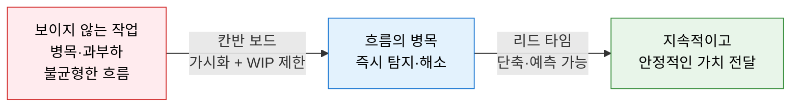
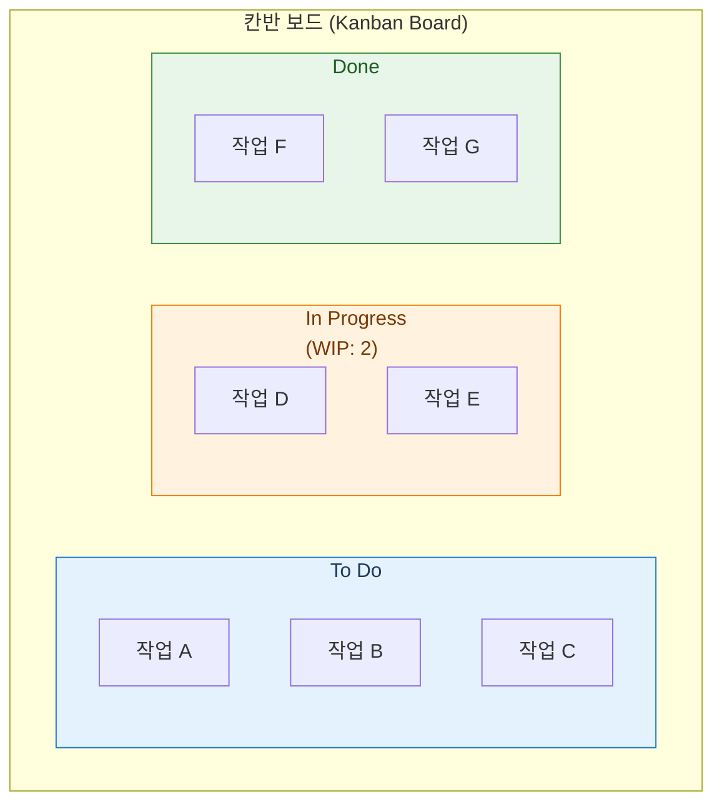
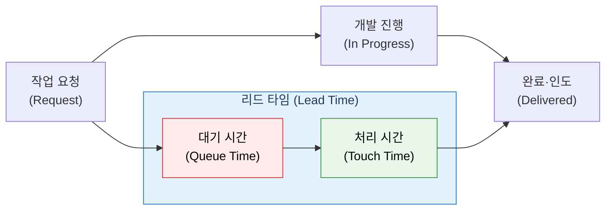

# Kanban
**칸반 — 워크플로우 가시화와 흐름 기반 작업 관리**

## 1. 작업 흐름을 시각화하고 WIP를 제한하여 지속적 가치 흐름을 실현하는 방법론, Kanban의 개요

**개념**: David J. Anderson이 도요타의 칸반 시스템을 지식 작업에 적용한 방법론으로, **작업 흐름의 시각화(Visualization)** 와 **진행 중 작업 수 제한(WIP Limit)** 을 통해 병목을 탐지하고 리드 타임을 단축하여 지속적이고 예측 가능한 가치 전달을 실현하는 흐름(Flow) 기반 작업 관리 시스템.

**특징**:
- 스프린트 주기·역할 구조 없이 **현재 프로세스에서 점진적 개선** 시작 가능 (처방적 변화 최소화).
- 풀(Pull) 시스템 기반 — 팀이 용량이 생길 때 작업을 당겨옴으로써 과부하 방지.
- Agile·Scrum과 달리 **반복 주기(Sprint) 없이 지속적 흐름(Continuous Flow)** 유지.

---

## 2. Kanban의 핵심 구성 체계

### 가. 가시화(Visualization) 및 WIP 제한

**칸반 6대 핵심 실천법**

| 실천법 | 설명 | 효과 |
|---|---|---|
| **워크플로우 가시화** | 모든 작업을 카드로 만들어 보드에 표시 | 팀 전체의 작업 현황·병목 즉시 파악 |
| **WIP 제한** | 각 컬럼(단계)의 동시 작업 수 상한 설정 | 멀티태스킹 방지, 흐름 집중, 병목 조기 탐지 |
| **흐름 관리** | 작업이 가능한 한 빠르고 원활하게 이동하도록 최적화 | 리드 타임 단축, 처리량 향상 |
| **명시적 정책** | 컬럼 이동 기준·완료 정의를 명문화 | 팀 공통 기준으로 혼선 방지 |
| **피드백 루프** | 일일 칸반 미팅·서비스 리뷰 등 정기 점검 | 지속적 개선(Kaizen) 문화 형성 |
| **협업적 개선** | 팀 전체가 데이터 기반으로 프로세스 개선 | 개인 최적화가 아닌 시스템 최적화 |

---

### 나. 리드 타임(Lead Time) 관리

**칸반 핵심 측정 지표**

| 지표 | 정의 | 활용 방법 |
|---|---|---|
| **리드 타임** | 작업 요청부터 완료·인도까지 걸린 전체 시간 | 예측 가능성 확보, SLA 기준 설정 |
| **사이클 타임** | 실제 작업 시작부터 완료까지의 시간 | 팀 처리 역량 측정, 작업 크기 조정 기준 |
| **처리량 (Throughput)** | 단위 시간당 완료된 작업 수 | 팀 속도 예측, 용량 계획 |
| **WIP 수** | 현재 진행 중인 작업의 총 개수 | 병목 탐지, 흐름 균형 지표 |
| **누적 흐름 다이어그램** | 시간별 각 단계의 작업 수 추이 시각화 | 병목 위치·규모·지속 시간 분석 |

**리드 타임 단축 전략**

| 전략 | 방법 |
|---|---|
| **WIP 제한 강화** | 동시 작업 수를 줄여 각 작업에 집중하면 평균 리드 타임 감소 |
| **작업 크기 분할** | 큰 작업을 작은 단위로 분할하여 사이클 타임 단축 |
| **병목 단계 보강** | 누적 흐름 다이어그램으로 병목 단계 탐지 후 자원 집중 |
| **대기 시간 제거** | 리뷰·승인 대기 자동화, 비동기 처리 도입 |

---

## 3. Kanban 적용의 기대효과 및 활용 방안

| 구분 | 주요 기대효과 | 활용 및 실무 적용 방안 |
|---|---|---|
| **흐름 가시성** | 전체 작업 현황과 병목을 실시간 파악 | Jira·Trello·Azure DevOps 칸반 보드 운영 |
| **예측 가능성** | 리드 타임 데이터 기반의 납기 예측 | 몬테카를로 시뮬레이션으로 완료 날짜 확률 예측 |
| **유연성** | 스프린트 없이 우선순위 변경 즉시 반영 | 운영·지원·유지보수 팀의 긴급 이슈 대응에 적합 |
| **지속적 개선** | 데이터 기반 프로세스 개선 문화 형성 | 주간 서비스 딜리버리 리뷰로 지표 분석 및 개선 |
