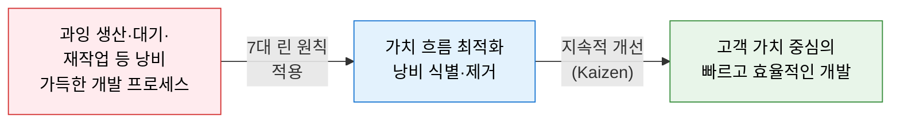
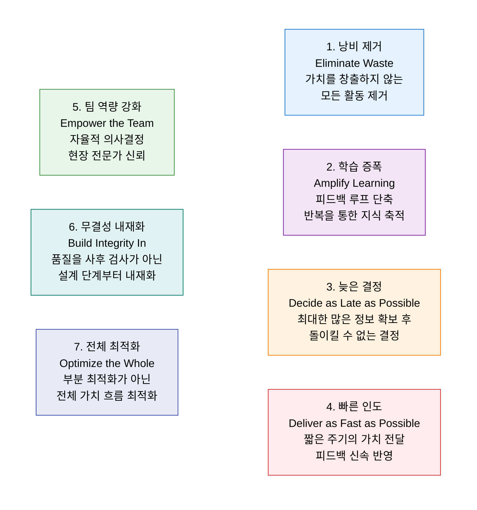
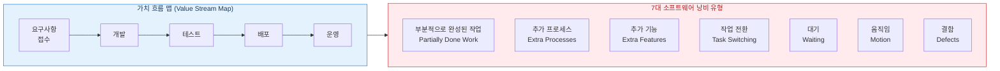

# Lean Software Development
**린 소프트웨어 개발 — 낭비 제거와 가치 흐름 최적화**

## 1. 도요타 TPS의 낭비 제거 철학을 SW 개발에 적용한 가치 흐름 방법론, Lean SW Development의 개요

**정의**: Mary·Tom Poppendieck이 도요타 생산 방식(TPS)의 린(Lean) 철학을 소프트웨어 개발에 적용한 방법론으로, **낭비(Waste) 제거와 가치 흐름(Value Stream) 최적화**를 통해 고객에게 빠르게 가치를 전달하는 7대 원칙 기반 개발 철학.

**특징**:
- 린 제조의 **무다(Muda·낭비), 무라(Mura·불균형), 무리(Muri·과부하)** 개념을 SW 개발에 적용.
- Agile·Kanban·DevOps의 이론적 기반으로 작용하는 상위 철학.
- 개별 단계 최적화보다 **전체 가치 흐름(End-to-End)** 최적화 지향.

---

## 2. Lean Software Development의 핵심 구성 체계

### 가. 7대 린 원칙

| 원칙 | 핵심 내용 | SW 개발 적용 사례 |
|---|---|---|
| **낭비 제거** | 고객 가치 창출에 기여하지 않는 모든 활동·산출물 제거 | 불필요한 문서화, 미사용 기능 개발 제거 |
| **학습 증폭** | 짧은 반복과 실험으로 지식을 빠르게 축적 | 프로토타입·A/B 테스트·스프린트 회고 |
| **늦은 결정** | 불확실한 상황에서 돌이킬 수 없는 결정을 최대한 미룸 | 아키텍처 결정 미루기, 옵션 기반 설계 |
| **빠른 인도** | 작은 단위로 자주 배포하여 피드백 루프 단축 | CI/CD, 소규모 배치 배포, Feature Flag |
| **팀 역량 강화** | 현장 전문가에게 의사결정 권한 부여 | 자율 팀 구성, 개발자 직접 고객 소통 |
| **무결성 내재화** | 품질을 프로세스 전반에 내재화 | TDD, 코드 리뷰, Continuous Testing |
| **전체 최적화** | 개별 단계가 아닌 전체 흐름의 처리량 극대화 | Value Stream Mapping, 병목 제거 |

---

### 나. 가치 흐름 분석 및 낭비(Muda) 제거

**7대 소프트웨어 낭비 유형 (Poppendieck)**

| 낭비 유형 | SW 개발 예시 | 제거 방법 |
|---|---|---|
| **부분 완성 작업** | 미완성 기능·브랜치·문서가 쌓임 | WIP(진행 중 작업) 제한, 작은 단위 완료 |
| **추가 프로세스** | 불필요한 승인·문서화·회의 | 프로세스 간소화, 자동화 도입 |
| **추가 기능** | YAGNI 위반, 사용되지 않는 기능 구현 | MVP 우선, 고객 검증 후 개발 |
| **작업 전환** | 멀티태스킹으로 인한 컨텍스트 전환 비용 | 1인 1작업 집중, Kanban 보드 활용 |
| **대기** | 코드 리뷰·배포 승인·테스트 대기 | CI/CD 자동화, Pull Request 신속 처리 |
| **움직임** | 도구·시스템 간 불필요한 전환 | 통합 개발 환경, 자동화 파이프라인 구축 |
| **결함** | 버그 수정·재작업에 소요되는 비용 | TDD·코드 리뷰·자동화 테스트로 예방 |

---

## 3. Lean SW Development 적용의 기대효과 및 활용 방안

| 구분 | 주요 기대효과 | 활용 및 실무 적용 방안 |
|---|---|---|
| **리드타임 단축** | 가치 흐름 병목 제거로 개발~배포 주기 단축 | Value Stream Mapping으로 낭비 단계 가시화 및 제거 |
| **품질 향상** | 무결성 내재화로 결함 발생 및 재작업 비용 감소 | TDD·자동화 테스트를 개발 표준 프로세스로 채택 |
| **팀 생산성** | 낭비 제거로 실질적 가치 창출 시간 확대 | WIP 제한·Kanban 보드로 흐름 시각화 및 병목 해소 |
| **DevOps 연계** | Lean 철학이 CI/CD·자동화의 이론적 기반 | Lean + Agile + DevOps 통합 개발 문화 수립 |
