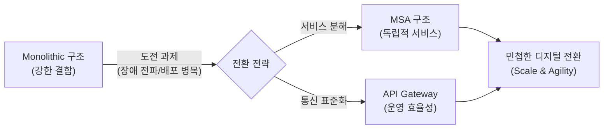
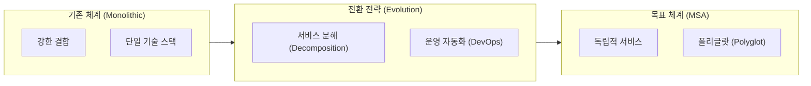

# Microservices (MSA)
**Microservices Architecture**

## 1. 민첩한 디지털 전환의 핵심, 마이크로서비스 아키텍처(MSA)의 개요

**개념**: 하나의 큰 애플리케이션을 독립적으로 배포 가능한 작은 서비스 단위들로 분해하고, 이들을 API를 통해 상호작용하도록 설계하는 소프트웨어 아키텍처 스타일.

**특징**: **느슨한 결합(Loosely Coupled)**, 서비스별 독립적 기술 스택 사용, 폴리글랏(Polyglot) 구조 및 클라우드 네이티브 환경에 최적화.

---

## 2. MSA의 아키텍처 구조 및 핵심 구성 기술

### 가. MSA 구성 요소 및 상호작용 모델 (Inner/Outer Architecture)

| 구분 | 주요 구성 요소 | 역할 |
|---|---|---|
| **API Gateway** | Entry Point | 인증, 인가, 라우팅, 속도 제한(Rate Limiting) |
| **Service Discovery** | Registry | 서비스 위치 자동 식별 (Netflix Eureka 등) |
| **Config Server** | Centralized Config | 서비스별 설정값의 통합 관리 (Spring Cloud Config 등) |
| **Circuit Breaker** | Fault Tolerance | 서비스 장애 전파 방지 (Resilience4j 등) |

---

### 나. 모놀리식(Monolithic) vs 마이크로서비스(MSA) 비교 (진화 관점)

| 비교 항목 | 모놀리식 아키텍처  | 마이크로서비스 아키텍처  |
|---|---|---|
| **배포 단위** | 전체 애플리케이션 (단일) | 개별 서비스 (다수) |
| **확장성** | 시스템 전체 확장 | 필요 서비스만 부분 확장 |
| **장애 영향** | 전체 시스템으로 전파 가능 | 장애 격리(Isolation) 용이 |
| **데이터 관리** | 통합 DB (Centralized) | 서비스별 DB (Decentralized) |

---

## 3. MSA 도입 전략 및 성공을 위한 고려사항

| 구분 | 주요 전략 및 고려사항 | 기대 효과 |
|---|---|---|
| **Domain Driven Design** | 전략적 설계 (Bounded Context) | 비즈니스 영역 중심의 명확한 서비스 경계 설정 |
| **DevOps & Automation** | 인프라 자동화 필수 | 다수의 서비스 배포 및 운영을 위한 CI/CD 체계 필수 |
| **분산 데이터 정합성** | Saga 패턴, 이벤트 소싱 활용 | 분산 환경에서의 데이터 일관성 문제 해결 |
| **관찰 가능성 (Observability)** | 분산 트레이싱 (Zipkin, Jaeger) | 복잡한 서비스 간 호출 흐름 가시화 및 문제 진단 |
