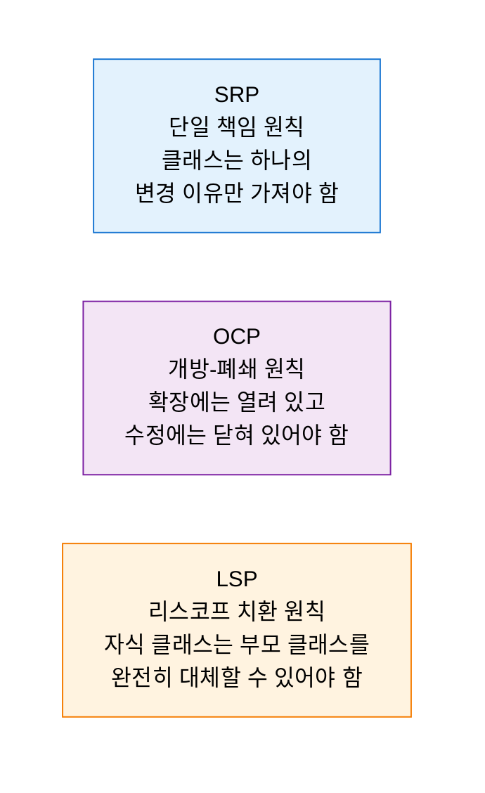
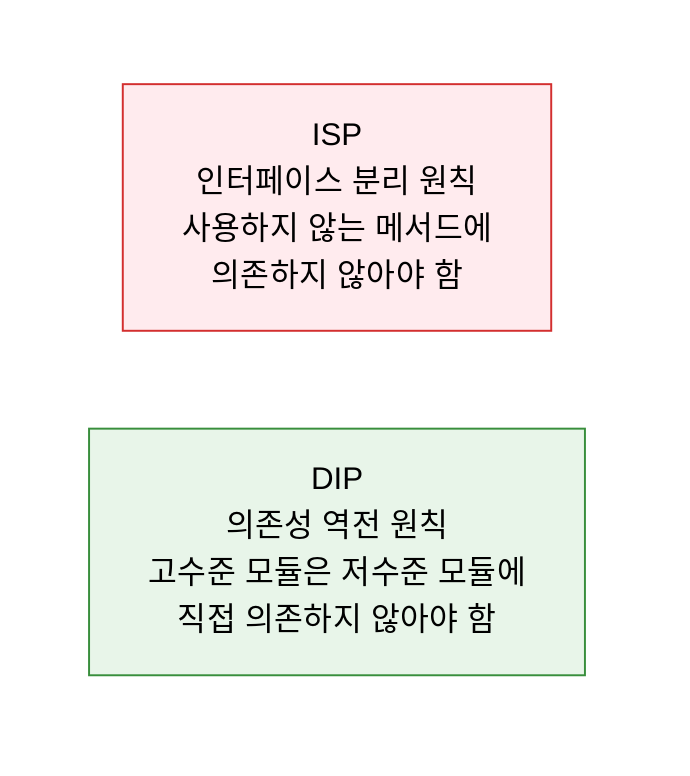
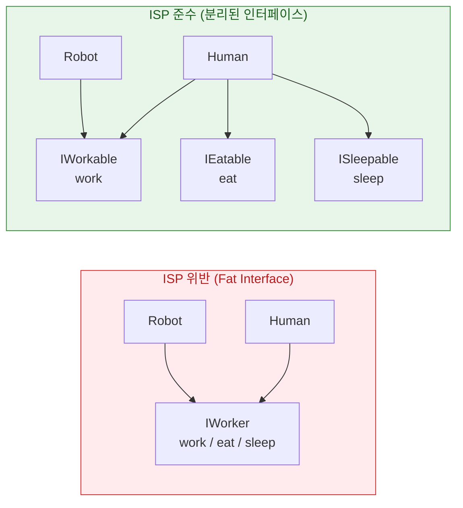
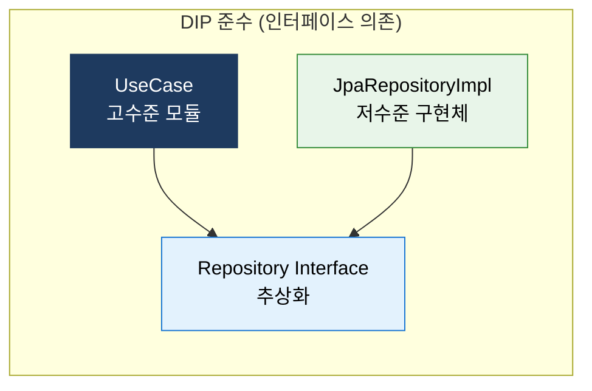

# SOLID Principle
**객체지향 설계 5대 원칙**

## 1. 변경에 강하고 유지보수 가능한 소프트웨어를 위한 객체지향 설계의 5대 원칙, SOLID의 개요

**개념**: Robert C. Martin이 정립한 객체지향 설계의 5가지 핵심 원칙으로, **단일 책임(SRP), 개방-폐쇄(OCP), 리스코프 치환(LSP), 인터페이스 분리(ISP), 의존성 역전(DIP)** 을 통해 결합도를 낮추고 응집도를 높여 유지보수·확장이 용이한 소프트웨어를 설계하는 지침.

**특징**:
- 각 원칙은 독립적이지만 상호 보완적으로 작용하여 **클린 아키텍처·DDD·디자인 패턴**의 기반 원칙.
- 원칙 위반은 코드 스멜(Code Smell)로 나타나며 기술 부채를 유발.
- 과도한 적용은 복잡성을 높일 수 있으므로 **비용-편익 판단** 필요.

---

## 2. SOLID 5대 원칙의 핵심 구성 체계

### 가. SRP, OCP, LSP

**SRP — Single Responsibility Principle**

| 구분 | 내용 |
|---|---|
| **원칙** | 하나의 클래스는 하나의 책임(변경 이유)만 가져야 한다 |
| **위반 예시** | `UserService`가 인증·이메일 발송·DB 저장을 모두 담당 |
| **준수 방법** | `AuthService`, `EmailService`, `UserRepository`로 분리 |
| **효과** | 변경 영향 범위 최소화, 테스트 단위 명확화 |

**OCP — Open/Closed Principle**

| 구분 | 내용 |
|---|---|
| **원칙** | 기존 코드 수정 없이 새 기능을 추가(확장)할 수 있어야 한다 |
| **위반 예시** | `if (type == "A") ... else if (type == "B") ...` 조건 분기 반복 |
| **준수 방법** | 인터페이스·추상 클래스 기반 Strategy·Template Method 패턴 적용 |
| **효과** | 신규 요구사항 추가 시 기존 코드 무수정, 회귀 버그 방지 |

**LSP — Liskov Substitution Principle**

| 구분 | 내용 |
|---|---|
| **원칙** | 자식 클래스는 부모 클래스의 계약(사전조건·사후조건)을 준수해야 한다 |
| **위반 예시** | `Rectangle` 상속 `Square`에서 너비·높이 독립 변경 불가 (행동 변형) |
| **준수 방법** | IS-A 관계 검증, 행동 변형 없는 상속 설계 |
| **효과** | 다형성의 안전한 활용, 예상치 못한 런타임 오류 방지 |

---

### 나. ISP, DIP 기술적 특징

**ISP — Interface Segregation Principle**

| 구분 | 내용 |
|---|---|
| **원칙** | 클라이언트가 사용하지 않는 메서드에 의존하도록 강제하지 말라 |
| **위반 예시** | `IWorker`에 `work()`·`eat()`·`sleep()` 모두 포함 → Robot이 `eat()` 구현 강제 |
| **준수 방법** | `IWorkable`, `IEatable`, `ISleepable`로 인터페이스 분리 |
| **효과** | 불필요한 의존 제거, 인터페이스 변경 영향 범위 최소화 |

**DIP — Dependency Inversion Principle**

| 구분 | 내용 |
|---|---|
| **원칙** | 고수준 모듈과 저수준 모듈 모두 추상화(인터페이스)에 의존해야 한다 |
| **위반 예시** | `OrderService`가 `MySQLOrderRepository`를 직접 생성·호출 |
| **준수 방법** | `OrderRepository` 인터페이스 정의, 의존성 주입(DI)으로 구현체 교체 |
| **효과** | 기술 스택 교체(MySQL→MongoDB) 시 비즈니스 로직 무수정, 테스트 Mock 교체 용이 |

---

## 3. SOLID 원칙 적용의 기대효과 및 활용 방안

| 원칙 | 주요 기대효과 | 실무 활용 방안 |
|---|---|---|
| **SRP** | 변경 영향 범위 최소화, 테스트 용이성 향상 | 클래스 크기 제한, 메서드 수 기준 책임 분리 점검 |
| **OCP** | 기존 코드 수정 없이 기능 확장 | Strategy·Decorator 패턴 활용, 플러그인 아키텍처 설계 |
| **LSP** | 다형성 안전 보장, 런타임 오류 예방 | IS-A 관계 검증, 상속보다 조합(Composition) 우선 |
| **ISP** | 불필요한 의존 제거, 인터페이스 응집도 향상 | API 설계 시 역할별 인터페이스 분리 |
| **DIP** | 기술 변경·테스트 Mock 교체 용이 | 의존성 주입(DI) 컨테이너(Spring) 활용 |
