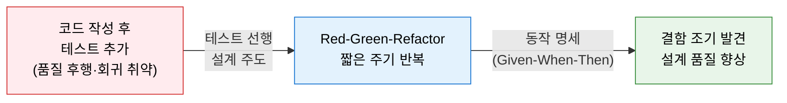
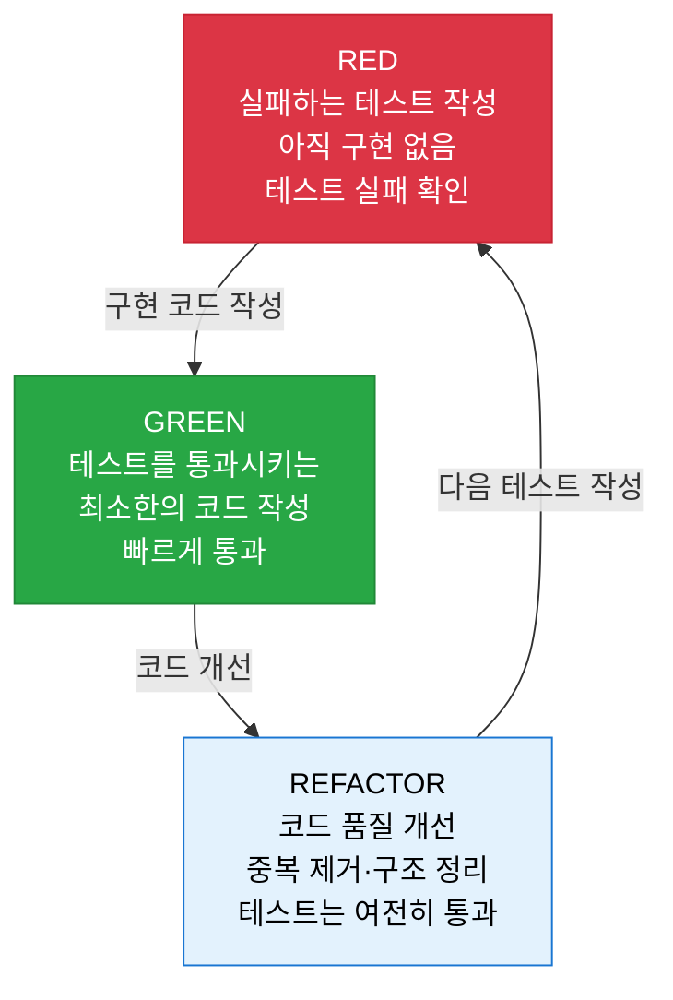
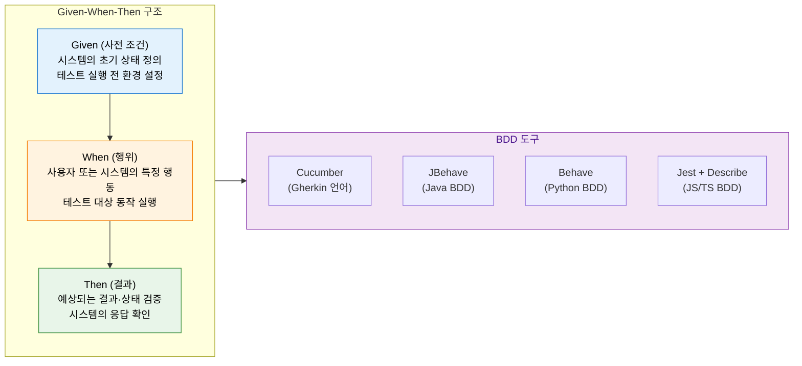

# TDD / BDD
**Test-Driven Development & Behavior-Driven Development**

## 1. 테스트를 먼저 작성하여 설계를 주도하고 품질을 내재화하는 개발 방법론, TDD·BDD의 개요



**개념**:
- **TDD(테스트 주도 개발)**: 구현 코드 작성 전 **실패하는 단위 테스트를 먼저 작성**하고, 테스트를 통과시키는 최소 코드를 구현한 후 리팩토링하는 Red-Green-Refactor 사이클을 반복하는 개발 방법론.
- **BDD(행위 주도 개발)**: TDD를 확장하여 시스템의 **행위(Behavior)를 비즈니스 관점에서 명세**하고, Given-When-Then 시나리오 언어로 개발자·QA·비즈니스 간 공통 이해를 형성하는 방법론.

**특징**:
- 테스트가 **설계 명세(Specification)** 역할을 겸하여 요구사항과 구현의 정합성 보장.
- 짧은 피드백 루프(수 분 이내)로 결함을 **조기에 발견·수정** 하여 기술 부채 억제.
- 리팩토링 안전망으로서의 테스트 코드 — 구조 개선 시 기존 동작 보장.

---

## 2. TDD·BDD의 핵심 구성 체계

### 가. Red-Green-Refactor 사이클



| 단계 | 목적 | 핵심 원칙 |
|---|---|---|
| **RED (실패)** | 구현 전 요구사항을 테스트로 명세화 | 테스트가 실패해야만 새 기능 추가 시작 |
| **GREEN (통과)** | 테스트를 통과하는 최소한의 구현 | 완벽하지 않아도 무조건 통과가 목표 |
| **REFACTOR (개선)** | 중복 제거·명명 개선·구조 정리 | 테스트 통과를 유지하면서 코드 품질 향상 |

**TDD 3원칙 (Uncle Bob)**

| 원칙 | 내용 |
|---|---|
| **원칙 1** | 실패하는 단위 테스트를 작성하기 전까지는 프로덕션 코드를 작성하지 않는다 |
| **원칙 2** | 컴파일이 실패하거나 하나의 테스트가 실패하는 것 이상으로 테스트 코드를 작성하지 않는다 |
| **원칙 3** | 현재 실패하는 테스트를 통과시키는 것 이상으로 프로덕션 코드를 작성하지 않는다 |

---

### 나. Given-When-Then 시나리오 (BDD 연계)



**Given-When-Then 시나리오 예시**

```
Feature: 온라인 쇼핑몰 장바구니

  Scenario: 상품을 장바구니에 추가
    Given 고객이 로그인한 상태이고
    And   상품 "노트북"의 재고가 5개 있을 때
    When  고객이 "노트북"을 장바구니에 1개 담으면
    Then  장바구니에 "노트북" 1개가 담겨 있어야 하고
    And   재고는 4개여야 한다
```

| 구성 요소 | 역할 | TDD 대응 요소 |
|---|---|---|
| **Given** | 테스트 사전 조건·초기 상태 설정 | `@Before` / `setUp()` |
| **When** | 테스트 대상 동작(Action) 실행 | 테스트 대상 메서드 호출 |
| **Then** | 기대 결과 검증 (Assert) | `assertEquals()` / `assertThat()` |
| **And / But** | 조건·결과의 추가 기술 | 여러 Given/When/Then 연결 |

**TDD vs BDD 비교**

| 비교 항목 | TDD | BDD |
|---|---|---|
| **관점** | 개발자 중심 (단위 기능) | 비즈니스 행위 중심 (시나리오) |
| **작성 언어** | 프로그래밍 언어 (Java, Python) | 자연어에 가까운 Gherkin 언어 |
| **협업 대상** | 개발자 간 | 개발자·QA·비즈니스 전체 |
| **테스트 단위** | 메서드·클래스 단위 | 사용자 시나리오(Feature) 단위 |
| **대표 도구** | JUnit, pytest, Jest | Cucumber, JBehave, Behave |

---

## 3. TDD·BDD 적용의 기대효과 및 활용 방안

| 구분 | 주요 기대효과 | 활용 및 실무 적용 방안 |
|---|---|---|
| **품질 내재화** | 결함 조기 발견으로 수정 비용 최소화 (1:10:100 법칙) | CI 파이프라인에 TDD 테스트 자동 실행 게이트 설정 |
| **설계 개선** | 테스트 가능한 코드가 자연스럽게 단일 책임·낮은 결합도 유도 | 레거시 리팩토링 시 TDD 기반 안전망 구축 후 구조 개선 |
| **협업 강화** | BDD 시나리오로 비즈니스·개발·QA 간 공통 이해 형성 | 스프린트 계획 시 Given-When-Then으로 인수 조건 정의 |
| **회귀 방지** | 자동화 테스트 코드가 지속적 회귀 테스트 역할 수행 | CD 파이프라인에서 전체 테스트 스위트 자동 실행 |
