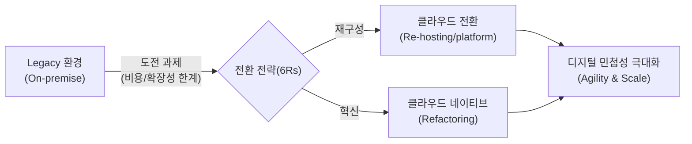
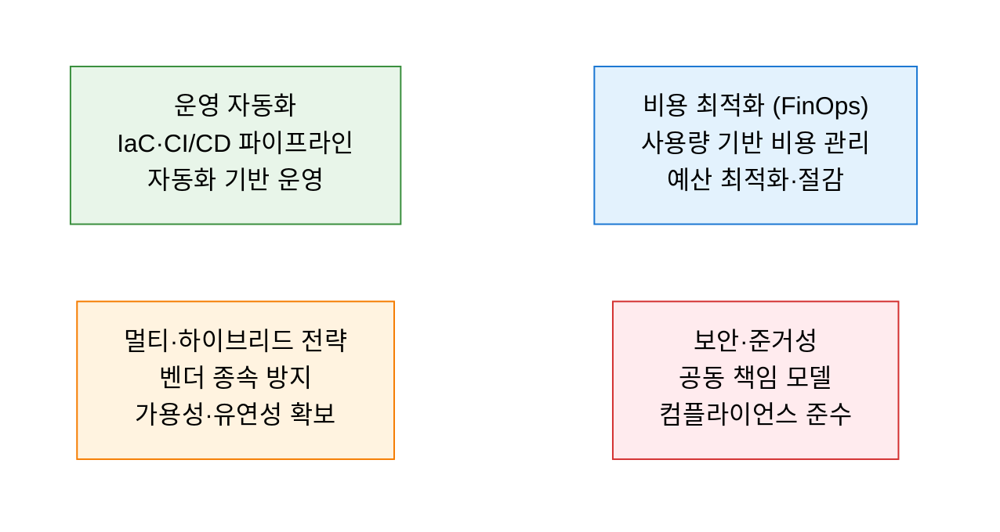

# Cloud Adoption Framework
**Cloud Adoption & Migration Strategies**

## 1. 디지털 전환의 기반, 클라우드 도입 및 전환의 개요

**정의**: 조직의 IT 자산을 온프레미스(On-premise)에서 클라우드 환경으로 이전하거나, 신규 시스템을 클라우드 네이티브로 구축하기 위한 전략적 프레임워크.

**특징**: 비용 절감보다는 **민첩성(Agility)** 과 **확장성(Scalability)** 확보 중심, 리쇼어링(Reshoring) 및 멀티/하이브리드 클라우드 전략 확산.

---

## 2. 클라우드 전환 전략 (6Rs) 및 아키텍처 모델

### 가. 클라우드 이전을 위한 6대 전략 (6Rs)

| 전략 | 명칭 | 설명 | 적용 사례 |
|---|---|---|---|
| **Re-hosting** | Lift & Shift | 코드 수정 없이 그대로 클라우드로 이전 | 빠른 마이그레이션 필요 시 |
| **Re-platforming** | Lift & Shape | 핵심 아키텍처는 유지하되 클라우드 DB/플랫폼 활용 | 운영 최적화 필요 시 |
| **Refactoring** | Cloud Native | 클라우드 기능을 십분 활용하도록 아키텍처 재설계 | MSA, 서버리스 도입 시 |
| **Repurchasing** | Drop & Shop | 기존 솔루션을 폐기하고 SaaS 서비스로 전환 | 메일, ERP, CRM 등 |

---

### 나. 클라우드 서비스 모델 및 거버넌스

| 서비스 모델 | 책임 범위 (관리 영역) | 비고 |
|---|---|---|
| **IaaS** | 인프라(서버, 스토리지, 네트워킹) 제공 | OS부터 사용자 직접 관리 |
| **PaaS** | 런타임, 미들웨어, OS 포함 플랫폼 제공 | 애플리케이션 및 데이터만 관리 |
| **SaaS** | 애플리케이션 전체 서비스 제공 | 설정 및 사용자 관리만 수행 |

---

## 3. 클라우드 도입의 기대효과 및 성공 로드맵

| 구분 | 주요 기대효과 | 활용 및 실무 적용 방안 |
|---|---|---|
| **비즈니스 민첩성** | IT 자원 조달 시간 단축 | 신규 서비스 출시 기간(Time-to-Market) 획기적 개선 |
| **비용 효율성** | CapEx에서 OpEx로 전환 | 종량제 과금을 통한 IT 예산 운영의 유연성 확보 (FinOps 적용) |
| **안정성/복구** | 글로벌 인프라 및 DR 자동화 | 전 세계 서비스 거점 확보 및 재해 복구 체계(BCP) 강화 |
