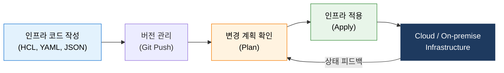
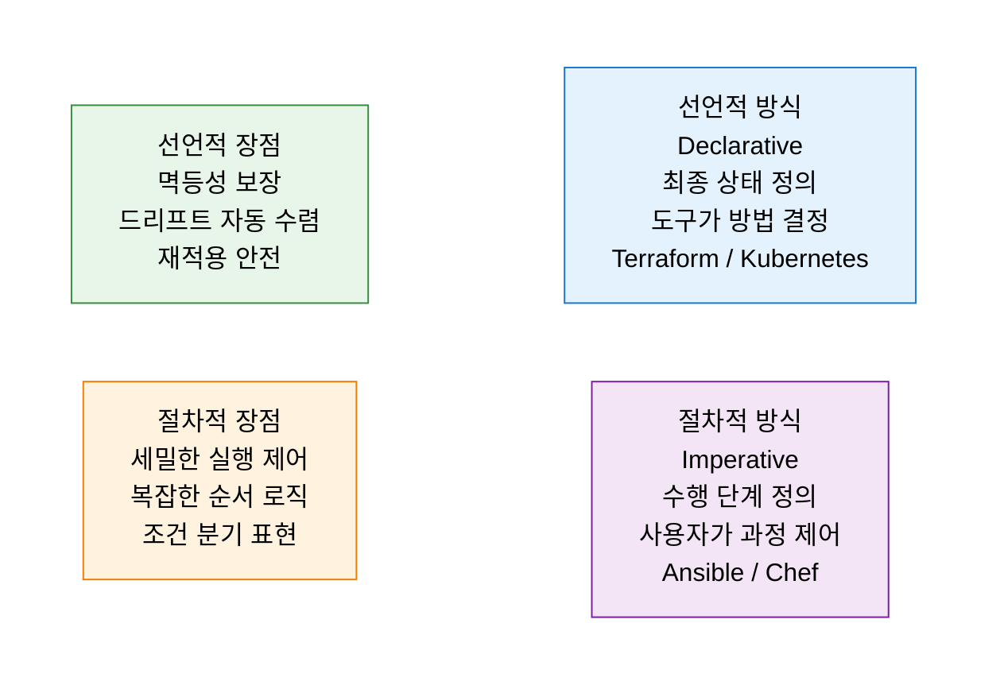

# Infrastructure as Code (IaC)
**코드를 통한 인프라 관리**

## 1. 인프라 구성을 코드로 정의하여 자동화·일관성·버전 관리를 실현하는 체계, IaC의 개요

**정의**: 서버·네트워크·스토리지 등 인프라 구성을 수동 작업 대신 **기계가 읽을 수 있는 코드(정의 파일)** 로 명세하고, 버전 관리·자동화 도구를 통해 인프라를 프로비저닝·변경·폐기하는 운영 방식.

**특징**:
- **선언적(Declarative)** 또는 **절차적(Imperative)** 방식으로 인프라 상태를 정의.
- 동일한 코드로 개발·검증·운영 환경을 재현하여 **드리프트(Drift) 제거** 및 환경 일관성 보장.
- Git 기반 버전 관리 연계로 인프라 변경 이력 추적·코드 리뷰·롤백 가능.

---

## 2. IaC의 작동 원리 및 핵심 도구 체계

### 가. IaC 워크플로우 (Provisioning Pipeline)

| 구성 요소 | 설명 | 대표 도구 |
|---|---|---|
| **Configuration File** | 인프라 상태를 정의한 코드 파일 | Terraform(.tf), Ansible(.yml), CloudFormation |
| **State File** | 현재 인프라의 실제 상태를 기록·동기화 | terraform.tfstate, Pulumi state |
| **Plan** | 코드와 현재 상태 비교 후 변경 사항 미리 확인 | `terraform plan`, `ansible --check` |
| **Apply** | 계획된 변경을 실제 인프라에 적용 | `terraform apply`, `ansible-playbook` |

---

### 나. 선언적(Declarative) vs 절차적(Imperative) 방식 비교

| 비교 항목 | 선언적 방식 | 절차적 방식 |
|---|---|---|
| **핵심 질문** | "무엇(What)"을 만들 것인가? | "어떻게(How)" 만들 것인가? |
| **상태 관리** | 최종 상태(Desired State)로 자동 수렴 | 각 단계를 순차적으로 재실행 |
| **멱등성** | 동일 코드 재실행 시 동일 결과 보장 | 재실행 시 부작용 발생 가능 |
| **가독성** | 최종 인프라 구조 파악 용이 | 실행 흐름과 순서 중심 |
| **대표 도구** | Terraform, Pulumi, Kubernetes YAML | Ansible, Chef, Puppet, Shell Script |

---

## 3. IaC 도입의 기대효과 및 실무 적용 방안

| 구분 | 주요 기대효과 | 활용 및 실무 적용 방안 |
|---|---|---|
| **일관성·정확성** | 환경 간 불일치(Drift) 제거, 인적 오류 방지 | 동일 코드로 Dev·Staging·Prod 환경 동일성 보장 |
| **운영 속도** | 인프라 프로비저닝 자동화로 배포 시간 단축 | 템플릿 모듈화로 서버·네트워크 증설 수 분 내 완료 |
| **버전 관리** | 인프라 변경 이력 추적 및 신속한 롤백 | GitOps 파이프라인으로 PR 기반 인프라 변경 심사 |
| **비용 최적화** | 불필요한 리소스 코드 기반 감지·정리 | Terraform drift detection으로 미사용 자원 자동 탐지 |
