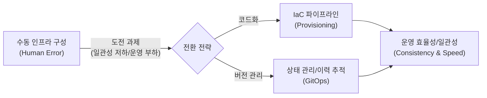

# Infrastructure as Code (IaC)
**코드를 통한 인프라 관리**

## 1. 인프라 운영의 자동화 혁신, IaC의 개요

**개념**: 수동적인 하드웨어 구성 대신, 기계가 읽을 수 있는 정의 파일(코드)을 사용하여 인프라를 프로비저닝하고 관리하는 방식.

**특징**: 버전 관리 가능, 재사용성 및 일관성 확보, **선언적(Declarative)** 또는 **절차적(Imperative)** 프로그래밍 방식 지원.

---

## 2. IaC의 작동 원리 및 핵심 도구 체계

### 가. IaC 워크플로우 (Provisioning Pipeline)



| 구성 요소 | 설명 | 비고 |
|---|---|---|
| **Configuration File** | 인프라의 상태를 정의한 코드 | Terraform(.tf), Ansible(.yml) 등 |
| **State File** | 현재 인프라의 실제 상태를 기록한 파일 | 드리프트(Drift) 감지 및 동기화 |
| **Execution Engine** | 코드를 해석하여 API 호출을 통해 리소스 생성 | 계획(Plan) 및 적용(Apply) 프로세스 |

---

### 나. 선언적(Declarative) vs 절차적(Imperative) 방식 비교

```mermaid
flowchart TD
  IaC --> Declarative[선언적 (Declarative)]
  Declarative --> DesiredState[최종 상태 (Desired State) 정의]
  Declarative --> Node6[도구가 방법을 결정]
  Declarative --> TerraformKubernetes[대표 도구: Terraform, Kubernetes]
  IaC --> Imperative[절차적 (Imperative)]
  Imperative --> Stepbystep[수행 단계 (Step-by-step) 정의]
  Imperative --> Node6[사용자가 과정을 직접 제어]
  Imperative --> AnsibleChefPuppet[대표 도구: Ansible, Chef, Puppet]
  IaC --> Node0[```]
```"

| 비교 항목 | 선언적 방식 (Declarative) | 절차적 방식 (Imperative) |
|---|---|---|
| **핵심 질문** | "무엇(What)"을 만들 것인가? | "어떻게(How)" 만들 것인가? |
| **변경 관리** | 최종 상태로 자동 수렴 | 각 단계를 순차적으로 재실행 |
| **가독성** | 최종 인프라 구조 파악 용이 | 워크플로우 및 스크립트 흐름 중심 |

---

## 3. IaC 도입의 기대효과 및 실무 적용 방안

| 구분 | 주요 기대효과 | 활용 및 실무 적용 방안 |
|---|---|---|
| **일관성 및 정확성** | 인적 오류(Human Error) 제거 | 동일한 코드로 개발/검증/운영 환경의 동일성 보장 |
| **운영 속도 향상** | 신속한 인프라 배포 | 템플릿화를 통한 서버 증설 및 환경 구축 시간 단축 |
| **버전 관리** | 변경 이력 추적 및 롤백 | Git과 연계하여 인프라 변경 사항에 대한 코드 리뷰 및 승인 프로세스 적용 |
