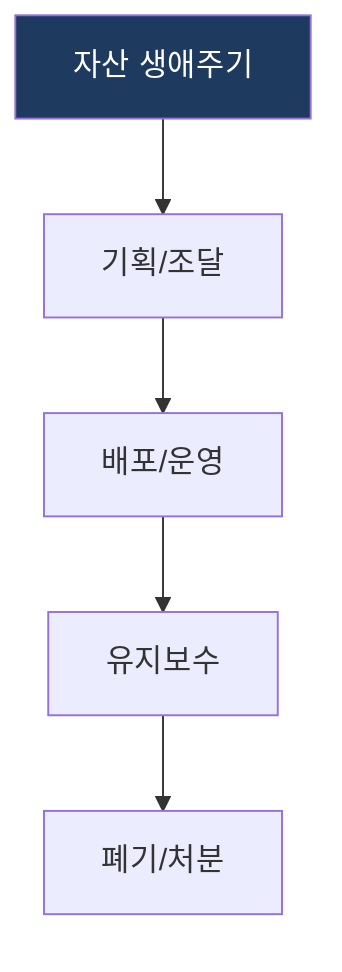
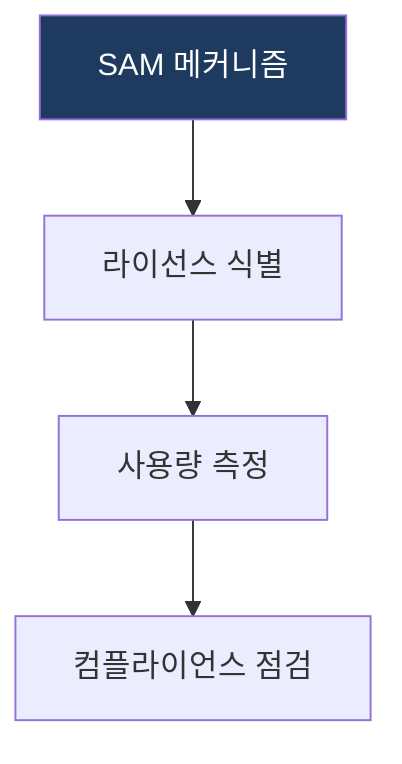

# IT 자산 관리 (ITAM: IT Asset Management)

## 1. 개요

**개념**: IT 자산의 조달부터 폐기까지의 전 생애주기를 추적, 관리하여 비용을 절감하고 가용성을 최적화하는 관리 체계.

**특징**: 
- 자산의 식별, 추적, 상태 관리를 통한 투명성 확보.
- 라이선스 준수 및 보안 리스크 예방.

---

## 2. IT 자산의 생애주기 관리 및 소프트웨어 자산 체계

### 가. 생애주기 관리
(조달부터 폐기까지의 연속적인 관리 프로세스)

* **기획/조달**: 수요 예측 및 자산 구매 계획 수립.
* **배포/운영**: 자산 설치, 사용자 할당 및 운영 상태 관리.
* **유지보수**: 정기 점검, 수리 및 라이선스 갱신.
* **폐기/처분**: 데이터 삭제 및 자산 불용 처리.

### 나. 소프트웨어 자산 관리 (SAM)
(라이선스 최적화 및 컴플라이언스 확보 메커니즘)

| 구분 | 주요 활동 | 상세 대응 메커니즘 |
|---|---|---|
| **라이선스 식별** | 설치 SW 인벤토리 관리 | 설치된 패키지 확인 및 계약 데이터 대조 |
| **사용량 측정** | 라이선스 활용도 분석 | 사용하지 않는 유휴 라이선스 회수 및 최적화 |
| **컴플라이언스** | 법적 규제 준수 점검 | 라이선스 위반 리스크 예방 및 정기 감사 대응 |

---

## 3. 기대효과 및 활용 방안
| 구분 | 기대효과 | 활용 방안 |
|---|---|---|
| **전략** | 비용 절감 (Cost Saving) | 중복 구매 방지 및 유휴 자산 재배치 |
| **운영** | 가용성 증대 | 자산 정보 가시성 확보를 통한 장애 대응 신속화 |
| **기술** | 보안 및 법적 리스크 완화 | 불법 SW 사용 방지 및 라이선스 위반 원천 차단 |
