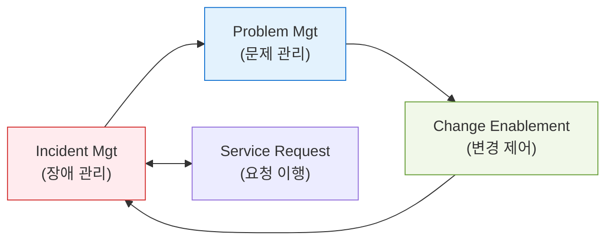
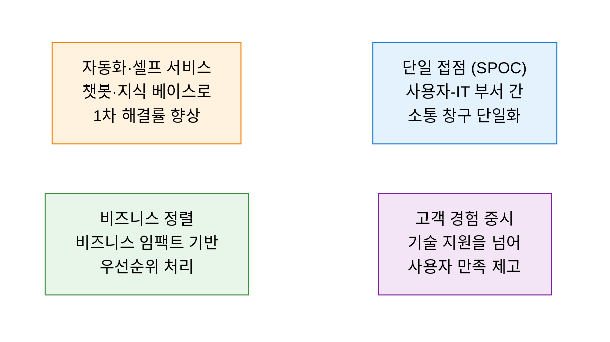

# ITIL 4 Operations
**ITIL 4 Service Operations and Practices**

## 1. 안정적 서비스 전달의 핵심, ITIL 4 운영 프랙티스의 개요

**개념**: 고객에게 합의된 수준의 가치를 지속적으로 제공하기 위해 IT 서비스의 일상적인 운영과 관리를 담당하는 ITIL 4의 핵심 실무 영역.

**특징**: v3의 프로세스 중심에서 **프랙티스(Practices)** 중심으로 확장, 장애 대응(Reactive)을 넘어 예방적(Proactive) 운영 및 가치 공동 창출 강조.

---

## 2. ITIL 4 운영의 핵심 프랙티스 및 서비스 데스크 모델

### 가. 주요 운영 프랙티스 간 상호작용

| 프랙티스 | 핵심 목적 | 주요 활동 |
|---|---|---|
| **장애 관리 (Incident)** | 서비스의 신속한 정상화 | 장애 식별, 로깅, 분류, 긴급 복구 |
| **문제 관리 (Problem)** | 장애의 근본 원인 제거 및 재발 방지 | 근본 원인 분석(RCA), 알려진 오류(KE) 등록 |
| **변경 제어 (Change)** | 변경에 따른 리스크 최소화 | 변경 영향 분석, 승인(CAB), 배포 계획 검토 |
| **모니터링 및 이벤트** | 상태 변화 감지 및 대응 | 로그 분석, 임계치 설정, 자동화된 알람 |

---

### 나. 서비스 데스크(Service Desk)의 역할 변화

| 구분 | 주요 역할 설명 | 비고 |
|---|---|---|
| **SPOC** | Single Point of Contact 역할 수행 | 의사소통 창구 단일화 |
| **Omni-channel** | 전화, 메일, 메신저, 포털 등 다양한 채널 통합 | 사용자 편의성 증대 |
| **Knowledge Base** | 해결 사례(SOP) 축적 및 공유 | 1차 해결률(FCR) 향상 |

---

## 3. ITIL 4 운영 도입 성과 및 지속적 개선 방안

| 구분 | 주요 기대효과 | 활용 및 실무 적용 방안 |
|---|---|---|
| **서비스 안정성** | 가동 중단 최소화 | SLA 준수율 모니터링 및 가용성 지표 관리 |
| **운영 효율성** | 반복 작업 자동화 및 리소스 최적화 | 표준 변경(Standard Change) 확대 및 자동화 도구 도입 |
| **데이터 기반 운영** | 객관적 지표 중심의 의사결정 | ITIL 4의 '지속적 개선(Continual Improvement)' 모델 적용 |
