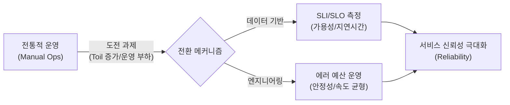

# SRE (Site Reliability Engineering)
**Site Reliability Engineering**

## 1. 운영을 소프트웨어 문제로 정의하는, SRE의 개요

**개념**: 구글에서 창안한 개념으로, 소프트웨어 엔지니어링 방법론을 시스템 운영에 적용하여 대규모 서비스의 신뢰성을 극대화하는 실무 방법론.

**특징**: **"Class SRE implements interface DevOps"** (SRE는 DevOps의 구현체), 에러 예산(Error Budget)을 통한 개발과 운영의 균형 추구.

---

## 2. SRE의 핵심 지표 및 에러 예산 메커니즘

### 가. 신뢰성 측정의 3대 지표 (SLI / SLO / SLA)



| 지표 | 정의 | 예시 |
|---|---|---|
| **SLI** | 서비스 수준 척도 (실제 측정값) | 성공한 요청 수 / 전체 요청 수 |
| **SLO** | 서비스 수준 목표 (팀 내부 목표) | 가용성 99.9% 이상, 응답속도 200ms 이하 |
| **SLA** | 서비스 수준 협약 (고객과의 계약) | SLO 미달 시 요금 환불 등 법적/재무적 약속 |

---

### 나. 에러 예산(Error Budget)과 운영 원칙

```mermaid
flowchart TD
  SRE --> ErrorBudget[에러 예산 (Error Budget)]
  ErrorBudget --> 100SLO[100% - SLO (허용 가능한 장애 범위)]
  ErrorBudget --> Node6[예산 소진 시 배포 중단 및 안정성 강화]
  SRE --> Toil[토일 (Toil) 최소화]
  Toil --> 50[반복적이고 수동적인 업무의 자동화 (50% 룰)]
  SRE --> Node4[분산 시스템 설계]
  Node4 --> Selfhealing[장애 격리 및 자기 복구 (Self-healing) 역량]
  SRE --> Postmortem[포스트모텀 (Post-mortem)]
  Postmortem --> Blameless[비난 없는 (Blameless) 장애 분석 및 공유]
  SRE --> Node0[```]
```"

| 원칙 | 상세 설명 | 비고 |
|---|---|---|
| **에러 예산** | 안정성과 혁신 속도 사이의 정량적 절충점 제공 | 소진 시 안정성 우선 |
| **자동화** | 운영 업무를 소프트웨어로 해결하여 확장성 확보 | 코드를 통한 운영 |
| **관찰 가능성** | 메트릭, 로그, 트레이싱을 통한 시스템 투명성 | Observability 확보 |

---

## 3. SRE 도입의 기대효과 및 활용 전략

| 구분 | 주요 기대효과 | 활용 및 실무 적용 방안 |
|---|---|---|
| **신뢰성 확보** | 정량적 지표 기반의 서비스 품질 관리 | 서비스 성격에 맞는 SLO 설정 및 실시간 모니터링 체계 구축 |
| **조직간 정렬** | 개발팀과 운영팀의 갈등 해소 | 에러 예산을 공유하여 배포 속도와 안정성에 대한 공통 합의 도달 |
| **운영 효율화** | 엔지니어링 중심의 운영으로 전환 | 반복 업무(Toil)를 자동화하여 창의적인 엔지니어링 업무 비중 확대 |
