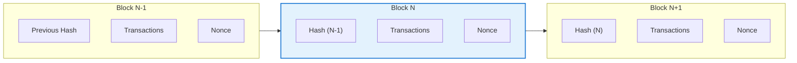
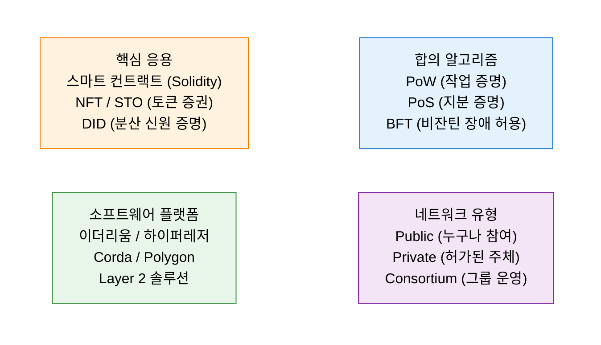

# Blockchain
**Distributed Ledger Technology (DLT)**

## 1. 신뢰의 기술, 블록체인의 개요

**정의**: 거래 정보를 중앙 서버가 아닌 네트워크 참여자들이 공동으로 기록하고 관리하는 **분산 원장 기술(Distributed Ledger Technology)**.

**특징**: **탈중앙화(Decentralization)**, 투명성, 불변성(Immutability), 가용성 확보, 스마트 계약(Smart Contract)을 통한 비즈니스 자동화.

---

## 2. 블록체인의 아키텍처 및 핵심 메커니즘

### 가. 블록 및 체인 구조

| 구성 요소 | 설명 | 비고 |
|---|---|---|
| **해시 (Hash)** | 블록의 고유 식별자이자 무결성 검증 수단 | 이전 블록 해시를 포함하여 체인 형성 |
| **트랜잭션** | 발생한 거래 정보들의 집합 | 머클 트리(Merkle Tree) 구조로 저장 |
| **합의 알고리즘** | 네트워크 참여자 간 데이터 일치 여부 결정 | PoW, PoS, PBFT 등 |

---

### 나. 합의 알고리즘 및 유형별 분류

| 유형 | 참여 제한 | 속도 | 주요 사례 |
|---|---|---|---|
| **Public** | 없음 (Permissionless) | 느림 | 비트코인, 이더리움 |
| **Private** | 허가 필요 (Permissioned) | 빠름 | 하이퍼레저 패브릭, R3 Corda |
| **Consortium** | 사전에 정의된 그룹 | 중간 | 은행 연합망, 물류 추적망 |

---

## 3. 블록체인 도입의 기대효과 및 산업별 활용 방안

| 구분 | 주요 기대효과 | 활용 분야 및 전략 |
|---|---|---|
| **중개 비용 절감** | 신뢰할 수 있는 제3자(TTP) 불필요 | 해외 송금, P2P 거래, 유통 이력 추적 |
| **데이터 무결성** | 조작 불가능한 이력 관리 | 투표 시스템, 저작권 관리, 식품 이력제 |
| **비즈니스 자동화** | 조건 충족 시 자동 거래 체결 | 스마트 계약 기반의 보험금 자동 지급, 공급망 관리 |
| **신원 보안** | 자기 주권 신원 증명 | DID(Decentralized Identifier)를 활용한 모바일 신분증 |
