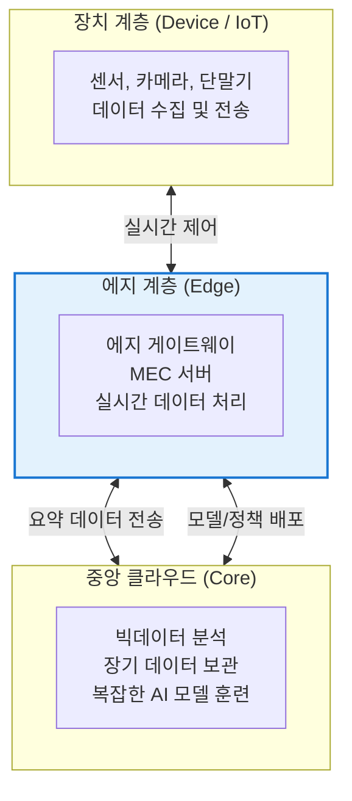
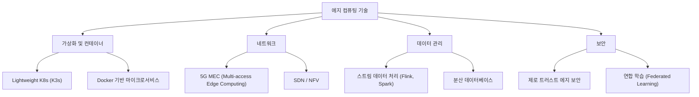

# Edge Computing
**Edge Computing & MEC**

## 1. 데이터 처리의 전진 배치, 에지 컴퓨팅의 개요

**개념**: 데이터를 중앙 클라우드 서버로 보내지 않고, 데이터가 발생한 물리적 장소(에지) 또는 그 근처에서 실시간으로 처리하는 분산 컴퓨팅 기술.

**특징**: **저지연(Low Latency)**, 대역폭 절감, 데이터 프라이버시 강화, 5G/6G 통신 기술과 결합된 MEC(Multi-access Edge Computing)로 진화.

---

## 2. 에지 컴퓨팅의 아키텍처 및 계층 구조

### 가. Cloud-Edge-Device 3계층 모델

| 계층 | 역할 및 주요 기능 | 응답 속도 |
|---|---|---|
| **중앙 클라우드** | 전역적 최적화, 대규모 연산, 백업 | 수백 ms ~ 초 |
| **에지 계층** | 로컬 분석, 필터링, 즉각적 제어 | 수 ms ~ 수십 ms |
| **장치 계층** | 데이터 센싱, 간단한 임계치 판단 | 즉시 (Real-time) |

---

### 나. 에지 컴퓨팅의 핵심 기술 요소

| 기술 요소 | 상세 설명 | 비고 |
|---|---|---|
| **MEC** | 이동통신망의 에지에서 컴퓨팅 역량 제공 | 5G 핵심 기술 |
| **Micro-DC** | 소규모 지역 거점 데이터센터 | 물리적 인프라 |
| **Edge AI** | 에지 장치에서 추론(Inference) 수행 | 온디바이스 AI 연계 |

---

## 3. 에지 컴퓨팅의 기대효과 및 주요 유스케이스

| 구분 | 주요 기대효과 | 실무 적용 및 유스케이스 |
|---|---|---|
| **성능 최적화** | 응답 지연 시간의 획기적 단축 | 자율주행차(V2X), 스마트 팩토리 실시간 공정 제어 |
| **비용 절감** | 클라우드 전송 데이터 양 최소화 | 스마트 시티 고화질 CCTV 영상 분석 및 필터링 |
| **프라이버시** | 민감 데이터의 로컬 처리 및 보관 | 의료 데이터 현장 처리, 스마트 홈 프라이버시 보호 |
