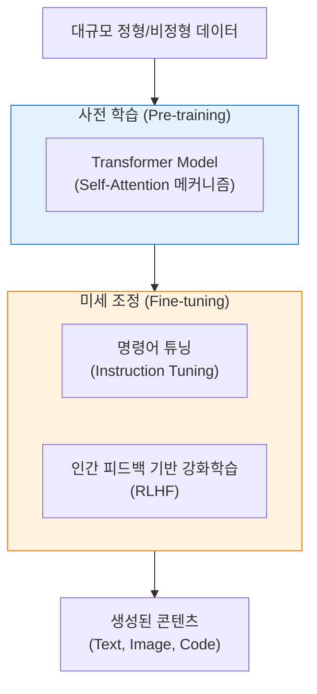
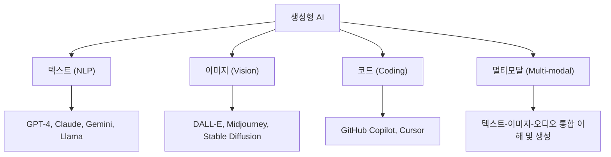

# Generative AI
**Generative Artificial Intelligence & LLM**

## 1. 창작하고 소통하는 인공지능, 생성형 AI의 개요

**정의**: 기존 데이터를 학습하여 단순히 분류하거나 예측하는 것을 넘어, 텍스트, 이미지, 오디오, 코드 등 새로운 콘텐츠를 스스로 생성해내는 인공지능 기술.

**특징**: **대규모 언어 모델(LLM)** 중심의 발전, 프롬프트 엔지니어링의 부상, 멀티모달(Multi-modal) 역량 강화.

---

## 2. 생성형 AI의 핵심 기술 및 아키텍처

### 가. 트랜스포머(Transformer) 아키텍처 기반의 진화

| 핵심 기술 | 설명 | 역할 |
|---|---|---|
| **Self-Attention** | 문장 내 단어 간의 관계적 의미 파악 | 맥락 이해 및 장기 의존성 해결 |
| **RLHF** | 인간의 선호도를 보상 함수로 사용하여 학습 | AI의 답변을 인간의 가치와 정렬(Alignment) |
| **Prompt Engineering** | AI에게 주는 지시어 최적화 | 생성 결과물의 품질 및 정확도 제어 |
| **RAG** | 외부 지식 베이스를 참조하여 답변 생성 | 환각(Hallucination) 방지 및 최신 정보 제공 |

---

### 나. 생성형 AI의 주요 모델 및 서비스 유형

| 구분 | 주요 기술 모델 | 대표 서비스 |
|---|---|---|
| **Closed Source** | 공개되지 않은 가중치 및 아키텍처 | ChatGPT, Claude, Gemini |
| **Open Source** | 커뮤니티 공유 및 로컬 구축 가능 | Llama 3, Mistral, Gemma |
| **SLM** | 특정 도메인에 특화된 소형 모델 | On-device AI, 기업 전용 모델 |

---

## 3. 생성형 AI 도입의 기대효과 및 리스크 대응 방안

| 구분 | 주요 기대효과 | 리스크 및 대응 전략 |
|---|---|---|
| **생산성 혁신** | 단순 반복 업무 및 콘텐츠 제작 자동화 | 저작권 침해 방지 및 투명성 확보 (AI 생성물 표시) |
| **개인화 경험** | 맞춤형 교육, 의료, 서비스 상담 제공 | 데이터 프라이버시 및 개인정보 유출 방지 (DLP 적용) |
| **비즈니스 혁신** | 신규 서비스 모델 및 창의적 문제 해결 | 환각(Hallucination) 현상 검증 및 RAG 도입 |
| **윤리적 활용** | 지식 접근성 확대 및 민주화 | 편향성(Bias) 제거 및 AI 윤리 가이드라인 수립 |
