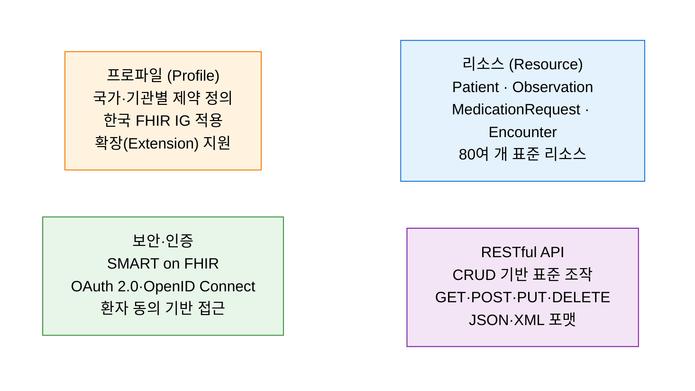
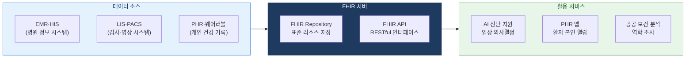

# HL7 / FHIR
**Health Level 7 & Fast Healthcare Interoperability Resources**

## 1. 이기종 의료 시스템 간 임상 데이터를 표준화하여 안전하게 교환하는 의료 정보 연계 표준, HL7·FHIR의 개요

**개념**: HL7(Health Level 7)은 의료 정보 교환의 국제 표준화 기구로, 가장 최신 표준인 **FHIR(Fast Healthcare Interoperability Resources)** 는 RESTful API 기반의 리소스(Resource) 단위 의료 데이터 교환 표준으로, 병원 정보 시스템 간 환자 정보·임상 데이터의 안전하고 일관된 공유를 가능케 하는 프레임워크.

**특징**:
- **RESTful API 기반**: JSON·XML 형식으로 웹 표준 방식 의료 데이터 교환 — 기존 HL7 v2·v3 대비 구현 용이성 대폭 향상.
- **리소스(Resource) 중심**: Patient·Observation·MedicationRequest 등 80여 개 표준 리소스 정의.
- 미국 ONC(국가의료IT조정실)·CMS 규정으로 **FHIR 지원 법적 의무화** — 한국 보건부도 추진 중.

**HL7 표준 버전 진화**

| 버전 | 특징 | 주요 활용 |
|---|---|---|
| **HL7 v2** | 파이프 구분자 메시지 형식, 1987년 제정 | 국내 병원 HIS·LIS 연계에 여전히 광범위 사용 |
| **HL7 v3** | XML 기반, 복잡한 구조로 도입 어려움 | 제한적 사용 |
| **FHIR R4** | REST·JSON·API 기반, 현재 주류 표준 | 글로벌 디지털 헬스케어 플랫폼 기본 표준 |
| **FHIR R5** | 구독 모델 강화, 스마트 앱 연동 개선 | 차세대 의료 AI·PHR 플랫폼 적용 예정 |

---

## 2. HL7 FHIR의 핵심 구성 체계

### 가. FHIR 핵심 구성 요소

**주요 FHIR 리소스 분류**

| 분류 | 리소스 | 설명 |
|---|---|---|
| **환자 정보** | Patient, RelatedPerson | 환자 인구통계·보호자 정보 |
| **임상 정보** | Observation, Condition, Procedure | 검사 결과·진단·처치 이력 |
| **약처방** | MedicationRequest, MedicationDispense | 처방·투약·조제 정보 |
| **진료 기록** | Encounter, EpisodeOfCare | 내원·입원·외래 에피소드 |
| **진단 영상** | ImagingStudy, DiagnosticReport | DICOM 연계·영상 판독 |
| **행정 정보** | Organization, Practitioner, Location | 기관·의료진·시설 정보 |

---

### 나. 디지털 헬스케어 데이터 연계 및 활용

**국내 디지털 헬스케어 FHIR 적용 현황**

| 영역 | 적용 내용 | 관련 기관·법규 |
|---|---|---|
| **마이헬스웨이** | 개인 건강정보 본인 조회·활용 플랫폼 | 보건복지부·건보공단 |
| **진료정보 교류** | 의료기관 간 환자 동의 기반 진료 이력 공유 | 의료법·진료정보 교류 사업 |
| **AI 의료기기** | FHIR 기반 임상 데이터 AI 모델 학습·추론 | 식품의약품안전처 SaMD 가이드라인 |
| **공공 보건** | 코로나 등 법정 감염병 역학 데이터 연계 | 질병관리청 |

---

## 3. HL7/FHIR 도입의 기대효과 및 활용 방안

| 구분 | 주요 기대효과 | 활용 및 실무 적용 방안 |
|---|---|---|
| **상호운용성** | 이기종 의료 시스템 간 표준 데이터 교환 | FHIR API 기반 EMR·LIS·PACS 연계 허브 구축 |
| **환자 중심** | 환자가 자신의 의료 기록을 직접 열람·이동 | 마이헬스웨이·PHR 앱 연동으로 본인 건강 데이터 활용 |
| **AI·분석 기반** | 표준화된 임상 데이터로 AI 모델 품질 향상 | FHIR 리소스 기반 임상 데이터 파이프라인 구축 |
| **규제 대응** | 국내외 디지털 헬스케어 법규 준수 기반 마련 | SMART on FHIR 기반 의료 앱 보안 인증 체계 구축 |
