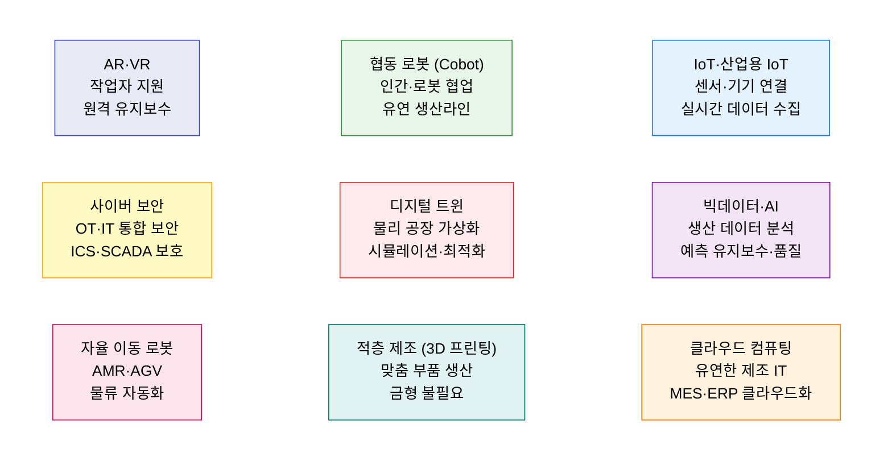
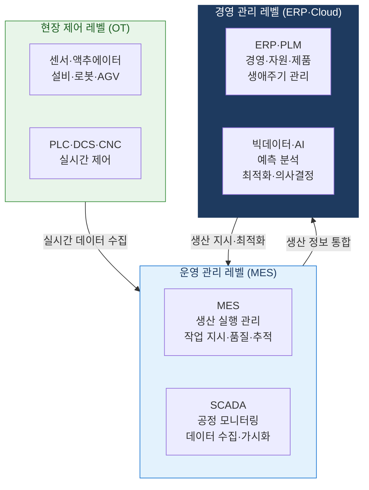

# Industry 4.0
**4차 산업혁명 — 사이버 물리 시스템 기반 스마트 제조 패러다임**

## 1. 디지털·물리 융합으로 자율·지능 제조를 실현하는 4차 산업혁명, Industry 4.0의 개요

**정의**: 독일 정부가 2011년 제안한 제조업 혁신 전략으로, **사이버 물리 시스템(CPS)** 을 통해 물리적 생산 설비와 디지털 세계를 실시간으로 연결하고, IoT·AI·빅데이터·로봇 등 9대 핵심 기술을 통합하여 자율적이고 지능적인 **스마트 팩토리(Smart Factory)** 를 구현하는 제조업 디지털 전환 패러다임.

**특징**:
- **수평 통합**: 가치 사슬 전체(공급업체→생산→고객)를 디지털로 연결.
- **수직 통합**: 현장 설비(OT)부터 경영 시스템(IT)까지 계층별 실시간 연동.
- **종단간 통합**: 제품 생애주기 전체(설계→제조→서비스)의 디지털화.

**산업혁명 4단계 진화**

| 혁명 | 시기 | 핵심 동력 | 생산 방식 |
|---|---|---|---|
| **1차** | 18세기 말 | 증기기관 | 기계화 생산 |
| **2차** | 20세기 초 | 전기·대량 생산 | 컨베이어벨트·분업 |
| **3차** | 1970년대~ | 전자·IT·자동화 | PLC·로봇 자동화 |
| **4차** | 2010년대~ | CPS·IoT·AI | 자율 지능 스마트 제조 |

---

## 2. Industry 4.0의 핵심 구성 체계

### 가. 9대 핵심 기술

| 핵심 기술 | 제조 적용 | 기대 효과 |
|---|---|---|
| **IoT·IIoT** | 설비·센서·제품에 네트워크 연결하여 실시간 상태 수집 | 설비 가동률 향상·불량 조기 감지 |
| **빅데이터·AI** | 생산 데이터 분석으로 예측 유지보수·품질 이상 탐지 | 다운타임 50%↓·불량률 최소화 |
| **디지털 트윈** | 물리 공장을 가상으로 복제하여 시뮬레이션·최적화 | 신제품 출시 기간 단축·공정 최적화 |
| **협동 로봇** | 안전 펜스 없이 인간과 협업하는 유연한 자동화 | 소량 다품종 생산 유연성 확보 |
| **적층 제조** | 3D 프린팅으로 맞춤 부품·금형 직접 제작 | 리드 타임 단축·재고 최소화 |
| **AR·VR** | 작업 지침 AR 표시·원격 전문가 지원·교육 훈련 | 현장 오류 감소·숙련도 향상 |

---

### 나. 스마트 팩토리 아키텍처

| 레벨 | 역할 | 핵심 시스템 | 통신 프로토콜 |
|---|---|---|---|
| **현장 제어 (L1)** | 설비 직접 제어·센서 데이터 수집 | PLC, DCS, CNC, Robot | OPC-UA, MQTT, Modbus |
| **운영 관리 (L2)** | 생산 실행·공정 모니터링·품질 추적 | MES, SCADA, WMS | OPC-UA, REST API |
| **경영 관리 (L3)** | 자원·계획·분석·최적화 의사결정 | ERP, PLM, BI, AI 플랫폼 | REST API, 클라우드 |

---

## 3. Industry 4.0 도입의 기대효과 및 활용 방안

| 구분 | 주요 기대효과 | 활용 및 실무 적용 방안 |
|---|---|---|
| **생산성 향상** | 자동화·최적화로 생산량·OEE(설비 종합 효율) 향상 | AI 예측 유지보수로 설비 가동률 95% 이상 목표 |
| **품질 혁신** | AI 비전 검사·실시간 SPC로 불량률 최소화 | 카메라·딥러닝 기반 인라인 자동 검사 시스템 구축 |
| **유연 생산** | 디지털 트윈·협동 로봇으로 소량 다품종 대응 | 혼류 생산 라인 시뮬레이션 후 실제 공정 적용 |
| **공급망 통합** | 수평 통합으로 공급업체→생산→고객 실시간 연결 | 공급망 가시성 플랫폼(Control Tower) 구축 |
