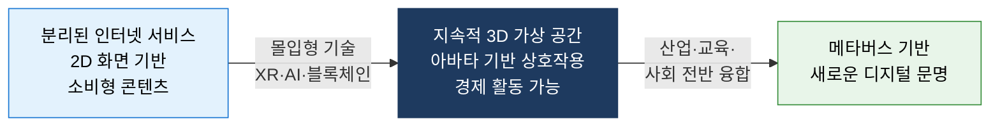
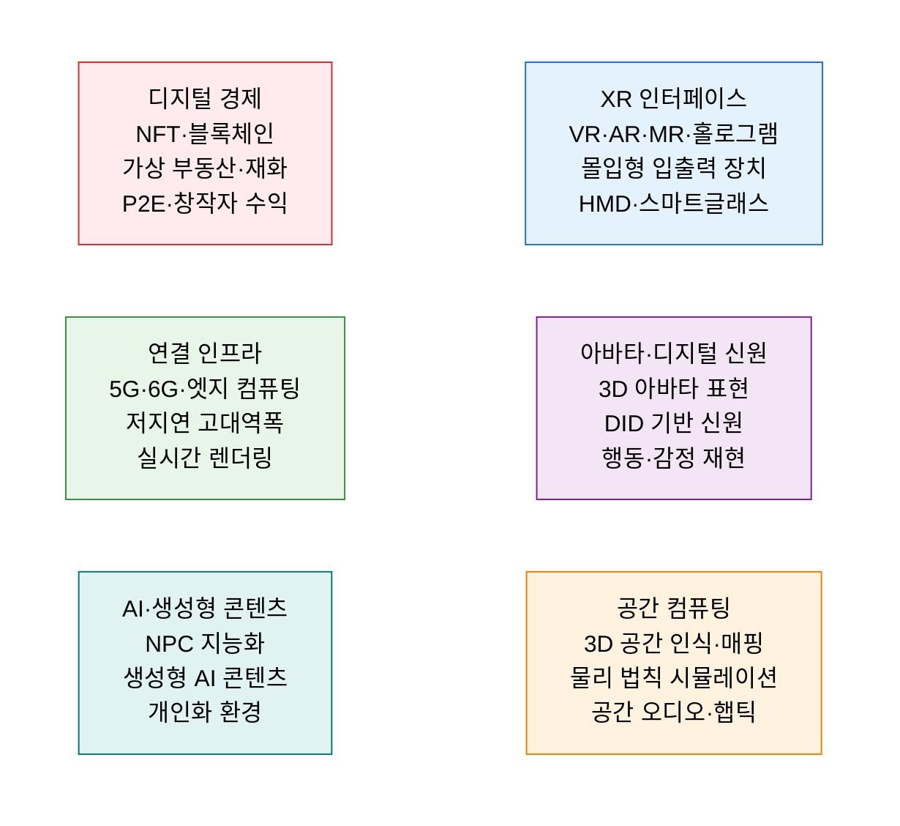
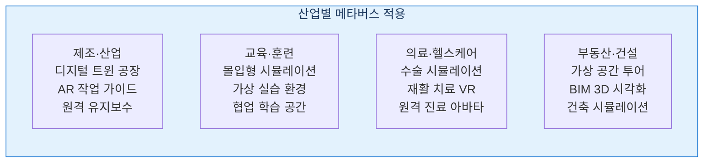

# Metaverse
**메타버스 — 물리 세계와 디지털 세계가 융합된 지속적 가상 공간**

## 1. 현실과 가상이 융합하여 실재감 있게 상호작용하는 차세대 인터넷 공간, 메타버스의 개요

**정의**: Neal Stephenson의 소설 "Snow Crash"(1992)에서 유래한 개념으로, **물리적 현실(Physical Reality)** 과 **디지털 가상 공간(Virtual Space)** 이 융합되어 사용자가 아바타로 상호작용하고, 경제·사회·문화 활동을 영위하는 **지속적·몰입형·상호작용적 3D 디지털 공간** 의 총칭.

**특징**:
- **지속성(Persistence)**: 사용자가 접속·이탈해도 세계가 지속적으로 존재하고 발전.
- **실재감(Presence)**: XR(VR·AR·MR) 기술을 통해 물리 세계에 있는 듯한 몰입감 제공.
- **경제 활동**: NFT·블록체인 기반 디지털 자산 소유·거래·수익 창출 가능.

**메타버스 유형 분류**

| 유형 | 특징 | 대표 사례 |
|---|---|---|
| **증강 현실(AR)형** | 현실 위에 디지털 정보 오버레이 | Pokémon GO, 산업용 AR 가이드 |
| **라이프로깅형** | 일상 활동을 디지털로 기록·공유 | Instagram, Apple Health, 웨어러블 |
| **거울 세계형** | 현실 세계를 그대로 디지털로 복제 | 디지털 트윈, Google Earth |
| **가상 세계형** | 완전한 디지털 대안 현실 공간 | Roblox, Fortnite, Horizon Worlds |

---

## 2. 메타버스의 핵심 구성 체계

### 가. 메타버스 구성 요소 및 기술 레이어

**메타버스 성숙도 단계 (Gartner Hype Cycle 기반)**

| 단계 | 현재 수준 | 핵심 기술 |
|---|---|---|
| **초기 메타버스** | 게임·소셜 플랫폼 수준 | Roblox·Fortnite·VRChat |
| **산업용 메타버스** | 제조·의료·훈련 적용 확대 | 디지털 트윈·산업용 AR |
| **인터넷 통합 메타버스** | 웹·모바일과 연결된 확장 현실 | WebXR·공간 컴퓨팅(Apple Vision Pro) |
| **완전 몰입 메타버스** | 물리-디지털 경계 소멸 | BMI·뇌-컴퓨터 인터페이스(미래) |

---

### 나. 산업별 메타버스 활용 및 거버넌스

**메타버스 거버넌스 핵심 이슈**

| 거버넌스 영역 | 주요 과제 | 대응 방향 |
|---|---|---|
| **개인정보·프라이버시** | 생체·행동·공간 데이터의 대규모 수집 | 온-디바이스 처리·데이터 최소화 원칙 |
| **디지털 신원·인증** | 아바타 사칭·신원 위조·딥페이크 아바타 | DID 기반 검증된 디지털 신원 체계 |
| **디지털 자산 보호** | NFT 저작권·사기·세금·규제 공백 | 블록체인 법적 지위·세제 기준 마련 |
| **중독·건강** | 과몰입·현실 회피·소셜 격리 | 사용 시간 제한·정신 건강 모니터링 |
| **플랫폼 독점** | 소수 빅테크의 메타버스 생태계 지배 | 개방형 표준(OpenXR·WebXR) 확산 |

---

## 3. 메타버스 기술의 기대효과 및 활용 방안

| 구분 | 주요 기대효과 | 활용 및 실무 적용 방안 |
|---|---|---|
| **교육·훈련** | 위험·비용 없이 실제 같은 훈련 환경 제공 | 군사·의료·건설 현장 시뮬레이션 훈련 도입 |
| **업무 혁신** | 원격 팀의 협업 몰입감 향상·창의적 협업 공간 | 가상 오피스·협업 메타버스 도구(Spatial·Microsoft Mesh) |
| **고객 경험** | 가상 쇼핑·시착·공간 체험으로 구매 전환율 향상 | 패션·가구·부동산 버추얼 쇼룸 구축 |
| **디지털 트윈 연계** | 물리 시스템을 가상으로 복제하여 운영 최적화 | 스마트 팩토리·스마트 시티 디지털 트윈 플랫폼 |
