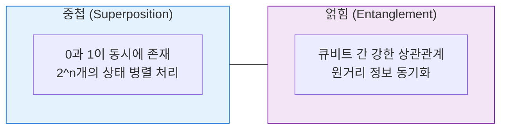

# Quantum Computing
**Quantum Computing & Information**

## 1. 컴퓨팅 패러다임의 근본적 혁신, 양자 컴퓨팅의 개요

**개념**: 기존 비트(0 또는 1) 대신 양자 역학적 현상인 **중첩(Superposition)** 과 **얽힘(Entanglement)** 을 이용하는 큐비트(Qubit)를 사용하여 연산 속도를 기하급수적으로 높이는 기술.

**특징**: 양자 우위(Quantum Supremacy) 달성 목표, 특정 알고리즘(Shor, Grover)에서 기존 슈퍼컴퓨터를 압도하는 성능 발휘.

---

## 2. 양자 컴퓨팅의 핵심 원리 및 아키텍처

### 가. 양자의 주요 물리적 특성



| 핵심 원리 | 설명 | 비즈니스 가치 |
|---|---|---|
| **중첩** | n개의 큐비트로 2^n개의 상태를 동시 표현 | 기하급수적 병렬 연산 성능 |
| **얽힘** | 한 쪽 큐비트의 상태가 다른 쪽에 즉시 영향 | 복잡한 데이터 간 관계 시뮬레이션 |
| **양자 간섭** | 확률적 분포를 조절하여 정답 확률 극대화 | 최적화 문제 해결의 핵심 |

---

### 나. 양자 컴퓨팅 구현 방식 및 기술 스택

```mermaid
flowchart TD
  QuantumTech --> Node4[하드웨어 방식]
  Node4 --> IBMGoogle[초전도 회로 (IBM, Google)]
  Node4 --> IonQHoneywell[이온 트랩 (IonQ, Honeywell)]
  Node4 --> Xanadu[광학 방식 (Xanadu)]
  QuantumTech --> Node4[알고리즘]
  Node4 --> Shor[Shor (소인수 분해 -> 암호 해독)]
  Node4 --> Grover[Grover (데이터 검색 속도 향상)]
  Node4 --> VQE[VQE (양자 화학 시뮬레이션)]
  QuantumTech --> Node4[소프트웨어/프레임워크]
  Node4 --> QiskitIBM[Qiskit (IBM)]
  Node4 --> CirqGoogle[Cirq (Google)]
  Node4 --> BraketAWS[Braket (AWS)]
  QuantumTech --> Node0[```]
```"

| 구분 | 주요 내용 | 비고 |
|---|---|---|
| **NISQ** | Noisy Intermediate-Scale Quantum | 현재 단계의 오류가 있는 중형 양자 장치 |
| **오류 정정** | Quantum Error Correction (QEC) | 실용적 양자 컴퓨터를 위한 필수 기술 |
| **냉각 시스템** | 극저온 유지 장치 (Cryogenics) | 초전도 방식의 물리적 한계 및 요구 조건 |

---

## 3. 양자 컴퓨팅의 파급 효과 및 산업별 활용 전망

| 구분 | 주요 영향 및 활용 분야 | 대응 전략 |
|---|---|---|
| **보안 및 암호** | 공개키 암호 체계(RSA 등) 위협 | 양자 내성 암호(PQC) 도입 및 준비 |
| **신소재/신약** | 분자 수준의 시뮬레이션 | 배터리 고효율화, 신약 후보 물질 발굴 기간 단축 |
| **금융/물류** | 복잡한 최적화 문제 해결 | 포트폴리오 최적화, 물류 경로 최적화 경로 탐색 |
| **AI/ML** | 양자 머신러닝(QML) | 대규모 데이터 학습 및 추론 속도 혁신 |
