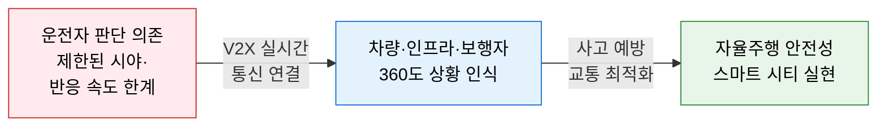
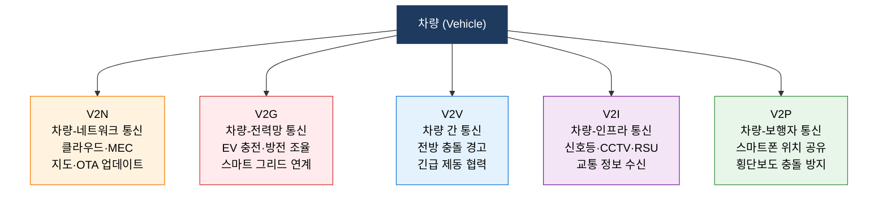
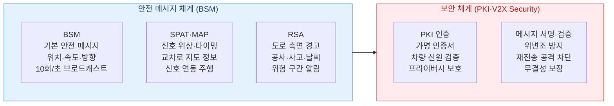

# V2X
**Vehicle-to-Everything — 자율주행 통신 체계**

## 1. 차량·인프라·보행자를 실시간 연결하는 자율주행 통신 체계, V2X의 개요

**정의**: 차량(Vehicle)이 다른 차량(V2V), 도로 인프라(V2I), 보행자(V2P), 네트워크(V2N), 전력망(V2G) 등 **모든 대상(Everything)** 과 실시간으로 통신하여 주변 상황을 공유·협력함으로써 자율주행의 안전성을 높이고 교통 흐름을 최적화하는 차세대 통신 체계.

**특징**:  
 **(센서 한계 보완)** 카메라·레이더·라이다만으로 인식 불가한 비가시 구간(Non-Line-of-Sight)을 V2X 통신으로 극복.  
 **(초저지연 통신)** DSRC(5.9GHz) 또는 C-V2X(LTE/5G) 방식으로 수 ms 내 안전 메시지 교환.  
 **(스마트 인프라)** 자율주행 Level 3 이상 구현 및 **스마트 시티·스마트 도로** 의 핵심 인프라.  

---

## 2. V2X의 핵심 구성 체계

### 가. V2X 통신 유형 및 구조

**V2X 통신 기술 방식 비교**

| 방식 | 표준 | 통신 범위 | 지연 시간 | 특징 |
|---|---|---|---|---|
| **DSRC** | IEEE 802.11p | ~1km | ~2ms | 인프라 독립·즉각 반응, 구축 비용 높음 |
| **C-V2X (LTE)** | 3GPP Release 14 | ~수km | ~20ms | 기존 LTE 인프라 활용, 커버리지 넓음 |
| **C-V2X (5G NR)** | 3GPP Release 16+ | ~수km | 1ms 미만 | 초저지연·고신뢰, 자율주행 Level 4+ 대응 |
| **하이브리드** | DSRC + C-V2X | 복합 | 상황별 | 직접 통신 + 네트워크 통신 병행 |

---

### 나. 자율주행 안전·보안 체계

**V2X 보안 위협 및 대응**

| 위협 유형 | 공격 시나리오 | 대응 방안 |
|---|---|---|
| **메시지 위조** | 가짜 충돌 경고 메시지로 차량 급정거 유도 | PKI 디지털 서명·메시지 무결성 검증 |
| **위치 추적** | V2X 메시지로 특정 차량 지속 추적 | 가명 인증서(Pseudonym Certificate) 주기적 교체 |
| **Sybil 공격** | 다수의 가상 차량 메시지로 교통 혼란 | 신뢰도 기반 메시지 필터링·이상 탐지 |
| **재전송 공격** | 이전 정상 메시지를 재전송하여 오동작 유발 | 타임스탬프·시퀀스 번호 검증 |
| **DoS 공격** | V2X 통신 채널 과부하로 안전 메시지 차단 | 채널 우선순위 관리·이상 트래픽 차단 |

---

## 3. V2X 기술의 기대효과 및 활용 방안

| 구분 | 주요 기대효과 | 활용 및 실무 적용 방안 |
|---|---|---|
| **교통 안전** | 교차로 충돌·추돌 사고 최대 80% 예방 가능 | V2I 신호 연동으로 교차로 안전 속도 제어 자동화 |
| **교통 효율** | 신호 최적화·군집 주행으로 연료·시간 절감 | C-ITS 플랫폼 연계 스마트 신호 제어 시스템 구축 |
| **자율주행 고도화** | 센서 사각지대 제거로 Level 3~4 안전성 확보 | 고속도로 자율주행 구간에 RSU 인프라 우선 구축 |
| **스마트 시티** | 실시간 교통 데이터로 도시 교통 최적화 | V2X 데이터를 디지털 트윈 도시 플랫폼에 연계 |
