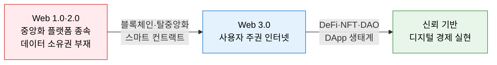
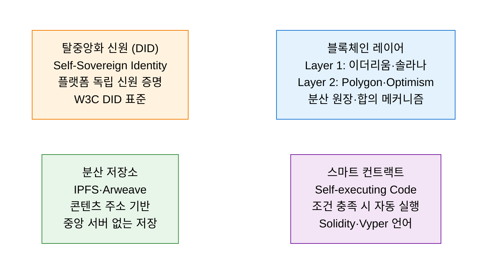
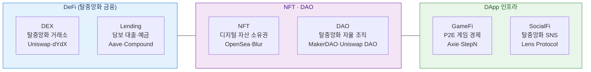

# Web 3.0
**탈중앙화 인터넷 패러다임**

## 1. 중앙화된 플랫폼 종속에서 벗어나 사용자가 데이터와 자산을 직접 소유·통제하는 차세대 인터넷, Web 3.0의 개요

**개념**: 블록체인 기술을 기반으로 중앙화된 서버·플랫폼 없이 운영되는 **탈중앙화(Decentralized)** 인터넷 패러다임으로, 사용자가 자신의 데이터·디지털 자산·신원을 직접 소유·통제하고 스마트 컨트랙트를 통해 신뢰 없는 자동 거래가 가능한 차세대 웹 구조.

**특징**:
- **탈중앙화(Decentralization)**: 특정 기업·서버에 의존하지 않고 P2P 네트워크와 블록체인으로 운영.
- **토큰 경제(Token Economy)**: 암호화폐·NFT·거버넌스 토큰으로 참여자에게 인센티브 제공.
- **자기 주권 신원(SSI)**: DID(탈중앙화 신원)로 플랫폼 종속 없이 디지털 신원 관리.

**Web 진화 비교**

| 구분 | Web 1.0 | Web 2.0 | Web 3.0 |
|---|---|---|---|
| **시기** | 1990년대 | 2000년대~ | 2020년대~ |
| **특징** | 읽기 전용 | 읽기·쓰기 (참여) | 읽기·쓰기·소유 |
| **데이터** | 정적 HTML | 플랫폼 중앙화 | 블록체인 분산 |
| **대표 서비스** | 포털·뉴스사이트 | Facebook·YouTube | DeFi·NFT·DAO |
| **신뢰 기반** | 서버 신뢰 | 플랫폼 신뢰 | 코드·수학적 신뢰 |

---

## 2. Web 3.0의 핵심 구성 체계

### 가. Web 3.0 핵심 기술

| 핵심 기술 | 역할 | 대표 구현체 |
|---|---|---|
| **블록체인 (Layer 1/2)** | 탈중앙화 거래·데이터의 불변 기록 기반 | 이더리움, 솔라나, Polygon, Arbitrum |
| **스마트 컨트랙트** | 중개자 없는 자동 실행 계약·로직 | Solidity, OpenZeppelin, Hardhat |
| **지갑 (Wallet)** | 개인키 기반 디지털 자산·신원 관리 | MetaMask, WalletConnect, Phantom |
| **DID·SSI** | 플랫폼 종속 없는 자기 주권 신원 | W3C DID, DIF, Microsoft ION |
| **분산 저장소** | 콘텐츠 주소 기반 탈중앙화 파일 저장 | IPFS, Arweave, Filecoin |
| **오라클** | 블록체인에 외부 데이터 공급 | Chainlink, Band Protocol |

---

### 나. 탈중앙화 응용 서비스

| 응용 서비스 | 개념 | 핵심 특징 |
|---|---|---|
| **DeFi** | 은행·증권사 없는 금융 서비스 (대출·거래·예금) | 스마트 컨트랙트 기반 자동화, TVL(총예치금) 지표 |
| **NFT** | 블록체인 기반 디지털 자산 고유 소유권 증명 | 복제 불가 소유권, 저작권·콘텐츠 수익화 |
| **DAO** | 토큰 기반 온체인 투표로 운영하는 자율 조직 | 거버넌스 토큰 보유자가 프로토콜 의사결정 참여 |
| **GameFi** | 게임 내 자산을 NFT·토큰으로 실제 가치화 | P2E(Play-to-Earn), 게임 경제와 금융의 융합 |
| **SocialFi** | 탈중앙화 SNS — 사용자가 콘텐츠 수익 직접 수취 | 알고리즘·플랫폼 없는 사용자 주권 소셜 미디어 |

---

## 3. Web 3.0 기술의 기대효과 및 활용 방안

| 구분 | 주요 기대효과 | 활용 및 실무 적용 방안 |
|---|---|---|
| **데이터 주권** | 개인이 자신의 데이터를 직접 소유·통제 | DID 기반 인증으로 서비스 간 신원 이동성 확보 |
| **금융 포용성** | 은행 계좌 없이도 금융 서비스 접근 가능 | DeFi 프로토콜로 해외 송금·소액 대출 비용 절감 |
| **디지털 자산 경제** | NFT로 창작자 직접 수익화·2차 판매 로열티 | 게임·미디어·부동산의 디지털 자산 토큰화 |
| **공공·엔터프라이즈** | 블록체인 기반 공급망·투표·인증 신뢰성 향상 | 전자정부 DID·공급망 추적·의료 데이터 공유에 적용 |
