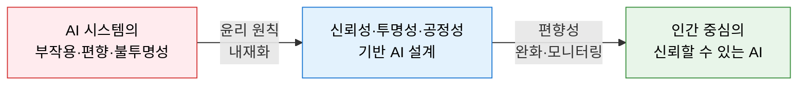
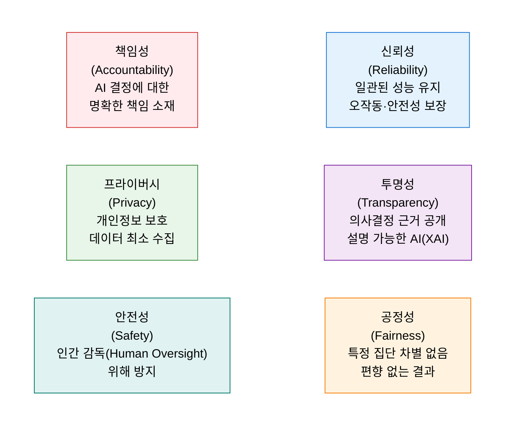
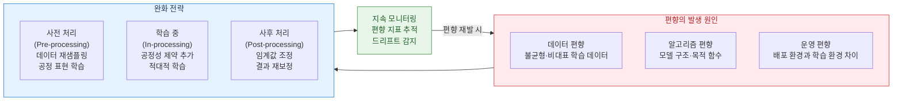

# AI 윤리 (AI Ethics)
**Trustworthy AI Framework**

## 1. 인간 중심의 신뢰할 수 있는 AI 시스템 구현을 위한 윤리 원칙 체계, AI 윤리의 개요

**정의**: AI 시스템의 개발·운영 전 주기에서 인간의 존엄성과 기본권을 보호하고, 사회적 신뢰를 확보하기 위해 **신뢰성(Reliability), 투명성(Transparency), 공정성(Fairness)** 등의 윤리 원칙을 설계 단계부터 내재화하는 거버넌스 체계.

**특징**:
- EU AI Act, OECD AI 원칙, 국내 AI 윤리 기준 등 글로벌 규제 강화로 AI 윤리의 **법적 의무화** 가속.
- 기술적 대응(XAI, 편향성 감지)과 거버넌스 체계(윤리 위원회, 영향평가)를 병행하는 통합 접근.
- 단순 준수(Compliance)를 넘어 **Responsible AI** 문화로의 조직 전환 필요.

---

## 2. AI 윤리의 핵심 구성 체계

### 가. 신뢰성(Reliability), 투명성(Transparency), 공정성(Fairness)

| 원칙 | 핵심 내용 | 기술·거버넌스 대응 |
|---|---|---|
| **신뢰성** | AI 시스템이 의도된 목적에서 일관되게 안전하게 동작 | 강건성 테스트, 모델 모니터링, 폴백(Fallback) 메커니즘 |
| **투명성** | AI의 판단 근거를 사용자가 이해할 수 있도록 설명 제공 | XAI(SHAP, LIME), 모델 카드(Model Card) 공개 |
| **공정성** | 성별·인종·나이 등 민감 속성에 따른 차별적 결과 방지 | 공정성 지표 측정(Demographic Parity), 편향 감사 |
| **책임성** | AI 결정으로 인한 피해에 대한 책임 주체 명확화 | AI 거버넌스 위원회, 감사 로그, 인간 검토 절차 |
| **프라이버시** | 개인정보 최소 수집 및 데이터 보호 원칙 준수 | 연합 학습(Federated Learning), 차분 프라이버시 |
| **안전성** | AI가 인간의 통제를 벗어나지 않도록 감독 체계 유지 | Human-in-the-Loop, 비상 정지(Kill Switch) 설계 |

---

### 나. 알고리즘 편향성 완화

| 단계 | 완화 기법 | 주요 도구·방법론 |
|---|---|---|
| **사전 처리 (Pre-processing)** | 불균형 데이터 재샘플링, 민감 속성 제거, 공정 표현 학습 | SMOTE, Reweighting, Fairness-aware Preprocessing |
| **학습 중 (In-processing)** | 공정성 제약 조건을 목적 함수에 추가, 적대적 학습 적용 | Adversarial Debiasing, Prejudice Remover |
| **사후 처리 (Post-processing)** | 그룹별 임계값(Threshold) 조정, 예측 결과 재보정 | Calibrated Equalized Odds, Reject Option |
| **지속 모니터링** | 운영 중 편향 지표 추적, 데이터 드리프트 감지 및 재학습 | Evidently AI, Fairlearn, IBM AI Fairness 360 |

---

## 3. AI 윤리 체계 도입의 기대효과 및 활용 방안

| 구분 | 주요 기대효과 | 활용 및 실무 적용 방안 |
|---|---|---|
| **규제 대응** | EU AI Act·국내 AI 법안 준수 체계 구축 | 고위험 AI 시스템 식별 및 적합성 평가(Conformity Assessment) 수행 |
| **사용자 신뢰** | 투명한 AI 설명으로 사용자 수용성 향상 | XAI 도입 및 AI 결정 근거 제공 UI 설계 |
| **리스크 관리** | 편향·오작동으로 인한 법적·평판 리스크 사전 차단 | AI 영향 평가(AIIA) 및 레드팀(Red Team) 테스트 정례화 |
| **지속 가능성** | Responsible AI 문화 정착으로 장기적 AI 경쟁력 확보 | AI 윤리 거버넌스 위원회 구성 및 전사 교육 체계 수립 |
