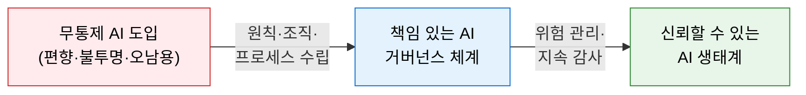
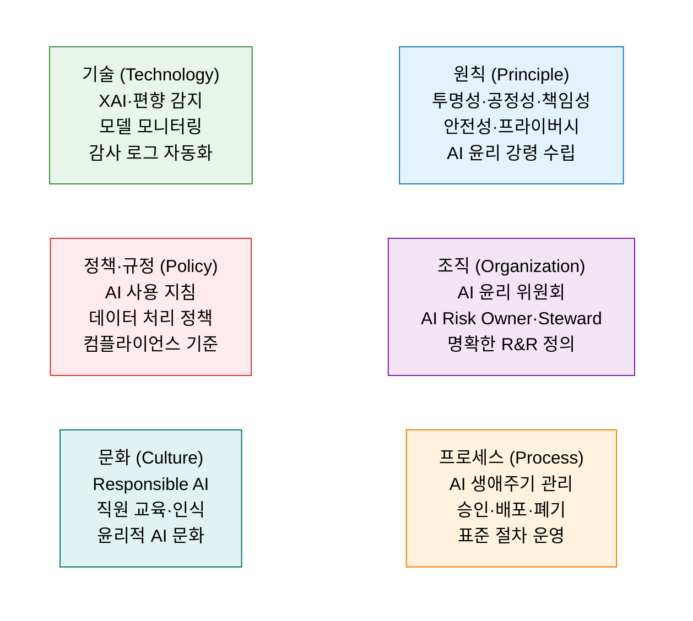
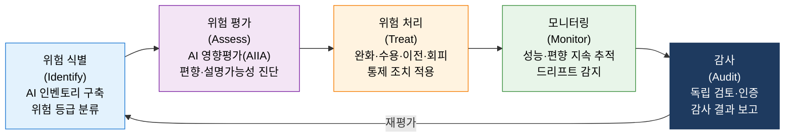

# AI 거버넌스
**AI Governance Framework**

## 1. AI 시스템의 책임 있는 개발·운영을 위한 원칙·조직·프로세스 통합 관리 체계, AI 거버넌스의 개요

**개념**: AI 시스템의 설계·개발·배포·운영 전 생애주기에서 윤리성·공정성·투명성·안전성을 보장하기 위해 **AI 원칙, 거버넌스 조직, 운영 프로세스** 를 체계화하고 AI 위험을 지속적으로 관리·감사하는 통합 관리 프레임워크.

**특징**:
- EU AI Act·OECD AI 원칙·ISO/IEC 42001 등 글로벌 AI 규제·표준에 대응하는 **법적·윤리적 의무 이행** 체계.
- 기술적 조치(XAI·편향 감지)와 조직적 조치(AI 윤리 위원회·영향평가)를 통합한 **Responsible AI** 실현.
- AI 거버넌스를 IT 거버넌스(COBIT)·데이터 거버넌스와 연계하는 **전사 통합 거버넌스** 관점 필요.

---

## 2. AI 거버넌스의 핵심 구성 체계

### 가. AI 거버넌스 체계 — 원칙(Principle)·조직(Organization)·프로세스(Process)

**AI 거버넌스 조직 구조**

| 역할 | 책임 수준 | 주요 업무 |
|---|---|---|
| **AI 거버넌스 위원회** | 전략·정책 결정 | AI 원칙 수립, 고위험 AI 승인, 위반 사항 의사결정 |
| **AI Risk Owner** | 비즈니스 책임 | 도메인별 AI 위험 식별·수용·보고 |
| **AI 윤리 담당자** | 운영 관리 | AI 영향평가 수행, 편향성 감사, 윤리 지침 배포 |
| **AI 엔지니어/MLOps** | 기술적 구현 | 모델 개발·배포·모니터링, 기술 문서화 |
| **법무·컴플라이언스** | 규제 준수 | AI 관련 법규 해석, 규제 대응, 계약 검토 |

---

### 나. AI 위험 관리 및 감사

| 단계 | 핵심 활동 | 주요 도구·방법론 |
|---|---|---|
| **위험 식별** | 전사 AI 시스템 인벤토리 구축 및 EU AI Act 기준 위험 등급 분류 | AI 레지스트리, 위험 분류 체계 |
| **위험 평가** | AI 영향평가(AIIA) 수행, 편향성·공정성·설명가능성 진단 | DPIA, AIIA, Fairlearn, IBM AI 360 |
| **위험 처리** | 수용 불가 위험 완화 조치, 모델 재학습·폐기·대체 결정 | 완화 계획서, 통제 조치 매트릭스 |
| **모니터링** | 배포 후 성능·편향·드리프트 지속 추적 및 임계치 초과 알람 | MLflow, Evidently AI, Grafana |
| **감사** | 독립적 내·외부 감사, AI 거버넌스 성숙도 평가, 인증 취득 | ISO/IEC 42001, 내부 감사 보고서 |

---

## 3. AI 거버넌스 도입의 기대효과 및 활용 방안

| 구분 | 주요 기대효과 | 활용 및 실무 적용 방안 |
|---|---|---|
| **규제 선제 대응** | EU AI Act·ISO 42001 등 글로벌 AI 규제 의무 이행 | AI 인벤토리 기반 위험 등급 분류 및 고위험 AI 적합성 평가 |
| **신뢰 확보** | 투명하고 설명 가능한 AI로 이해관계자 신뢰 향상 | 모델 카드·데이터 시트 공개 및 XAI 기반 결정 근거 제공 |
| **리스크 감소** | 편향·오작동·개인정보 침해 등 AI 위험 사전 차단 | AI 영향평가(AIIA) 의무화 및 레드팀(Red Team) 테스트 정례화 |
| **경쟁 우위** | Responsible AI 문화 정착으로 지속 가능한 AI 경쟁력 확보 | AI 거버넌스 성숙도 모델(AIMMM) 기반 단계적 역량 향상 |
