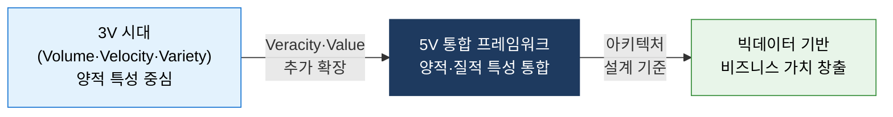
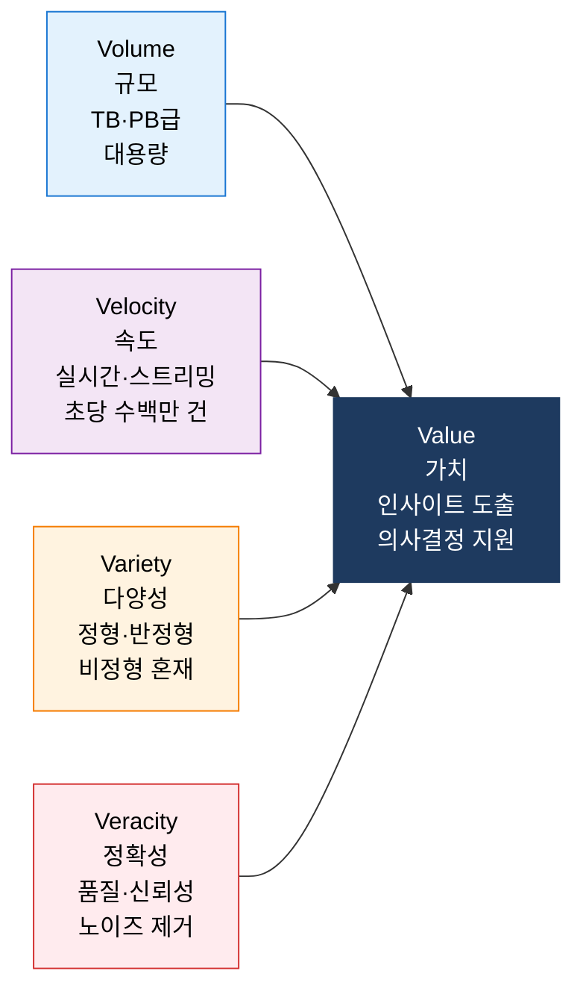
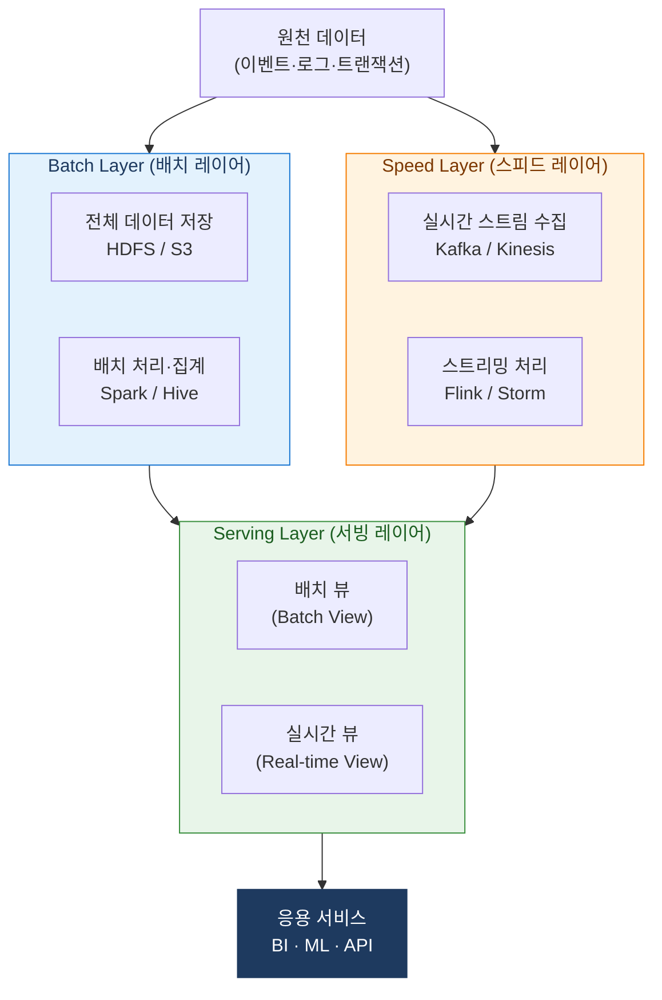

# Big Data 5V
**Volume · Velocity · Variety · Veracity · Value**

## 1. 빅데이터의 5대 속성(5V)으로 가치를 창출하는 분석 프레임워크, Big Data 5V의 개요

**정의**: 빅데이터를 규모(Volume), 속도(Velocity), 다양성(Variety), 정확성(Veracity), 가치(Value)의 **5가지 속성**으로 정의하고, 각 속성의 특성에 맞게 수집·저장·처리·분석 아키텍처를 설계하여 데이터에서 비즈니스 가치를 창출하는 프레임워크.

**특징**:  
 **(5V 확장 모델)** 초기 3V(Volume·Velocity·Variety)에서 **Veracity(정확성)** 와 **Value(가치)** 를 추가한 5V 확장 모델.  
 **(양·질 통합 관리)** 데이터의 양적 특성(규모·속도·다양성)과 질적 특성(정확성·가치)을 통합적으로 관리.  
 **(아키텍처 선택 기준)** Lambda Architecture, Kappa Architecture 등 빅데이터 처리 아키텍처 선택의 기준으로 활용.  

---

## 2. Big Data 5V의 핵심 구성 체계

### 가. 규모(Volume), 속도(Velocity), 다양성(Variety), 정확성(Veracity), 가치(Value)

| 속성 | 정의 | 핵심 과제 | 대응 기술 |
|---|---|---|---|
| **Volume (규모)** | 수십 TB~PB 이상의 대용량 데이터 | 분산 저장 및 병렬 처리 | HDFS, S3, Data Lake |
| **Velocity (속도)** | 초당 수백만 건 이상의 실시간 데이터 생성 | 저지연 스트림 처리 | Kafka, Spark Streaming, Flink |
| **Variety (다양성)** | 정형(DB), 반정형(JSON/XML), 비정형(이미지·텍스트) | 다양한 포맷 통합 | Spark, Hive, NoSQL |
| **Veracity (정확성)** | 데이터 품질 저하·노이즈·불완전 데이터 혼재 | 품질 검증 및 정제 | DQ 도구, 데이터 프로파일링 |
| **Value (가치)** | 대용량 데이터에서 의미 있는 인사이트 도출 | 분석 모델 개발·배포 | ML/AI 플랫폼, BI 도구 |

---

### 나. 빅데이터 분석 아키텍처

**Lambda Architecture** (배치 + 스트림 하이브리드)

| 레이어 | 역할 | 특징 | 핵심 기술 |
|---|---|---|---|
| **Batch Layer** | 전체 원천 데이터를 저장하고 주기적으로 배치 처리 | 높은 정확성, 처리 지연 존재 | HDFS, Spark, Hive |
| **Speed Layer** | 실시간 스트리밍 데이터를 즉시 처리하여 최신 뷰 생성 | 낮은 지연, 부분 데이터 처리 | Kafka, Flink, Storm |
| **Serving Layer** | 배치 뷰와 실시간 뷰를 병합하여 쿼리 응답 제공 | 빠른 읽기, 최신·정확 데이터 통합 | HBase, Cassandra, Druid |

> **Kappa Architecture**: Speed Layer만으로 배치·스트림을 통합 처리하는 단순화 모델. Kafka Streams, Flink 기반으로 구현하며 Lambda보다 운영 복잡도가 낮음.

---

## 3. Big Data 5V 프레임워크의 기대효과 및 활용 방안

| 구분 | 주요 기대효과 | 활용 및 실무 적용 방안 |
|---|---|---|
| **아키텍처 설계** | 5V 특성 기반의 최적 처리 아키텍처 선택 | 실시간성 요구 시 Speed Layer, 정확성 요구 시 Batch Layer 강화 |
| **품질 확보** | Veracity 관리로 분석 신뢰도 향상 | 데이터 품질 파이프라인 내 프로파일링·정제 자동화 |
| **비용 최적화** | 용도별 저장소 계층화로 스토리지 비용 절감 | Hot/Warm/Cold 티어링 및 압축·파티셔닝 전략 적용 |
| **AI·ML 연계** | 고품질 대용량 데이터로 AI 모델 학습 품질 향상 | Feature Store 구축 및 MLOps 파이프라인과 연계 |
