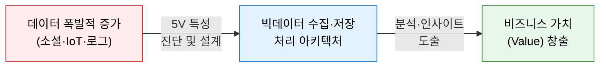
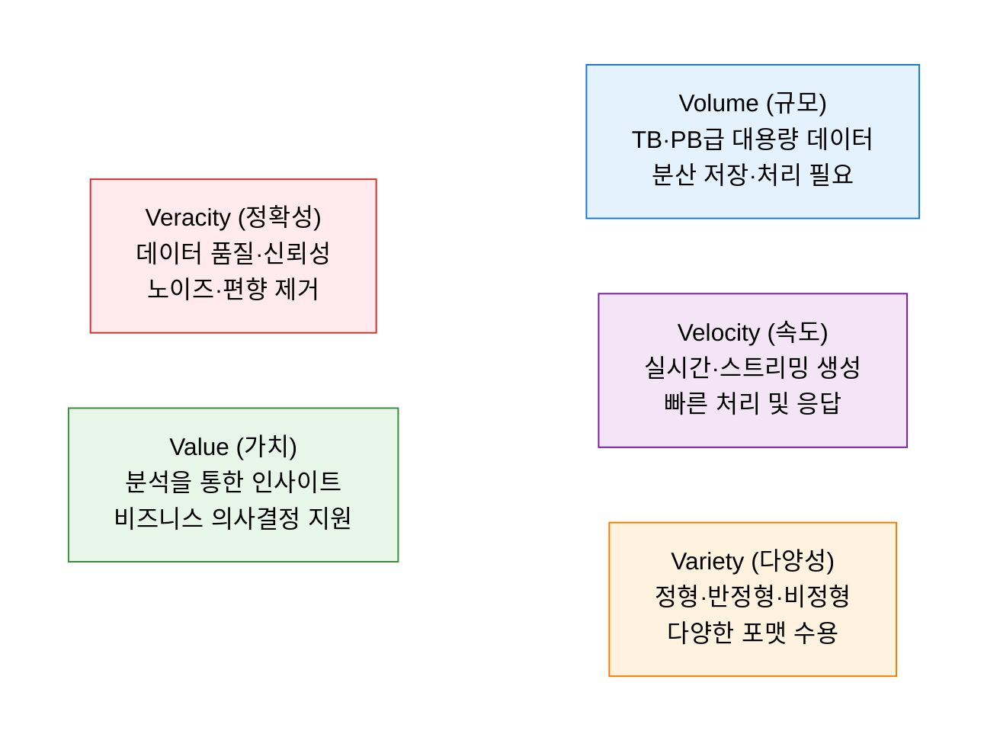

# Big Data 5V
**Volume · Velocity · Variety · Veracity · Value**

## 1. 대용량 데이터의 특성을 정의하고 분석 가치를 창출하는 빅데이터 프레임워크, Big Data 5V의 개요

**개념**: 빅데이터를 특징짓는 **Volume(규모), Velocity(속도), Variety(다양성), Veracity(정확성), Value(가치)** 의 5가지 속성을 기반으로 데이터 특성을 진단하고, 이에 적합한 수집·저장·처리·분석 아키텍처를 설계하는 프레임워크.

**특징**:
- 초기 3V(Volume·Velocity·Variety)에서 Veracity·Value를 추가한 **5V 확장 모델**로 발전.
- 데이터의 양적 특성(규모·속도·다양성)과 질적 특성(정확성·가치)을 통합적으로 고려.
- Lambda Architecture, Kappa Architecture 등 빅데이터 처리 아키텍처 선택의 기준으로 활용.

---

## 2. Big Data 5V의 핵심 구성 체계

### 가. 규모(Volume), 속도(Velocity), 다양성(Variety), 정확성(Veracity), 가치(Value)

| V | 속성 | 핵심 과제 | 대응 기술 |
|---|---|---|---|
| **Volume** | 수십 TB~PB 규모의 대용량 데이터 | 분산 저장 및 병렬 처리 | HDFS, S3, Data Lake |
| **Velocity** | 초당 수백만 건의 실시간 데이터 생성 | 저지연 스트림 처리 | Kafka, Spark Streaming, Flink |
| **Variety** | 정형(DB), 반정형(JSON/XML), 비정형(이미지·텍스트) | 다양한 포맷 통합 처리 | Spark, Hive, NoSQL |
| **Veracity** | 데이터 품질 저하, 노이즈, 불완전 데이터 | 품질 검증·정제 체계 | Data Quality 도구, 데이터 프로파일링 |
| **Value** | 대용량 데이터에서 의미 있는 인사이트 도출 | 분석 모델 개발 및 배포 | ML/AI 플랫폼, BI 도구 |

---

### 나. 빅데이터 분석 아키텍처

```mermaid
flowchart LR
    subgraph SRC["데이터 소스"]
        direction TB
        S1["정형 데이터<br/>(DB, ERP)"]
        S2["반정형 데이터<br/>(Log, JSON)"]
        S3["비정형 데이터<br/>(SNS, 이미지)"]
    end

    subgraph ING["수집·적재"]
        direction TB
        I1["배치 수집<br/>Sqoop, Flume"]
        I2["스트림 수집<br/>Kafka, Kinesis"]
    end

    subgraph STR["저장"]
        direction TB
        ST1["Data Lake<br/>HDFS, S3"]
        ST2["Data Warehouse<br/>Redshift, BigQuery"]
    end

    subgraph PROC["처리·분석"]
        direction TB
        P1["배치 처리<br/>Spark, Hive"]
        P2["스트림 처리<br/>Flink, Storm"]
    end

    VIZ["시각화·서비스<br/>BI·ML·API"]

    SRC --> ING --> STR --> PROC --> VIZ

    style SRC  fill:#E3F2FD,stroke:#1976D2,color:#1E3A5F
    style ING  fill:#F3E5F5,stroke:#7B1FA2,color:#4A148C
    style STR  fill:#FFF3E0,stroke:#F57C00,color:#E65100
    style PROC fill:#FFEBEE,stroke:#D32F2F,color:#B71C1C
    style VIZ  fill:#1E3A5F,stroke:#1E3A5F,color:#fff
```

| 레이어 | 역할 | 핵심 기술 스택 |
|---|---|---|
| **수집·적재** | 다양한 소스에서 배치·실시간으로 데이터 수집 | Apache Kafka, Flume, Sqoop, AWS Kinesis |
| **저장** | 원시 데이터(Data Lake) 및 분석용 데이터(DW) 저장 | HDFS, AWS S3, Snowflake, BigQuery |
| **처리·분석** | 배치·스트리밍 방식의 대규모 데이터 처리 | Apache Spark, Flink, Hive, Presto |
| **시각화·서비스** | 분석 결과의 대시보드화 및 ML 모델 서비스 배포 | Tableau, Grafana, MLflow, REST API |

---

## 3. Big Data 5V 프레임워크의 기대효과 및 활용 방안

| 구분 | 주요 기대효과 | 활용 및 실무 적용 방안 |
|---|---|---|
| **전략적 설계** | 데이터 특성 기반의 아키텍처 최적 설계 | 5V 진단을 통해 배치·스트리밍·하이브리드 아키텍처 선택 |
| **품질 확보** | Veracity 관리를 통한 분석 신뢰도 향상 | 데이터 품질 파이프라인 구축 및 이상치·결측치 처리 자동화 |
| **비용 효율화** | 용도별 저장소 분리로 스토리지 비용 최적화 | Hot/Warm/Cold 데이터 계층화 및 자동 티어링 정책 적용 |
| **AI·분석 기반** | 고품질 대용량 데이터로 AI 모델 학습 품질 향상 | Feature Store 구축 및 MLOps 파이프라인과 연계 |
