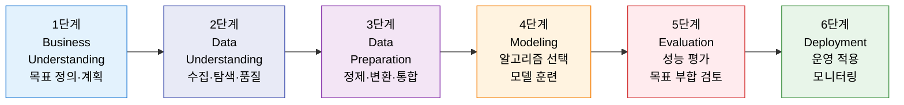
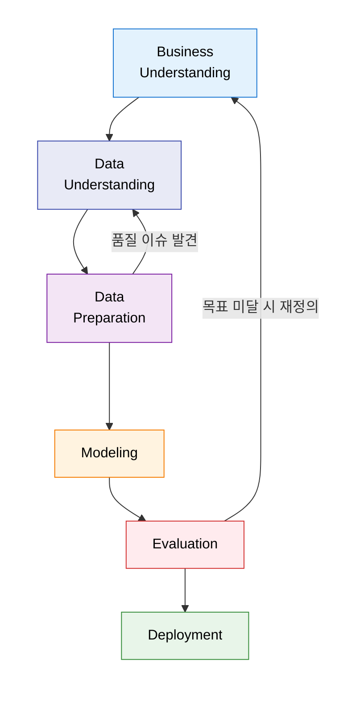

# CRISP-DM
**Cross-Industry Standard Process for Data Mining**

## 1. 비즈니스 문제 해결을 위한 데이터 분석의 국제 표준 절차, CRISP-DM의 개요

**정의**: 산업 전반에 적용 가능한 데이터 마이닝 및 분석 프로젝트의 표준 수행 절차로, 비즈니스 이해부터 배포까지 **6단계**를 반복적으로 수행하여 데이터로부터 비즈니스 가치를 창출하는 방법론.

**특징**:
- 특정 도구·기술에 종속되지 않는 **산업 중립적(Cross-Industry)** 표준 프로세스.
- 단방향 진행이 아닌 **각 단계 간 피드백과 반복(Iteration)** 을 통한 점진적 품질 향상.
- 데이터 분석가와 비즈니스 이해관계자 간의 **공통 언어**로 협업 효율화.

---

## 2. CRISP-DM의 핵심 구성 체계

### 가. 6단계 분석 절차

| 단계 | 주요 활동 | 핵심 산출물 |
|---|---|---|
| **1. Business Understanding** | 프로젝트 목적·범위 정의, 데이터 마이닝 목표 설정 | 프로젝트 헌장, 성공 기준 정의서 |
| **2. Data Understanding** | 초기 데이터 수집, EDA(탐색적 데이터 분석), 품질 평가 | 데이터 탐색 보고서, 품질 이슈 목록 |
| **3. Data Preparation** | 결측치 처리, 이상치 제거, 피처 엔지니어링, 데이터 통합 | 분석용 최종 데이터셋 |
| **4. Modeling** | 모델 선택, 훈련·검증 데이터 분리, 하이퍼파라미터 튜닝 | 최적화된 예측 모델 |
| **5. Evaluation** | 모델 성능 지표 측정, 비즈니스 가치 검토, 배포 승인 | 모델 평가 보고서, 배포 결정 문서 |
| **6. Deployment** | 운영 환경 적용, 사용자 교육, 모니터링 체계 구축 | 배포된 모델, 운영 매뉴얼 |

---

### 나. 반복적 수행 메커니즘

| 반복 유형 | 발생 시점 | 목적 |
|---|---|---|
| **단계 내 반복** | 모델링 중 파라미터 튜닝, 데이터 준비 중 변환 방식 조정 | 해당 단계 결과물의 품질 향상 |
| **이전 단계 피드백** | 데이터 준비 → 데이터 이해, 모델링 → 데이터 준비 | 상위 단계의 미비점 보완 |
| **프로젝트 전체 반복** | 평가 결과 비즈니스 목표 미달 시 1단계 재수행 | 분석 방향·가설 재정의 및 전체 재수행 |

---

## 3. CRISP-DM 적용의 기대효과 및 활용 방안

| 구분 | 주요 기대효과 | 활용 및 실무 적용 방안 |
|---|---|---|
| **프로젝트 체계화** | 분석 프로젝트의 예측 가능성 및 관리 효율 향상 | AI·ML 프로젝트의 WBS 수립 및 단계별 산출물 관리 기준 |
| **협업 강화** | 비즈니스-데이터팀 간 공통 언어 확보 | 각 단계 리뷰 회의를 통한 이해관계자 참여 및 기대 조율 |
| **품질 보증** | 반복적 검증을 통한 모델 신뢰도 향상 | 배포 전 비즈니스 목표 부합성 평가 게이트 운영 |
| **지식 재사용** | 표준화된 절차로 분석 노하우 축적 | 유사 프로젝트에 재활용 가능한 데이터 파이프라인·피처 라이브러리 구축 |
