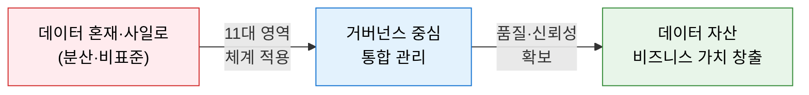
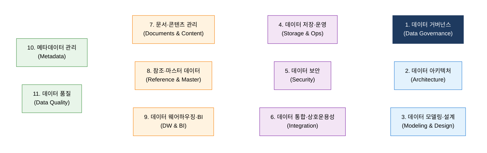
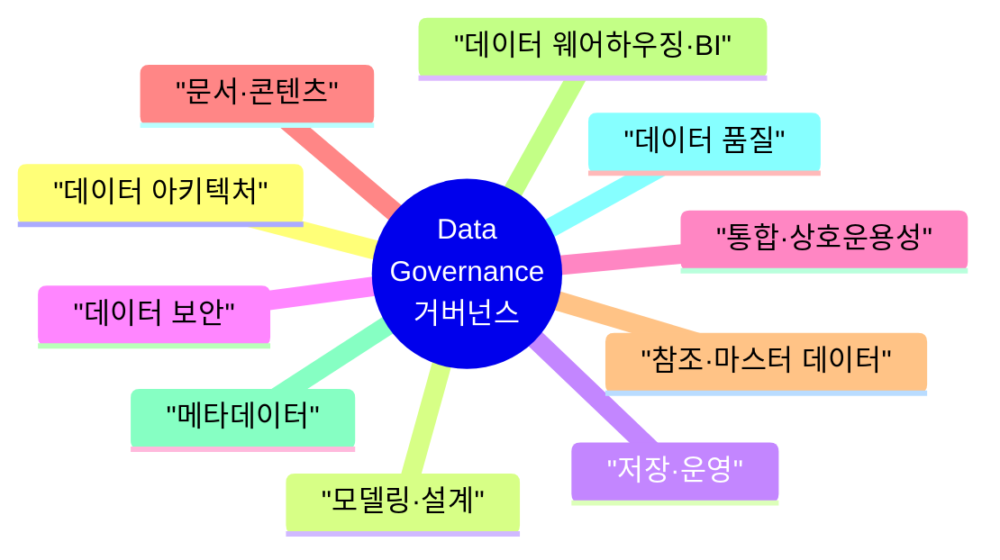

# DAMA-DMBOK
**Data Management Body of Knowledge**

## 1. 데이터 자산의 체계적 관리를 위한 국제 표준 지식 체계, DAMA-DMBOK의 개요

**개념**: DAMA International에서 발간한 데이터 관리 지식 체계로, 조직이 데이터 자산을 효과적으로 관리하기 위한 **11대 지식 영역(Knowledge Areas)** 과 실무 가이드라인을 제공하는 글로벌 표준 프레임워크.

**특징**:
- 데이터 거버넌스를 중심축으로 10개 관리 영역이 유기적으로 연결된 **DAMA Wheel** 구조 제시.
- 데이터를 IT 자산이 아닌 **전사 비즈니스 자산**으로 인식하는 관점 전환 지원.
- 데이터 관리 성숙도(Maturity) 진단 및 조직 역량 개선 로드맵 수립의 기준 제공.

---

## 2. DAMA-DMBOK의 핵심 구성 체계

### 가. 11대 데이터 관리 영역

| 영역 | 핵심 목적 | 주요 활동 |
|---|---|---|
| **1. 데이터 거버넌스** | 전사 데이터 관리 정책·전략·책임 체계 수립 | 데이터 오너십 정의, 정책 수립, 컴플라이언스 |
| **2. 데이터 아키텍처** | 전사 데이터 구조 및 흐름의 표준 설계 | ERD, 개념·논리·물리 모델 설계 |
| **3. 모델링·설계** | 데이터 요구사항의 정형화된 표현 | 정규화, 모델 검토, 메타데이터 등록 |
| **4. 저장·운영** | 데이터 저장 인프라 및 운영 관리 | DB 관리, 백업, 복구, 성능 최적화 |
| **5. 데이터 보안** | 데이터 접근 통제 및 개인정보 보호 | 접근 권한 관리, 암호화, 개인정보 마스킹 |
| **6. 통합·상호운용성** | 이기종 시스템 간 데이터 연계 | ETL, API, 데이터 허브 설계 |
| **7. 문서·콘텐츠** | 비정형 데이터 및 문서의 체계적 관리 | 콘텐츠 분류, 보존 정책, 검색 최적화 |
| **8. 참조·마스터 데이터** | 핵심 공통 데이터의 일관성 확보 | MDM 구축, 황금 레코드(Golden Record) 관리 |
| **9. 데이터 웨어하우징·BI** | 분석용 데이터 통합 및 인사이트 제공 | DW 설계, OLAP, 대시보드, 리포팅 |
| **10. 메타데이터** | 데이터의 의미·출처·맥락 정보 관리 | 데이터 카탈로그, 데이터 리니지 추적 |
| **11. 데이터 품질** | 데이터의 정확성·완전성·일관성 보장 | 품질 측정, 프로파일링, 정제·표준화 |

---

### 나. 데이터 관리 프레임워크 (DAMA Wheel)

| 구성 원리 | 설명 |
|---|---|
| **거버넌스 중심** | Data Governance가 Wheel의 허브(Hub)로서 나머지 10개 영역의 방향과 정책을 통제 |
| **영역 간 상호 연계** | 각 영역은 독립적이지 않으며 메타데이터, 품질, 보안 등이 전 영역에 걸쳐 적용 |
| **전사적 적용** | 특정 부서가 아닌 조직 전체의 데이터 관리 역량을 체계화하는 통합 프레임워크 |

---

## 3. DAMA-DMBOK 도입의 기대효과 및 활용 방안

| 구분 | 주요 기대효과 | 활용 및 실무 적용 방안 |
|---|---|---|
| **표준 체계 수립** | 글로벌 표준 기반의 데이터 관리 체계 구축 | 조직 내 데이터 관리 성숙도(Maturity) 진단 및 개선 로드맵 수립 |
| **품질·신뢰성 확보** | 데이터의 정확성·무결성·일관성 제고 | 고품질 데이터 기반의 AI 모델링 및 경영 의사결정 품질 향상 |
| **규제 대응** | 개인정보 보호·컴플라이언스 준수 | GDPR, 개인정보 보호법 등 규제 요건의 데이터 거버넌스 내 내재화 |
| **AI·분석 기반 강화** | 신뢰할 수 있는 데이터 파이프라인 확보 | MDM·메타데이터 체계 정비를 통한 데이터 레이크·AI 플랫폼 구축 |
