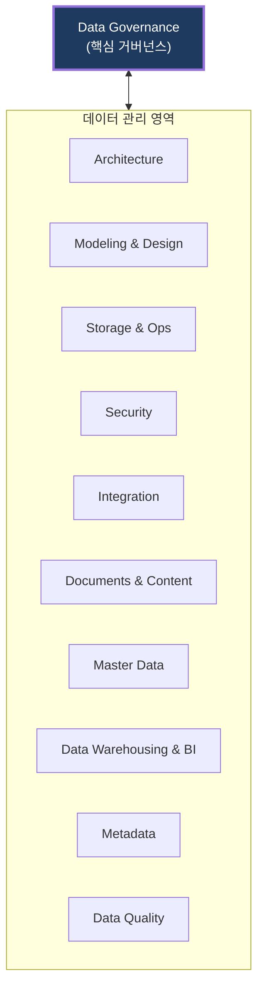
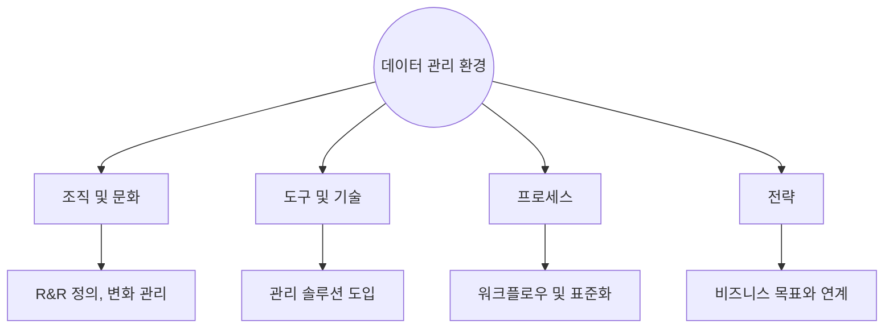

# DAMA-DMBOK
**Data Management Body of Knowledge**

## 1. 전사 데이터 관리의 지식 체계, DAMA-DMBOK의 개요

**개념**: 비영리 단체인 DAMA International에서 발간한 데이터 관리 지식 체계로, 조직이 데이터 자산을 효과적으로 관리하기 위해 필요한 프레임워크와 가이드라인을 제공.

**특징**: 데이터 거버넌스를 중심으로 11개의 지식 영역(Knowledge Areas)을 정의한 **DAMA Wheel** 모델 제시.

---

## 2. DAMA-DMBOK의 핵심 구성 및 프레임워크

### 가. DAMA Wheel (11개 지식 영역)

| 주요 영역 | 설명 | 비고 |
|---|---|---|
| **Governance** | 전반적인 데이터 관리 정책 및 전략 수립 | Wheel의 중심 |
| **Architecture** | 전사 데이터 구조 및 모델 정의 | EA 연계 |
| **Security** | 데이터 접근 제어 및 개인정보 보호 | Compliance 대응 |
| **Metadata** | 데이터의 맥락(Context) 정보 관리 | 발견 가능성 확보 |
| **Quality** | 데이터 정확성, 완전성 보장 프로세스 | 정제 및 프로파일링 |

---

### 나. 환경 요소 (Environmental Factors)

| 요소 | 주요 내용 | 실무 적용 방안 |
|---|---|---|
| **People** | 데이터 관리자(Steward) 및 책임자 지정 | 데이터 거버넌스 조직 구성 |
| **Process** | 데이터 생애주기 전반의 프로세스 정의 | 표준 지침서 배포 |
| **Technology** | 메타데이터 관리 시스템, DQ 도구 등 활용 | 자동화 도구 기반의 상시 점검 |

---

## 3. DAMA-DMBOK 활용을 통한 기대효과

| 구분 | 주요 기대효과 | 활용 및 실무 적용 방안 |
|---|---|---|
| **표준 가이드** | 글로벌 표준 기반의 관리 체계 구축 | 조직 내 데이터 관리 수준(Maturity) 진단 및 로드맵 수립 |
| **품질 신뢰도** | 데이터의 신뢰성 및 무결성 확보 | 고품질 데이터 기반의 분석 및 AI 모델링 성과 제고 |
| **운영 효율성** | 데이터 관리 업무의 체계화 | 중복 작업 제거 및 데이터 자산 검색 비용 감소 |
| **리스크 감소** | 규제 준수 및 보안 사고 방지 | 데이터 보안 거버넌스 강화를 통한 법적 리스크 사전 차단 |
