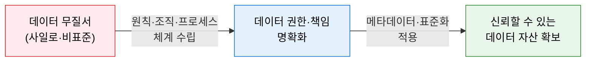
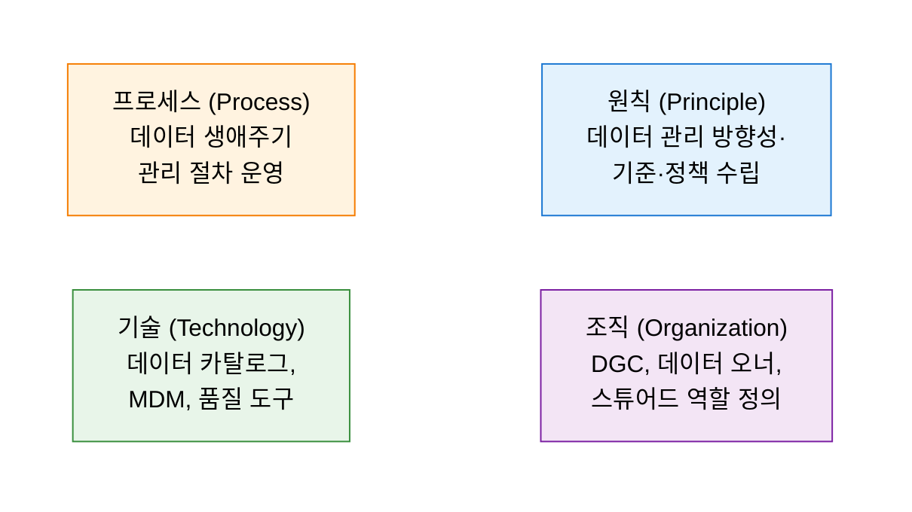
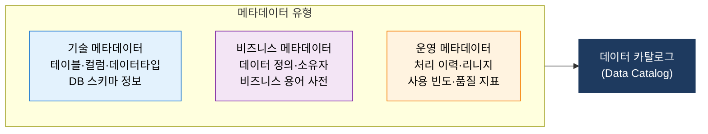

# Data Governance
**데이터 거버넌스**

## 1. 데이터를 전략 자산으로 관리하기 위한 권한·책임 체계, 데이터 거버넌스의 개요

**개념**: 조직 내 데이터의 가용성, 유용성, 무결성, 보안을 보장하기 위해 **데이터 관리 원칙, 거버넌스 조직, 운영 프로세스**를 체계화하고, 데이터 자산에 대한 권한과 책임을 명확히 정의하는 관리 체계.

**특징**:
- 데이터를 IT 자원이 아닌 **전사 비즈니스 자산**으로 인식하는 관점 전환.
- 데이터 오너(Owner), 스튜어드(Steward), 관리자(Custodian)의 역할과 책임(R&R) 분리.
- 메타데이터 관리 및 데이터 표준화를 통한 조직 전반의 데이터 일관성 확보.

---

## 2. 데이터 거버넌스의 구성 체계

### 가. 원칙(Principle), 조직(Organization), 프로세스(Process)

| 구성 요소 | 주요 내용 | 핵심 산출물 |
|---|---|---|
| **원칙 (Principle)** | 데이터 품질·보안·프라이버시에 대한 조직의 기본 방침 정의 | 데이터 정책서, 표준 지침서 |
| **조직 (Organization)** | DGC(Data Governance Council) 구성, 오너·스튜어드·커스터디언 R&R 확립 | 거버넌스 조직도, 역할 기술서 |
| **프로세스 (Process)** | 데이터 수집-저장-사용-폐기 전 주기의 표준 절차 운영 | 데이터 생애주기 프로세스 맵 |
| **기술 (Technology)** | 거버넌스 실행을 지원하는 플랫폼·도구 (카탈로그, MDM, DQ 도구) | 기술 아키텍처 로드맵 |

**거버넌스 조직 계층**

| 역할 | 책임 수준 | 주요 업무 |
|---|---|---|
| **Data Governance Council** | 전략·정책 결정 | 데이터 전략 수립, 예산 승인, 이슈 의사결정 |
| **Data Owner** | 비즈니스 오너십 | 데이터 정의, 품질 기준 설정, 접근 권한 승인 |
| **Data Steward** | 운영 관리 | 데이터 품질 모니터링, 메타데이터 등록, 표준 준수 |
| **Data Custodian** | 기술적 관리 | DB 운영, 보안 통제, 백업·복구 수행 |

---

### 나. 메타데이터 관리 및 표준화

| 표준화 영역 | 설명 | 적용 방안 |
|---|---|---|
| **데이터 용어 표준** | 전사 공통 비즈니스 용어 정의 및 동의어·이음어 관리 | 비즈니스 용어 사전(Business Glossary) 구축 |
| **데이터 모델 표준** | 엔티티·속성 명명 규칙, 도메인·코드값 표준화 | 전사 표준 데이터 모델 수립 및 레지스트리 운영 |
| **데이터 리니지** | 데이터의 발생·가공·이동 경로 추적 | 분석 오류 원인 추적 및 규제 감사 대응 |
| **데이터 카탈로그** | 전사 데이터 자산의 검색·탐색·이해를 지원하는 통합 포털 | Self-service 데이터 분석 환경 기반 마련 |

---

## 3. 데이터 거버넌스 도입의 기대효과 및 활용 방안

| 구분 | 주요 기대효과 | 활용 및 실무 적용 방안 |
|---|---|---|
| **데이터 신뢰성** | 정확하고 일관된 데이터로 의사결정 품질 향상 | 단일 진실 공급원(Single Source of Truth) 확립 |
| **규제 준수** | GDPR·개인정보 보호법·금융 규제 대응 체계화 | 데이터 처리 활동 기록(RoPA) 자동화 및 감사 대응 |
| **AI·분석 기반** | 고품질 데이터 파이프라인으로 AI 모델 신뢰도 제고 | 피처 스토어(Feature Store) 및 MLOps 연계 강화 |
| **운영 효율** | 데이터 중복·오류 제거로 유지보수 비용 절감 | MDM 구축을 통한 마스터 데이터 일원화 |
