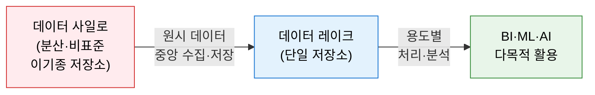
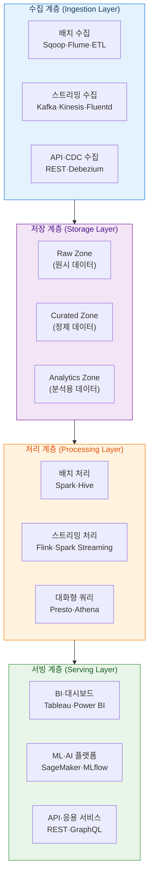
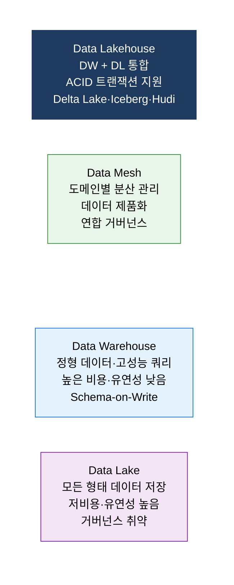

# Data Lake Architecture
**데이터 레이크 아키텍처**

## 1. 정형·비정형 데이터를 원시 형태로 중앙 저장하고 다목적으로 활용하는 통합 데이터 플랫폼, 데이터 레이크의 개요

**개념**: 정형(DB·DW), 반정형(JSON·XML·로그), 비정형(이미지·동영상·텍스트) 데이터를 **원시 형태(Raw Format) 그대로** 대용량 분산 저장소에 중앙 집중 적재하고, 필요 시 목적에 맞게 처리·분석하는 확장 가능한 데이터 플랫폼 아키텍처.

**특징**:
- **Schema-on-Read**: 수집 시 스키마를 정의하지 않고 읽을 때 필요한 구조 적용 (DW의 Schema-on-Write와 대비).
- S3·HDFS·Azure ADLS 등 저비용 오브젝트 스토리지 기반의 **수평 확장** 구조.
- 관리 미흡 시 데이터 품질·거버넌스 부재로 **Data Swamp(데이터 늪)** 전락 위험.

---

## 2. 데이터 레이크 아키텍처의 핵심 구성 체계

### 가. 4계층 아키텍처 구조

| 계층 | 역할 | 핵심 기술 |
|---|---|---|
| **수집 계층** | 배치·스트리밍·API 방식으로 다양한 소스에서 원시 데이터 수집 | Kafka, Kinesis, Flume, Sqoop, Debezium |
| **저장 계층** | Raw→Curated→Analytics 구역으로 데이터 성숙도 관리 | HDFS, AWS S3, Azure ADLS, Delta Lake |
| **처리 계층** | 배치·스트리밍·대화형 방식의 대규모 데이터 처리 및 변환 | Apache Spark, Flink, Hive, Presto |
| **서빙 계층** | 분석·ML·API 형태로 최종 소비자에게 데이터 제공 | Tableau, SageMaker, REST API |

**저장 구역(Zone) 설계**

| 구역 | 데이터 상태 | 보존 정책 |
|---|---|---|
| **Raw Zone (Landing)** | 원시 데이터 무수정 보관 | 장기 보존, 감사 기준점 |
| **Curated Zone (Silver)** | 정제·표준화·파티셔닝 완료 | 품질 검증 후 적재 |
| **Analytics Zone (Gold)** | 비즈니스 로직 집계·피처 생성 완료 | BI·ML 소비 전용 |

---

### 나. Data Lakehouse 진화 및 거버넌스

**데이터 레이크 거버넌스 핵심 과제**

| 과제 | 문제 | 해결 방안 |
|---|---|---|
| **데이터 품질** | 원시 데이터 적재로 오류·중복 방치 → Data Swamp | 수집 단계 DQ 검증 게이트, Great Expectations 적용 |
| **메타데이터 관리** | 데이터 위치·의미·소유자 불명 → 탐색 불가 | 데이터 카탈로그(Datahub, AWS Glue) 연계 |
| **접근 제어** | 모든 데이터 무분별 접근 → 개인정보 침해 | 컬럼·행 수준 접근 제어, 데이터 마스킹 |
| **ACID 보장** | 동시 쓰기·업데이트 불일치 | Delta Lake·Apache Iceberg·Apache Hudi 도입 |
| **비용 관리** | 무분별 저장 증가 → 스토리지 비용 폭증 | 데이터 생애주기 정책(Hot/Warm/Cold 티어링) |

---

## 3. 데이터 레이크 아키텍처 도입의 기대효과 및 활용 방안

| 구분 | 주요 기대효과 | 활용 및 실무 적용 방안 |
|---|---|---|
| **비용 절감** | DW 대비 저비용 오브젝트 스토리지로 수십 배 절감 | 콜드 데이터를 S3·GCS로 이전, DW는 핫 데이터만 유지 |
| **유연성** | 비정형·반정형 데이터 수용으로 AI·ML 데이터 확보 | 이미지·텍스트·로그 기반 AI 모델 학습 데이터 파이프라인 구축 |
| **확장성** | 페타바이트급 데이터도 수평 확장으로 처리 | 클라우드 네이티브 아키텍처로 온디맨드 컴퓨팅 자원 활용 |
| **Data Lakehouse 전환** | ACID 지원으로 DW 기능과 Data Lake 유연성 통합 | Delta Lake 도입으로 실시간 업데이트·타임트래블 기능 확보 |
