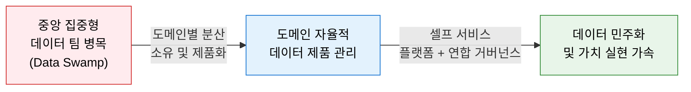
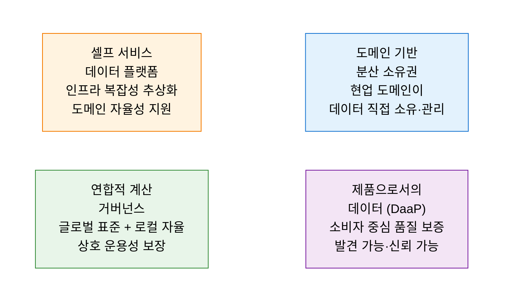
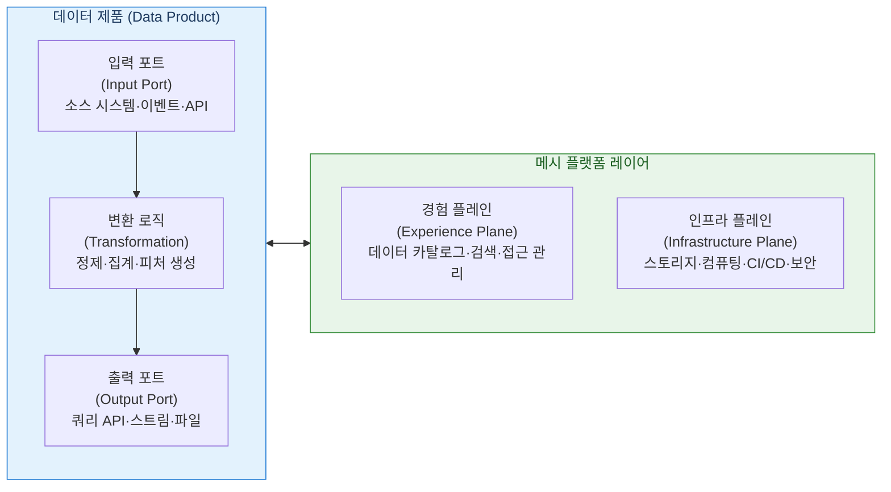

# Data Mesh
**Decentralized Data Architecture**

## 1. 중앙 집중형 데이터 관리의 병목을 극복하는 도메인 분산 데이터 아키텍처, 데이터 메시의 개요

**정의**: 데이터를 중앙의 단일 팀이 관리하는 대신, 각 비즈니스 도메인 팀이 자신의 데이터를 직접 소유·관리하고 **데이터 제품(Data Product)** 으로 서비스화하여, 셀프 서비스 플랫폼과 연합 거버넌스 위에서 전사 데이터를 운영하는 탈중앙화 데이터 아키텍처.

**특징**:
- **도메인 주도 설계(DDD)** 원칙을 데이터 관리에 적용하여 비즈니스 현실을 데이터 구조에 반영.
- 중앙 데이터 팀의 병목 없이 도메인 팀이 자율적으로 데이터를 생산·소비.
- 4대 원칙(도메인 소유권·데이터 제품·셀프 서비스·연합 거버넌스)을 기반으로 구현.

---

## 2. 데이터 메시의 핵심 구성 체계

### 가. 4대 핵심 원칙

| 원칙 | 핵심 내용 | 기존 중앙 집중형과의 차이 |
|---|---|---|
| **도메인 소유권** | 데이터를 가장 잘 아는 현업 부서가 소유·관리·책임 | 중앙 데이터 팀 → 도메인 팀으로 책임 이전 |
| **Data as a Product** | 데이터를 내부 소비자를 위한 제품처럼 개발·배포·유지 | 파이프라인 산출물 → 발견·신뢰·사용 가능한 제품 |
| **Self-service Platform** | 도메인 팀이 기술 지식 없이도 데이터 인프라 활용 | 중앙 엔지니어 의존 → 플랫폼 추상화로 자율화 |
| **연합 거버넌스** | 전사 공통 표준은 유지하되 도메인 자율성 보장 | 중앙 통제 → 표준화된 규칙 기반 자율 거버넌스 |

---

### 나. 데이터 제품 아키텍처

| 구성 요소 | 역할 | 핵심 기술 |
|---|---|---|
| **입력 포트** | 소스 시스템·이벤트·타 데이터 제품으로부터 데이터 수신 | Kafka, CDC, REST API |
| **변환 로직** | 도메인 비즈니스 규칙에 따른 정제·집계·피처 생성 | dbt, Spark, SQL |
| **출력 포트** | 소비자가 접근하는 인터페이스 (쿼리·스트림·파일) | REST API, Snowflake, S3 |
| **경험 플레인** | 데이터 제품의 검색·발견·접근 관리 지원 | Datahub, Collibra, Apache Atlas |
| **인프라 플레인** | 도메인 팀의 데이터 제품 구축·배포를 위한 공통 인프라 | Terraform, Kubernetes, Airflow |

---

## 3. 데이터 메시 도입의 기대효과 및 활용 방안

| 구분 | 주요 기대효과 | 활용 및 실무 적용 방안 |
|---|---|---|
| **확장성** | 도메인 수에 비례한 데이터 처리 역량 증가 | 도메인별 독립 데이터 제품 팀 구성 및 순차적 도입 |
| **가치 실현 속도** | 중앙 팀 의존 없이 신속한 데이터 분석 | 현업 주도의 셀프 서비스 분석 환경 구축 |
| **데이터 품질** | 소스 시스템 전문가의 직접 데이터 관리 | SLA 기반 데이터 제품 품질 지표(freshness·completeness) 운영 |
| **AI·ML 가속** | 고품질 도메인 데이터 제품 기반 피처 스토어 구성 | 데이터 제품을 ML 피처 파이프라인의 입력으로 활용 |
