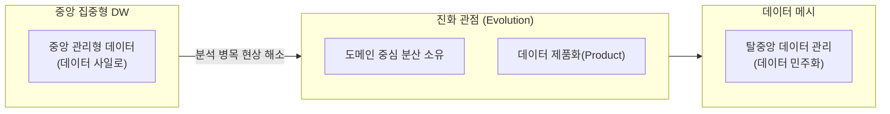

# Data Mesh
**Decentralized Data Architecture**

## 1. 중앙 집중형의 한계를 넘는 데이터 아키텍처, 데이터 메시의 개요

**개념**: 데이터를 중앙의 단일 팀이 관리하는 대신, 각 비즈니스 도메인 팀이 자신의 데이터를 직접 관리하고 서비스로 제공하는 탈중앙화된 데이터 아키텍처 및 거버넌스 모델.

**특징**: **도메인 중심(Domain-driven)** 설계, 데이터를 제품(Data as a Product)으로 취급, 셀프 서비스 데이터 플랫폼 기반 인프라 공유.

---

## 2. 데이터 메시의 4대 핵심 원칙 및 아키텍처

### 나. 데이터 메시를 위한 진화 관점



| 원칙 | 상세 설명 | 비고 |
|---|---|---|
| **도메인 소유권** | 데이터를 가장 잘 아는 현업 부서가 직접 관리 | 중앙 집중형 병목 해소 |
| **Data as a Product** | 데이터 소비자를 고객으로 간주하여 품질 보증 | 데이터 활용도 극대화 |
| **Self-service Platform** | 데이터 엔지니어링 역량의 공통 플랫폼화 | 기술 장벽 완화 |
| **연합 거버넌스** | 표준화된 인터페이스 및 상호 운용성 규정 | 파편화 방지 |

---

### 나. 데이터 메시 아키텍처 레이어

```mermaid
flowchart TD
  DataMeshLayer --> Node4[메시 익스피리언스]
  Node4 --> Node6[데이터 카탈로그, 검색, 권한 관리]
  DataMeshLayer --> Node4[데이터 프로덕트]
  Node4 --> API[데이터 쿼리 API, 스트림, 변환 로직]
  DataMeshLayer --> Node4[유틸리티 레이어]
  Node4 --> CICD[스토리지, 컴퓨팅, CI/CD, 보안 정책]
  DataMeshLayer --> Node0[```]
```"

| 구성 요소 | 역할 | 관련 기술 예시 |
|---|---|---|
| **Data Product** | 도메인 데이터의 논리적 단위 | dbt, Snowflake, Spark |
| **Platform Services** | 도메인 팀이 사용하는 공통 도구 | Airflow, Terraform, Kubernetes |
| **Governance Engine** | 전사 데이터 규정 강제화 | Apache Atlas, Collibra |

---

## 3. 데이터 메시 도입의 기대효과 및 활용 전략

| 구분 | 주요 기대효과 | 활용 및 실무 적용 방안 |
|---|---|---|
| **확장성 확보** | 도메인 수에 비례한 데이터 처리 역량 증가 | 대규모 엔터프라이즈 환경의 데이터 늪(Data Swamp) 방지 |
| **가치 실현 속도** | 중앙 팀 거치지 않는 신속한 데이터 분석 | 현업 중심의 실시간 의사결정 및 AI 모델 개발 가속화 |
| **데이터 품질 개선** | 소스 시스템 전문가의 직접적 데이터 정제 | 책임 소재 명확화를 통한 고품질 데이터 자산 확보 |
