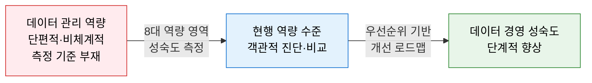
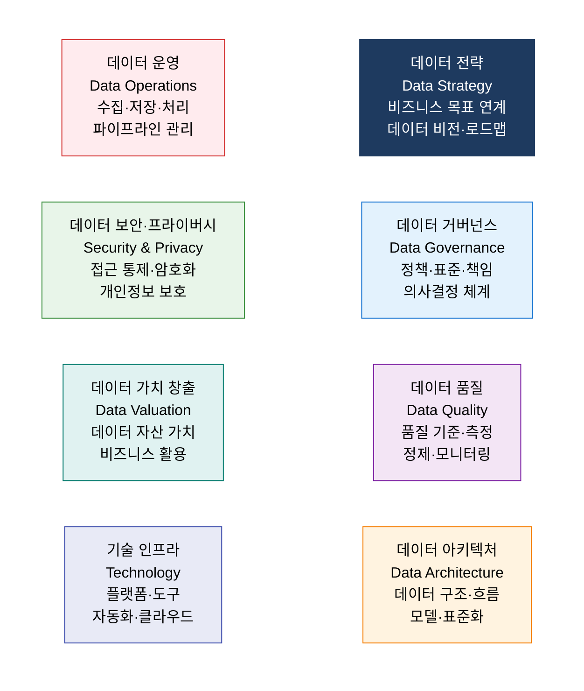
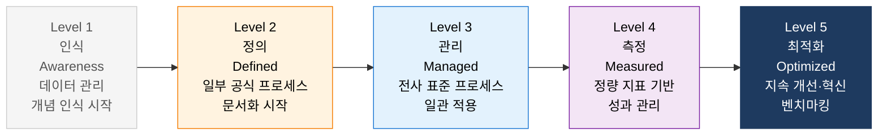
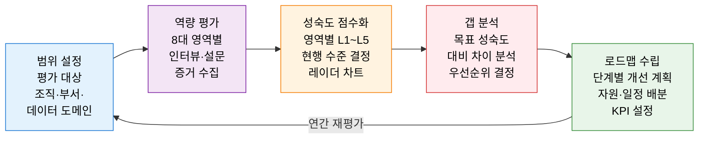

# DCAM
**Data Management Capability Assessment Model — 데이터 관리 역량 평가 모델**

## 1. 데이터 관리 역량을 8대 영역으로 측정하는 성숙도 진단 표준, DCAM의 개요

**정의**: EDM Council(Enterprise Data Management Council)이 개발한 데이터 관리 역량 평가 프레임워크로, 조직의 데이터 관리 프로그램을 **8대 역량 영역(Capability Domain)** 과 37개 역량 구성 요소로 체계화하여 현재 수준을 측정·비교하고 목표 성숙도 달성을 위한 로드맵을 제시하는 데이터 거버넌스 표준 모델.

**특징**:
- **업계 벤치마킹**: 금융·보험·에너지 등 주요 산업의 데이터 관리 성숙도를 동일 기준으로 비교 가능.
- DAMA-DMBOK가 **무엇을(What)** 관리해야 하는지 지식 체계라면, DCAM은 **얼마나 잘(How Well)** 하고 있는지 성숙도 측정에 특화.
- Basel III·BCBS 239 등 금융 규제의 데이터 품질·거버넌스 요건 충족을 위한 평가 기준으로 광범위 활용.

---

## 2. DCAM의 핵심 구성 체계

### 가. DCAM 8대 역량 영역

**8대 역량 영역 상세**

| 영역 | 핵심 역량 요소 | 주요 산출물 |
|---|---|---|
| **1. 데이터 전략** | 비즈니스 목표 연계 데이터 전략·비전·로드맵 수립 | 데이터 전략서, 투자 계획, 성과 지표 |
| **2. 데이터 거버넌스** | 데이터 오너십·스튜어드십·정책·의사결정 체계 | 거버넌스 조직도, 정책서, 역할 기술서 |
| **3. 데이터 품질** | 품질 기준 정의·측정·모니터링·정제 프로세스 | 데이터 품질 지표, 품질 보고서 |
| **4. 데이터 아키텍처** | 개념·논리·물리 모델, 메타데이터, 마스터 데이터 | 데이터 모델, 카탈로그, 아키텍처 문서 |
| **5. 데이터 운영** | 데이터 수집·통합·저장·배포 파이프라인 | 데이터 흐름도, SLA, 운영 절차서 |
| **6. 데이터 보안·프라이버시** | 접근 제어·분류·암호화·개인정보 보호 | 보안 정책, 분류 체계, 접근 권한 매트릭스 |
| **7. 데이터 가치 창출** | 데이터 자산 가치 측정·비즈니스 활용·ROI 분석 | 데이터 자산 목록, 가치 평가 보고서 |
| **8. 기술 인프라** | 데이터 플랫폼·도구·자동화·클라우드 아키텍처 | 기술 로드맵, 플랫폼 구성도 |

---

### 나. 성숙도 수준 평가 및 개선 로드맵

**DCAM 평가 절차**

**DCAM vs DAMA-DMBOK 비교**

| 비교 항목 | DCAM | DAMA-DMBOK |
|---|---|---|
| **개발 기관** | EDM Council | DAMA International |
| **초점** | 역량 성숙도 측정·벤치마킹 | 데이터 관리 지식 체계·실무 가이드 |
| **접근 방식** | 정량적 성숙도 평가 (Level 1~5) | 11개 지식 영역 실무 지침 |
| **활용 목적** | 현재 역량 진단·업계 비교 | 데이터 관리 방법론·교육 |
| **규제 연계** | BCBS 239·Basel III 금융 규제 대응 | 범용 데이터 관리 표준 |
| **상호 보완** | DCAM으로 진단 → DMBOK으로 개선 방법 찾기 ||

---

## 3. DCAM 도입의 기대효과 및 활용 방안

| 구분 | 주요 기대효과 | 활용 및 실무 적용 방안 |
|---|---|---|
| **객관적 진단** | 업계 평균 대비 데이터 관리 역량 수준 정량 파악 | 연 1회 DCAM 평가로 8대 영역별 성숙도 추이 추적 |
| **규제 대응** | BCBS 239·개인정보 보호법 등 데이터 규제 준수 근거 | 금융 데이터 품질·거버넌스 규제 요건을 DCAM 영역으로 매핑 |
| **투자 우선순위** | 성숙도 낮은 영역에 데이터 투자 집중 근거 확보 | 레이더 차트로 약점 영역 시각화 후 경영진 투자 설득 |
| **AI·분석 기반** | 데이터 거버넌스·품질 성숙도 향상으로 AI 모델 신뢰도 향상 | DCAM Level 3 이상 달성을 AI 도입 전제 조건으로 설정 |
