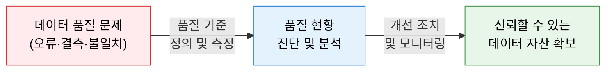
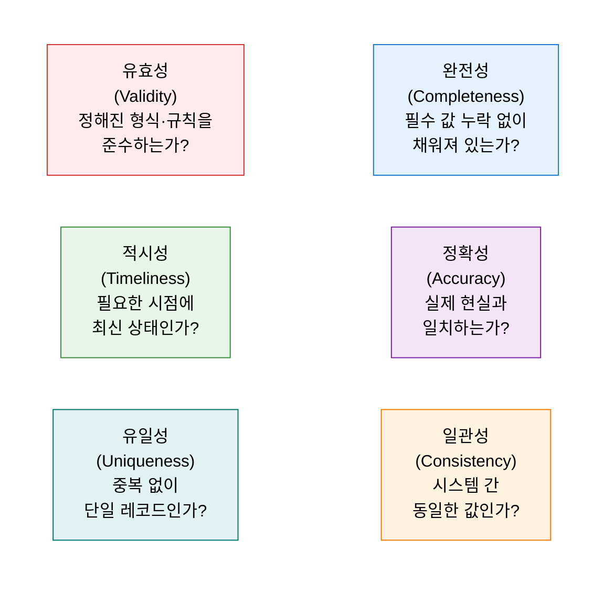
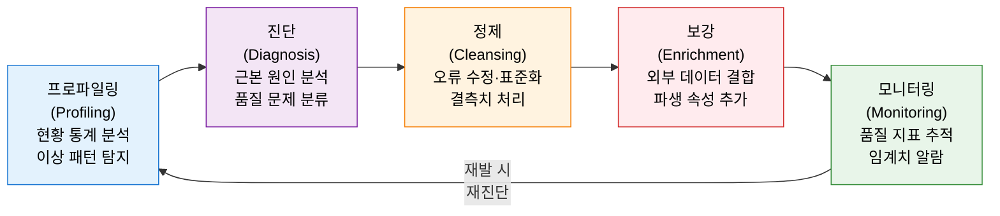

# 데이터 품질 관리 (DQC)
**Data Quality Management**

## 1. 신뢰할 수 있는 데이터를 지속적으로 확보하기 위한 품질 진단·개선 체계, DQC의 개요

**개념**: 조직이 보유한 정형·비정형 데이터의 품질을 완전성, 정확성, 일관성, 유효성 등의 기준으로 측정·진단하고, 발견된 품질 문제를 체계적으로 개선·모니터링하는 데이터 관리 체계.

**특징**:
- 데이터 품질을 **6대 품질 차원**(완전성·정확성·일관성·유효성·적시성·유일성)으로 정의하여 측정.
- 정형 데이터(DB·DW)뿐 아니라 비정형 데이터(텍스트·이미지·로그)까지 포괄하는 통합 품질 관리.
- 사후 정제(Cleansing) 중심에서 **사전 예방(Prevention)** 과 **지속 모니터링** 중심으로 전환.

---

## 2. DQC의 핵심 구성 체계

### 가. 정형/비정형 데이터 품질

| 구분 | 정형 데이터 품질 이슈 | 비정형 데이터 품질 이슈 |
|---|---|---|
| **완전성** | 필수 컬럼 NULL 값, 레코드 누락 | 텍스트 공백, 이미지 손상, 로그 누락 |
| **정확성** | 잘못된 코드값, 날짜 오류 | 오탈자, 라벨링 오류, 센서 이상값 |
| **일관성** | 시스템 간 코드 불일치, 단위 혼용 | 언어·표현 방식 불일치, 중복 문서 |
| **유효성** | 형식 위반(전화번호, 이메일) | 허용되지 않은 문자, 형식 미준수 |
| **적시성** | 지연된 배치 적재, 만료 데이터 | 오래된 콘텐츠, 실시간 피드 지연 |
| **유일성** | 중복 키, 중복 고객 레코드 | 동일 문서 중복 저장, 이미지 중복 |

---

### 나. 품질 진단 및 개선 프로세스

| 단계 | 주요 활동 | 핵심 도구·기법 |
|---|---|---|
| **프로파일링** | 데이터 분포·형식·패턴 통계 분석, 이상 징후 탐지 | SQL 통계 쿼리, Talend, Informatica DQ |
| **진단** | 품질 문제의 원인 분류(업무 규칙 위반·시스템 오류·입력 오류) | 품질 오류 분류 체계, 근본 원인 분석(RCA) |
| **정제** | 오류 데이터 수정, 표준화, 결측치 대체, 중복 제거 | Match & Merge, 규칙 기반 정제, ML 기반 보정 |
| **보강** | 외부 기준 데이터 결합, 파생 속성 생성, 메타데이터 추가 | 참조 데이터 매핑, MDM 연계 |
| **모니터링** | 품질 지표 대시보드 운영, 임계치 초과 시 알람·자동 조치 | Great Expectations, dbt tests, Grafana |

---

## 3. DQC 도입의 기대효과 및 활용 방안

| 구분 | 주요 기대효과 | 활용 및 실무 적용 방안 |
|---|---|---|
| **의사결정 신뢰도** | 정확한 데이터 기반의 경영 판단 오류 감소 | KPI 산출 기준 데이터 품질 등급 도입 및 이슈 추적 |
| **AI 모델 품질** | 훈련 데이터 품질 향상으로 모델 정확도 제고 | 학습 데이터 파이프라인에 DQ 게이트 적용 |
| **규제 준수** | 개인정보 보호법·GDPR 데이터 정확성 의무 이행 | 데이터 품질 보고서를 감사 증빙 자료로 활용 |
| **운영 효율** | 오류 데이터로 인한 재처리·장애 비용 절감 | 품질 문제 조기 탐지로 다운스트림 시스템 영향 최소화 |
