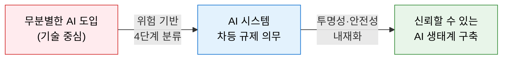
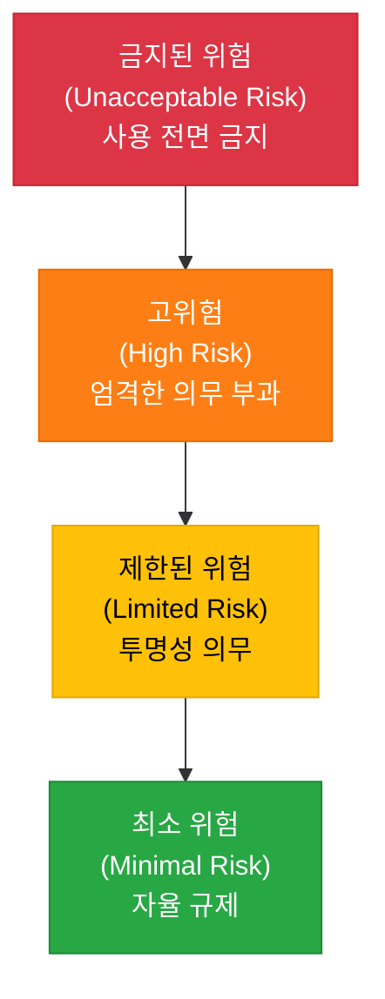
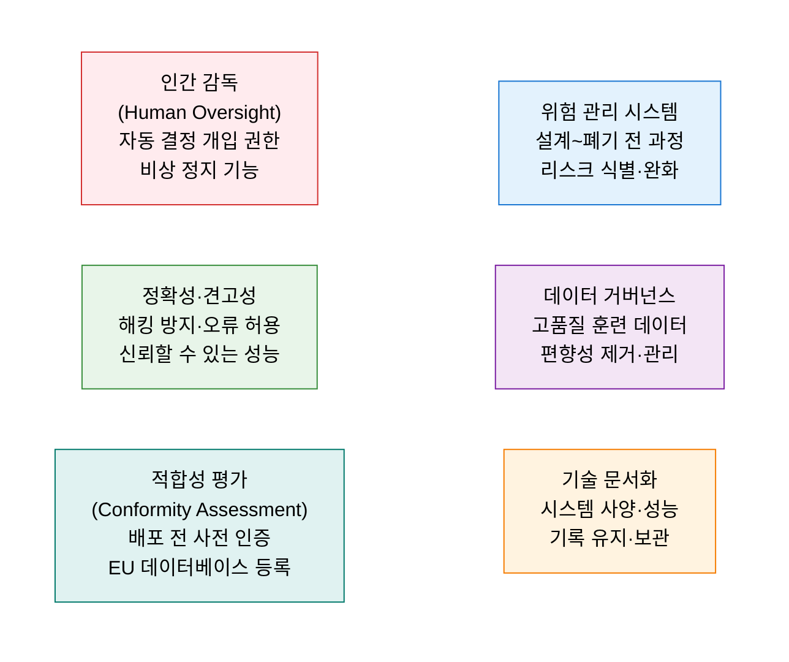

# EU AI Act
**EU Artificial Intelligence Act**

## 1. 세계 최초의 포괄적 AI 규제 법안, EU AI Act의 개요

**개념**: AI 시스템이 가져올 수 있는 위험을 체계적으로 분류하고, 위험 수준에 따라 차등적 의무를 부과하여 안전하고 투명한 AI 도입을 보장하기 위해 유럽연합(EU)이 2024년 제정한 **세계 최초의 포괄적 AI 규제 법안**.

**특징**:
- **위험 기반 접근법(Risk-based Approach)**: AI를 금지·고위험·제한·최소 위험의 4단계로 분류하여 비례적 규제 적용.
- **역외 적용(Extraterritoriality)**: EU 시민에게 AI 서비스를 제공하는 전 세계 기업에 적용되는 **브뤼셀 효과**.
- GDPR에 이어 AI 분야에서도 글로벌 규제 표준화의 기준점으로 작용.

---

## 2. EU AI Act의 핵심 구성 체계

### 가. 위험 기반 4단계 분류

| 위험 수준 | 규제 강도 | 적용 대상 사례 | 위반 시 과징금 |
|---|---|---|---|
| **금지된 위험** | 완전 금지 | 실시간 원격 생체 인식, 사회적 신용 평가, 행동 조작 | 최대 3,500만 € 또는 연매출 7% |
| **고위험** | 강한 규제 | 채용 심사, 대출 승인, 의료 진단, 중요 인프라 운영 | 최대 1,500만 € 또는 연매출 3% |
| **제한된 위험** | 투명성 의무 | 챗봇, 딥페이크, 생성형 AI 콘텐츠 (AI 생성 고지 의무) | 최대 750만 € 또는 연매출 1% |
| **최소 위험** | 자율 준수 | AI 게임, 스팸 필터, 재고 관리 AI | 규정 없음 |

---

### 나. 고위험 AI 준수 요건 및 기업 대응

| 준수 요건 | 핵심 내용 | 실무 적용 방안 |
|---|---|---|
| **위험 관리 시스템** | AI 생애주기 전반의 위험 식별·평가·완화 체계 | AI 위험 레지스트리 운영 및 정기 위험 평가 수행 |
| **데이터 거버넌스** | 훈련·검증 데이터의 품질·대표성·편향성 관리 | 데이터 품질 파이프라인 및 편향 감사 자동화 |
| **기술 문서화** | 시스템 설계·성능·한계에 관한 상세 문서 유지 | 모델 카드(Model Card), 데이터 시트 작성·관리 |
| **인간 감독** | AI 자동 결정에 대한 인간의 검토·개입·거부 권한 | Human-in-the-Loop 설계 및 의사결정 로그 보관 |
| **적합성 평가** | 배포 전 제3자 인증 또는 자체 평가 수행 후 등록 | CE 마킹 절차 준용, EU AI 데이터베이스 등록 |

---

## 3. EU AI Act 대응의 기대효과 및 활용 방안

| 구분 | 주요 기대효과 | 활용 및 실무 적용 방안 |
|---|---|---|
| **글로벌 표준 선점** | GDPR처럼 EU AI Act가 전 세계 AI 규제 기준으로 확산 | 선제적 준수로 글로벌 시장 진출 시 규제 대응 비용 최소화 |
| **리스크 관리** | 사전 위험 분류로 규제 위반 및 과징금 리스크 차단 | AI 시스템 인벤토리 구축 및 위험 등급 분류 체계 수립 |
| **신뢰도 향상** | 투명성·설명 가능성 확보로 고객·이해관계자 신뢰 제고 | XAI 도입 및 AI 영향 평가(AIIA) 결과 공개 |
| **생성형 AI 대응** | GPAI(범용 AI) 규제 준수로 LLM 기반 서비스 안전화 | 저작권 준수 데이터 사용, AI 생성 콘텐츠 라벨링 의무화 |
