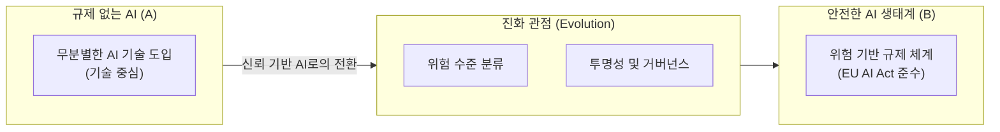

# EU AI Act
**EU Artificial Intelligence Act**

## 1. 세계 최초의 포괄적 AI 규제, EU AI Act의 개요

**개념**: AI 시스템이 가져올 수 있는 위험을 체계적으로 분류하고, 안전하고 투명한 AI 도입을 위해 유럽연합(EU)이 제정한 세계 최초의 인공지능 법안.

**특징**: **위험 기반 접근법(Risk-based Approach)** 을 적용하여 AI 시스템을 4단계 위험군으로 분류하고, 위험 수준에 따른 차등적 의무 부과.

---

### 나. 위험 기반 규제 체계 (진화 관점)



| 위험 수준 | 규제 강도 | 해당 사례 |
|---|---|---|
| **금지된 위험** | 완전 금지 | 행동 조작, 사회적 신용 평가, 실시간 생체 인식 |
| **고위험** | 강한 규제 | 채용 심사, 대출 승인, 교육 평가, 중요 인프라 운영 |
| **제한된 위험** | 투명성 확보 | 생성형 AI(챗봇), 딥페이크(AI 생성물 고지 의무) |
| **최소 위험** | 자율 준수 | AI 기반 비디오 게임, 스팸 필터링 시스템 |

---

### 나. 고위험 AI 시스템에 대한 주요 의무 사항

```mermaid
flowchart TD
  AIn --> Node4[리스크 관리 시스템]
  Node4 --> Node6[설계부터 폐기까지 전 과정 관리]
  AIn --> Node4[데이터 거버넌스]
  Node4 --> Node6[고품질 훈련 데이터 및 편향성 제거]
  AIn --> Node4[기술 문서화]
  Node4 --> Node6[시스템 사양 및 성능 기록 유지]
  AIn --> HumanOversight[인간적 감독 (Human Oversight)]
  HumanOversight --> Node6[자동화된 결정에 대한 인간의 개입]
  AIn --> Node4[정확성 및 보안]
  Node4 --> Node6[해킹 방지 및 신뢰할 수 있는 성능]
  AIn --> Node0[```]
```"

---

## 3. EU AI Act 도입에 따른 기업의 영향 및 대응 방안

| 구분 | 주요 영향 | 기업의 대응 전략 |
|---|---|---|
| **글로벌 스탠다드** | '브뤼셀 효과' 발생 | GDPR과 마찬가지로 전 세계 AI 규제의 표준으로 작동 |
| **컴플라이언스** | 위반 시 막대한 과징금 | AI 윤리 가이드라인 수립 및 내부 통제 시스템 구축 |
| **기술적 과제** | 설명 가능한 AI(XAI) 요구 | AI 모델의 결정 과정을 추적하고 설명할 수 있는 기술 확보 |
| **생성형 AI** | 범용 AI(GPAI) 규제 | 기초 모델 개발사의 투명성 보고 및 저작권 준수 강화 |
