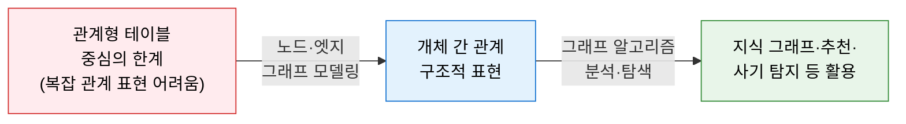
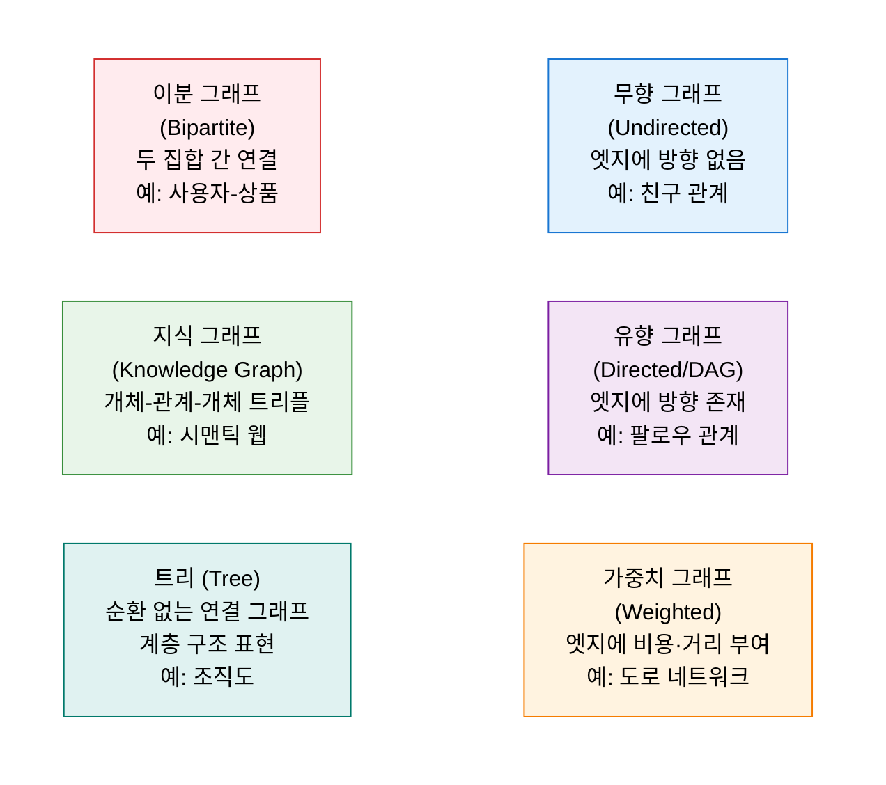
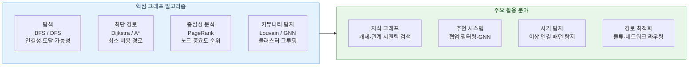

# Graph Theory Framework
**그래프 이론 — 관계 중심의 데이터 분석 프레임워크**

## 1. 개체 간의 복잡한 관계를 노드와 엣지로 모델링하여 구조적 패턴을 분석하는 프레임워크, 그래프 이론의 개요

**개념**: 개체(Entity)를 **노드(Node)**, 개체 간의 관계를 **엣지(Edge)** 로 표현하여 복잡한 연결 구조를 수학적으로 분석하는 이론 체계로, 지식 그래프·소셜 네트워크·추천 시스템·경로 최적화 등 다양한 데이터 분석 분야에 적용되는 기반 프레임워크.

**특징**:
- 관계형 데이터베이스로 표현이 어려운 **복잡한 다대다 관계**를 직관적으로 모델링.
- 방향성(유향/무향), 가중치(유가중/무가중) 등 다양한 그래프 유형으로 실세계 문제 표현.
- BFS·DFS·Dijkstra 등 **그래프 알고리즘**을 통해 최단 경로·중심성·클러스터 분석 가능.

---

## 2. 그래프 이론의 핵심 구성 체계

### 가. 그래프 구성 요소 및 유형

**핵심 그래프 용어**

| 용어 | 정의 | 데이터 분석 의미 |
|---|---|---|
| **노드 (Node/Vertex)** | 그래프의 개체(사람·제품·문서 등) | 분석 대상 엔티티 |
| **엣지 (Edge/Arc)** | 노드 간의 관계(연결·상호작용) | 개체 간 관계 표현 |
| **차수 (Degree)** | 하나의 노드에 연결된 엣지 수 | 영향력·연결성 지표 |
| **경로 (Path)** | 노드를 순서대로 연결한 엣지의 시퀀스 | 최단 경로·도달 가능성 분석 |
| **중심성 (Centrality)** | 그래프에서 노드의 중요도 측정 | 핵심 허브·영향력 노드 탐지 |
| **클러스터 (Cluster)** | 상호 연결이 밀집된 노드 집합 | 커뮤니티·그룹 탐지 |

---

### 나. 핵심 알고리즘 및 데이터 활용

| 알고리즘 | 목적 | 시간 복잡도 | 대표 활용 |
|---|---|---|---|
| **BFS (너비 우선 탐색)** | 시작 노드에서 최단 홉(hop) 경로 탐색 | O(V+E) | SNS 친구 추천, 연결 가능 경로 탐색 |
| **DFS (깊이 우선 탐색)** | 그래프 전체 순회 및 사이클 탐지 | O(V+E) | 위상 정렬, 연결 요소 분석 |
| **Dijkstra** | 가중 그래프에서 최소 비용 최단 경로 | O((V+E) log V) | 네비게이션, 물류 경로 최적화 |
| **PageRank** | 엣지 기반 노드 중요도(영향력) 순위 산출 | O(V+E) × 반복 | 검색 엔진 랭킹, 핵심 노드 탐지 |
| **GNN (그래프 신경망)** | 그래프 구조를 학습하는 딥러닝 모델 | 모델 크기 의존 | 분자 구조 예측, 추천·사기 탐지 |

---

## 3. 그래프 이론 프레임워크 적용의 기대효과 및 활용 방안

| 구분 | 주요 기대효과 | 활용 및 실무 적용 방안 |
|---|---|---|
| **관계 분석** | 관계형 DB로 표현 불가한 복잡 연결 구조 분석 | 공급망·조직·소셜 네트워크의 핵심 허브·병목 탐지 |
| **AI 품질 향상** | 지식 그래프 연계로 LLM·RAG 정확도 향상 | 도메인 온톨로지 기반 지식 그래프 구축 및 AI 추론 연계 |
| **사기·이상 탐지** | 비정상적 관계 패턴 실시간 탐지 | 금융 거래 네트워크의 사기 링크 탐지, 이상 커뮤니티 감지 |
| **추천·개인화** | 사용자-아이템 이분 그래프 기반 협업 필터링 | GNN 기반 추천 모델로 콜드 스타트 문제 완화 |
