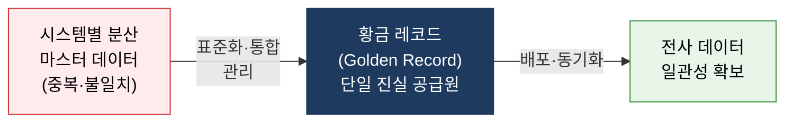
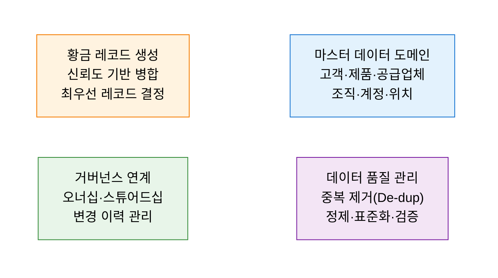
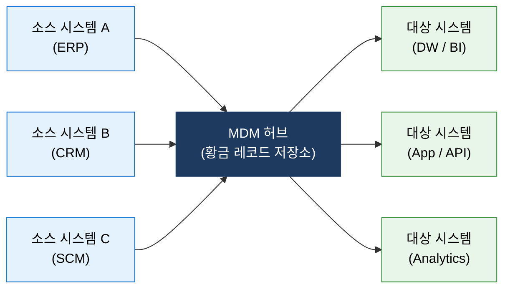

# MDM
**Master Data Management**

## 1. 분산된 핵심 데이터를 하나의 황금 레코드로 통합·배포하는 체계, MDM의 개요

**개념**: 고객, 제품, 공급업체, 조직 등 기업의 핵심 공통 데이터(마스터 데이터)를 중앙에서 표준화하고, **황금 레코드(Golden Record)** 를 생성하여 전사 시스템에 일관되게 배포·관리하는 데이터 관리 체계.

**특징**:
- 마스터 데이터는 거래 데이터(Transaction Data)와 달리 변경 빈도가 낮고 전사 공유 범위가 넓은 **핵심 참조 데이터**.
- 분산된 시스템 간 데이터 불일치(Data Inconsistency) 문제를 해결하는 **단일 진실 공급원(SSOT: Single Source of Truth)** 역할.
- 고객 360도 뷰, 제품 정보 관리(PIM), 공급망 데이터 통합 등 다양한 비즈니스 도메인에 적용.

---

## 2. MDM의 핵심 구성 체계

### 가. 마스터 데이터 관리

| 관리 영역 | 주요 내용 | 핵심 기법 |
|---|---|---|
| **마스터 데이터 도메인** | 전사 공통으로 사용되는 핵심 참조 데이터 식별 및 분류 | 도메인 정의서, 표준 데이터 모델 수립 |
| **데이터 품질 관리** | 중복 탐지·정제·표준화를 통한 신뢰할 수 있는 데이터 확보 | 매칭·병합(Match & Merge) 알고리즘 |
| **황금 레코드 생성** | 복수 소스 데이터를 신뢰도 기반으로 통합한 단일 레코드 생성 | Survivorship Rule(생존 규칙) 적용 |
| **거버넌스 연계** | 마스터 데이터의 소유권·변경 이력·승인 절차 관리 | 데이터 스튜어드십 프로세스 운영 |

---

### 나. 데이터 통합 및 배포 체계

| 구현 방식 | 설명 | 특징 및 적용 |
|---|---|---|
| **Registry Style** | MDM 시스템이 소스 데이터의 위치만 참조·관리 | 침습적 변경 최소, 기존 시스템 유지 가능 |
| **Consolidation Style** | 소스 데이터를 MDM 허브로 통합하여 분석용 황금 레코드 생성 | 보고·분석 중심, 소스 시스템에 배포 안 함 |
| **Coexistence Style** | 황금 레코드를 MDM 허브에서 관리하되 소스에도 동기화 | 균형적 접근, 대부분의 엔터프라이즈 적용 |
| **Centralized Style** | MDM 허브가 마스터 데이터의 유일한 저장·관리 시스템 | 강력한 통제, 구축 비용 높음 |

---

## 3. MDM 도입의 기대효과 및 활용 방안

| 구분 | 주요 기대효과 | 활용 및 실무 적용 방안 |
|---|---|---|
| **데이터 일관성** | 전사 핵심 데이터의 단일 진실 공급원 확보 | ERP·CRM·SCM 간 고객·제품 데이터 불일치 해소 |
| **분석 품질 향상** | 신뢰도 높은 마스터 데이터 기반 경영 의사결정 | DW·BI 플랫폼에 정제된 황금 레코드 공급 |
| **운영 효율화** | 중복 데이터 관리 비용 및 오류 처리 감소 | 고객 360도 뷰 구축으로 마케팅·서비스 품질 개선 |
| **규제 준수** | 데이터 계보 추적 및 개인정보 관리 강화 | GDPR·개인정보 보호법 대응을 위한 데이터 이력 관리 |
