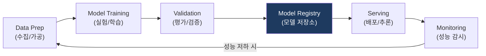

# MLOps
**Machine Learning Operations**

## 1. AI 모델의 생애주기 관리 최적화, MLOps의 개요

**정의**: 머신러닝 모델의 개발(ML)과 운영(Ops)을 통합하여, 모델의 훈련, 배포, 모니터링 전 과정을 자동화하고 신뢰성을 확보하는 방법론 및 시스템.

**특징**:  
 **(지속적 학습)** Continuous Training(CT)으로 새 데이터를 반영한 모델 재학습을 자동화.  
 **(버전 관리)** 데이터·피처·모델·코드를 모두 버전 관리하여 재현성과 거버넌스를 확보.  
 **(드리프트 감지)** 모델 성능 드리프트를 실시간 모니터링하여 품질 저하 시 자동 재학습 트리거.  

---

## 2. MLOps의 파이프라인 및 성숙도 모델

### 가. MLOps 핵심 워크플로우 (End-to-End Pipeline)

| 단계 | 주요 활동 | 핵심 도구 (예시) |
|---|---|---|
| **Data Prep** | 피처 엔지니어링, 데이터 버전 관리 | Feast, DVC, Spark |
| **Training** | 하이퍼파라미터 튜닝, 실험 추적 | MLflow, Kubeflow, WandB |
| **Serving** | API 형태의 모델 배포 (Online/Batch) | Seldon Core, TF Serving, BentoML |
| **Monitoring** | 데이터/모델 드리프트 감지 | Prometheus, Grafana, Evidently |

---

### 나. MLOps를 위한 진화 관점

| 비교 항목 | DevOps (SW) | MLOps (ML) |
|---|---|---|
| **핵심 자산** | 코드 (Code) | 코드 + 데이터 + 모델 |
| **버전 관리** | 소스 코드 버전 | 코드 + 하이퍼파라미터 + 데이터셋 버전 |
| **배포 성공 기준** | 빌드 성공 및 테스트 통과 | 정밀도(Precision), 재현율(Recall) 등 지표 통과 |
| **지속적 요소** | CI / CD | CI / CD / **CT (Continuous Training)** |

---

## 3. MLOps 도입의 기대효과 및 성공 전략

| 구분 | 주요 기대효과 | 활용 및 실무 적용 방안 |
|---|---|---|
| **운영 안정성** | AI 모델의 지속적 성능 유지 | 실시간 모니터링을 통한 모델 성능 하락 즉각 대응 |
| **생산성 향상** | 실험 속도 및 배포 주기 단축 | 모델 파이프라인 템플릿화를 통한 개발 효율화 |
| **거버넌스 강화** | 모델 변경 이력 및 추적성 확보 | AI 규제 대응을 위한 모델 생성 과정의 투명성 확보 |
| **가치 극대화** | AI 실험의 비즈니스 서비스화 성공률 제고 | PoC를 넘어 실제 운영 환경에서의 AI 가치 실현 |
