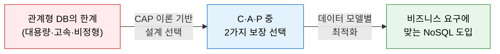
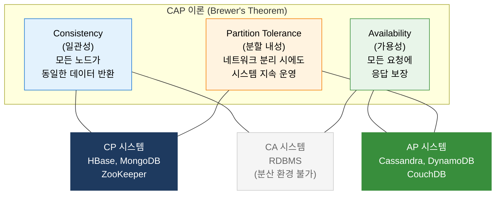
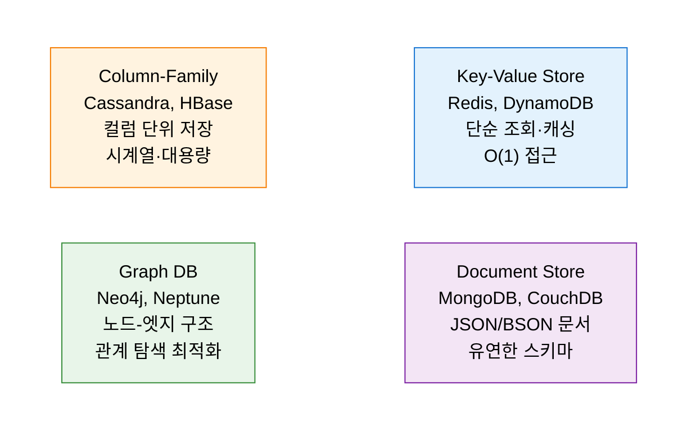

# NoSQL (CAP 이론)
**Non-Relational Database & CAP Theorem**

## 1. 분산 시스템의 세 가지 속성 간 균형을 정의하는 이론, NoSQL과 CAP 이론의 개요

**정의**: NoSQL은 관계형 데이터베이스(RDBMS)의 스키마 제약과 수직 확장 한계를 극복하기 위한 비관계형 데이터베이스의 총칭이며, **CAP 이론**은 분산 시스템에서 일관성(C), 가용성(A), 분할 내성(P)을 동시에 모두 만족할 수 없음을 증명한 이론.

**특징**:  
 **(CP·AP 선택)** CAP 이론에 따라 분산 NoSQL 시스템은 **CP(일관성+분할 내성)** 또는 **AP(가용성+분할 내성)** 중 하나를 선택.  
 **(유연성·확장성)** 유연한 스키마(Schema-less), 수평 확장(Scale-out), 고성능 읽기·쓰기 지원.  
 **(다양한 데이터 모델)** 키-값, 문서, 컬럼 패밀리, 그래프 등 데이터 특성에 따라 다양한 모델 선택 가능.  

---

## 2. NoSQL/CAP 이론의 핵심 구성 체계

### 가. Consistency, Availability, Partition Tolerance

| 속성 | 정의 | 분산 환경에서의 의미 |
|---|---|---|
| **C — Consistency** | 모든 노드가 동시에 동일한 데이터를 반환 | 쓰기 후 읽기 시 항상 최신 데이터 보장 |
| **A — Availability** | 모든 요청에 반드시 응답(최신 데이터가 아닐 수 있음) | 노드 장애 시에도 서비스 중단 없이 응답 |
| **P — Partition Tolerance** | 네트워크 분리(파티션) 발생 시에도 시스템 동작 | 실제 분산 환경에서 필수 — P는 포기 불가 |

**CAP 조합별 특성 비교**

| 조합 | 보장 속성 | 희생 속성 | 대표 시스템 | 적합 유스케이스 |
|---|---|---|---|---|
| **CP** | 일관성 + 분할 내성 | 가용성 | HBase, MongoDB, Redis | 금융 거래, 재고 관리 |
| **AP** | 가용성 + 분할 내성 | 일관성 | Cassandra, DynamoDB | SNS, IoT, 로그 수집 |
| **CA** | 일관성 + 가용성 | 분할 내성 | MySQL, PostgreSQL | 단일 서버 트랜잭션 |

---

### 나. 데이터 모델별 분류

| 모델 | 구조 | 강점 | 적합 사례 |
|---|---|---|---|
| **Key-Value** | 키-값 쌍의 단순 저장소 | 초고속 읽기·쓰기, 수평 확장 | 세션 관리, 캐싱, 장바구니 |
| **Document** | JSON/BSON 형태의 계층적 문서 | 유연한 스키마, 중첩 쿼리 | 상품 카탈로그, 콘텐츠 관리 |
| **Column-Family** | 로우·컬럼·타임스탬프 기반 저장 | 대용량 쓰기, 컬럼 압축 효율 | 시계열 데이터, 로그, IoT |
| **Graph** | 노드(엔티티)와 엣지(관계)의 그래프 | 복잡한 관계 탐색 최적화 | 추천 시스템, 소셜 네트워크, 사기 탐지 |

---

## 3. NoSQL/CAP 이론 적용의 기대효과 및 활용 방안

| 구분 | 주요 기대효과 | 활용 및 실무 적용 방안 |
|---|---|---|
| **확장성** | 수평 확장(Scale-out)으로 대용량 트래픽 대응 | 클라우드 환경에서 샤딩·복제를 통한 탄력적 인프라 구성 |
| **설계 적합성** | CAP 기반 데이터베이스 선택으로 요구사항 최적화 | 금융(CP) vs SNS·IoT(AP) 특성에 맞는 기술 선택 |
| **성능 최적화** | 데이터 모델별 특화된 읽기·쓰기 성능 확보 | 캐싱(Redis), 분석(Cassandra), 관계 탐색(Neo4j) 목적별 혼용 |
| **유연성** | 스키마리스 구조로 비정형 데이터 수용 | 마이크로서비스 아키텍처에서 서비스별 최적 DB 선택(Polyglot Persistence) |
