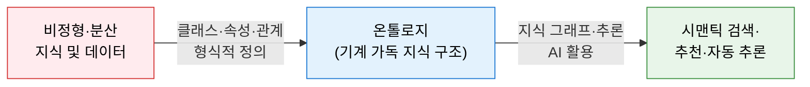
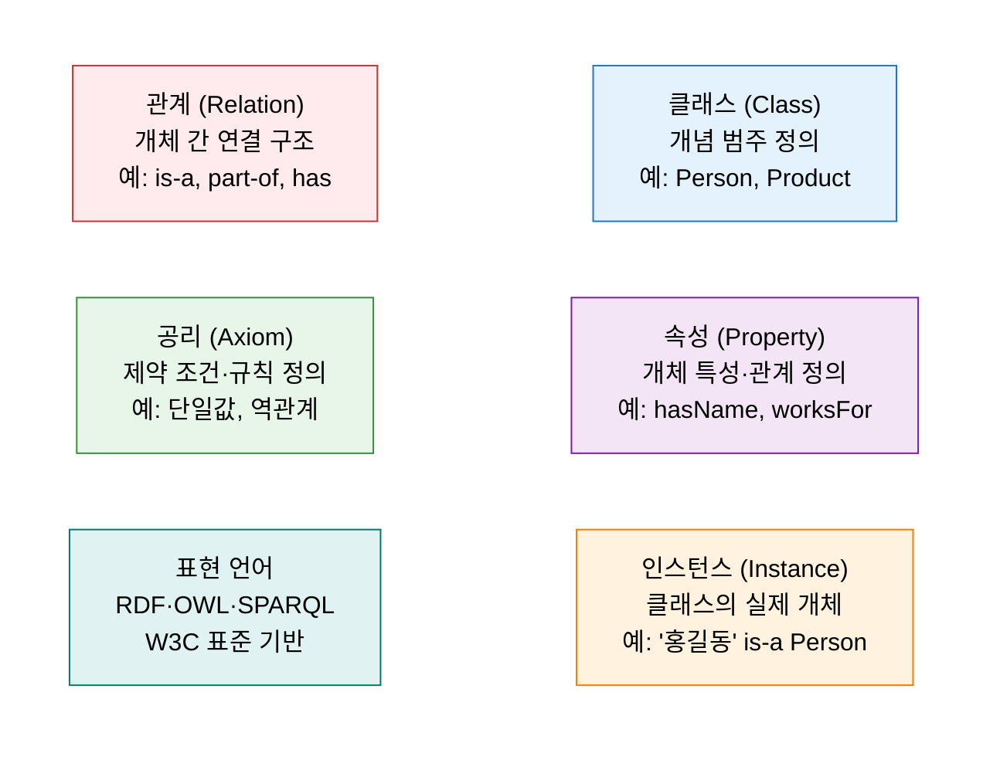
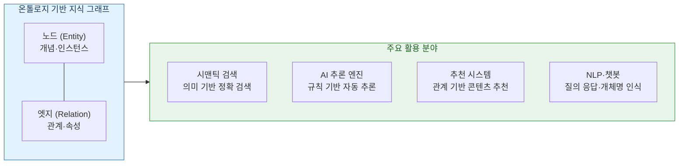

# Ontology Framework
**온톨로지 — 지식 표현 및 개념 구조화**

## 1. 개념·관계를 형식화하여 기계가 공유·추론하는 도메인 지식 체계, 온톨로지의 개요

**정의**: 특정 도메인의 개념(클래스)과 개념 간의 관계(속성·제약)를 형식적 언어로 정의하여, 사람과 시스템이 공유하고 재사용할 수 있는 **공식적이고 명시적인 지식 표현 체계**.

**특징**:
- 데이터의 의미(Semantics)를 기계가 이해할 수 있도록 **형식화(Formalization)** 하여 자동 추론 가능.
- RDF·OWL 등 W3C 표준 언어를 기반으로 **시맨틱 웹(Semantic Web)** 생태계와 연동.
- 지식 그래프(Knowledge Graph), NLP, AI 추론 엔진의 핵심 기반 구조로 활용.

---

## 2. 온톨로지의 핵심 구성 체계

### 가. 온톨로지 구성 요소

| 구성 요소 | 정의 | 예시 |
|---|---|---|
| **클래스 (Class)** | 공통 특성을 가진 개념의 집합(범주) | `Person`, `Organization`, `Product` |
| **속성 (Property)** | 클래스 간 또는 클래스-값 간의 관계 기술 | `hasName`, `worksFor`, `hasAge` |
| **인스턴스 (Instance)** | 클래스에 속하는 실제 개체(개별 사례) | `홍길동` is-a `Person` |
| **관계 (Relation)** | 개체 간의 의미적 연결 구조 | `is-a`(상속), `part-of`(부분), `has`(소유) |
| **공리 (Axiom)** | 지식 표현의 제약 조건 및 논리 규칙 | `Person`은 하나의 `birthDate`만 가짐 |
| **표현 언어** | 온톨로지를 형식화하는 W3C 표준 언어 | RDF(저장), OWL(표현), SPARQL(질의) |

**온톨로지 표현 언어 계층**

| 언어 | 역할 | 특징 |
|---|---|---|
| **RDF** | 자원 기술 프레임워크 (주어-술어-목적어 트리플) | 그래프 기반 데이터 모델의 기반 |
| **OWL** | 온톨로지 정의 언어 (클래스·속성·공리 표현) | 추론 가능한 풍부한 의미 표현 지원 |
| **SPARQL** | RDF 데이터 질의 언어 | SQL과 유사한 그래프 데이터 쿼리 |

---

### 나. 지식 그래프 및 AI 활용

| 활용 분야 | 적용 방식 | 대표 사례 |
|---|---|---|
| **지식 그래프** | 온톨로지를 기반으로 엔티티·관계 그래프 구축 | Google Knowledge Graph, DBpedia, Wikidata |
| **시맨틱 검색** | 키워드 매칭이 아닌 개념·의미 기반 검색 | 검색 엔진 Featured Snippet, 엔터프라이즈 검색 |
| **AI 추론** | OWL 규칙 기반의 자동 추론 및 신규 지식 도출 | 의료 진단 지원, 규정 준수 자동 검증 |
| **NLP·챗봇** | 개체명 인식(NER), 관계 추출, 질의 응답 | 도메인 특화 챗봇, 금융·법률 QA 시스템 |
| **추천 시스템** | 사용자-아이템 관계 그래프 기반 협업 필터링 | 콘텐츠 추천, 전문가 매칭, 제품 연관 추천 |

---

## 3. 온톨로지 프레임워크 도입의 기대효과 및 활용 방안

| 구분 | 주요 기대효과 | 활용 및 실무 적용 방안 |
|---|---|---|
| **지식 재사용** | 도메인 지식의 표준화·공유로 중복 구축 방지 | 기업 내 공통 온톨로지 수립 및 시스템 간 공유 |
| **AI 정확도** | 구조화된 지식 기반으로 AI 추론·NLP 품질 향상 | RAG(검색 증강 생성) 시스템에 지식 그래프 연계 |
| **데이터 통합** | 이기종 데이터 소스의 의미적 통합 | 전사 마스터 데이터와 온톨로지 연계로 데이터 패브릭 구현 |
| **자동 추론** | 명시적으로 정의되지 않은 새 지식 자동 도출 | 규정 준수 자동 검증, 공급망 이상 탐지 적용 |
