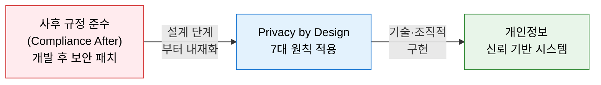
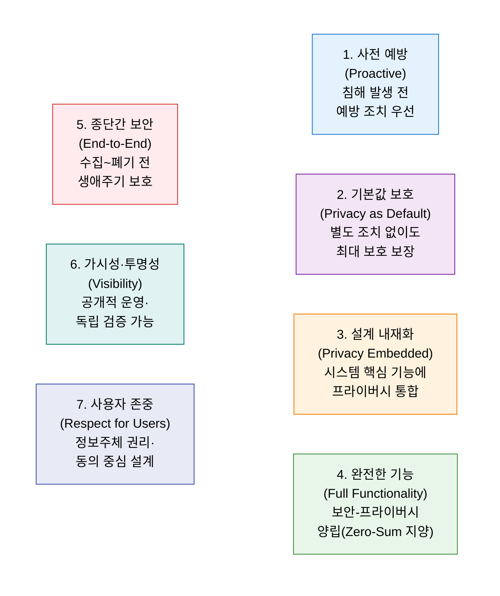
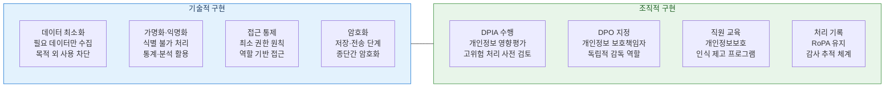

# Privacy by Design
**설계 단계부터 내재화하는 개인정보보호 프레임워크**

## 1. 설계 단계부터 개인정보보호를 내재화하는 선제적 프라이버시 원칙, Privacy by Design의 개요

**정의**: Ann Cavoukian 박사가 제안한 개인정보보호 접근 방식으로, 개인정보보호를 시스템·서비스·비즈니스 프로세스의 **설계 단계부터 기본값(Default)으로 내재화**하여 사후 조치가 아닌 사전 예방 중심의 프라이버시를 실현하는 프레임워크.

**특징**:  
 **(GDPR 법적 기반)** GDPR Article 25 "설계 및 기본 설정에 의한 데이터 보호"의 법적 기반이 된 개념.  
 **(양립 가능 가치)** 기능성(Functionality)과 프라이버시를 상충 관계가 아닌 **양립 가능한 가치**로 접근.  
 **(전사적 프레임워크)** 기술적 조치(암호화·익명화)와 조직적 조치(정책·교육)를 통합한 전사적 프레임워크.  

---

## 2. Privacy by Design의 핵심 구성 체계

### 가. 7대 설계 원칙

| 원칙 | 핵심 내용 | 적용 방안 |
|---|---|---|
| **1. 사전 예방** | 프라이버시 침해 위험을 사전에 식별하고 예방 | DPIA(개인정보 영향평가) 설계 단계 수행 |
| **2. 기본값 보호** | 사용자가 아무것도 하지 않아도 최대 보호 상태 | 수집 최소화·목적 제한을 기본 설정으로 구현 |
| **3. 설계 내재화** | 프라이버시를 추가 기능이 아닌 핵심 아키텍처에 포함 | Privacy Pattern 적용, 보안 코딩 가이드 준수 |
| **4. 완전한 기능** | 보안과 프라이버시를 Zero-Sum 관계로 보지 않음 | 암호화로 보안과 프라이버시를 동시에 달성 |
| **5. 종단간 보안** | 데이터 수집부터 폐기까지 전 생애주기 보호 | 데이터 생애주기 관리 정책 및 자동 파기 구현 |
| **6. 가시성·투명성** | 시스템 운영 방식을 공개하고 독립 검증 허용 | 개인정보 처리 방침 공개, 외부 감사 수용 |
| **7. 사용자 존중** | 정보주체의 권리·선택권·동의를 중심에 배치 | 동의 관리 플랫폼(CMP), 열람·삭제 요청 처리 |

---

### 나. 기술적·조직적 구현 방안

| 구현 영역 | 핵심 기법 | GDPR 연계 조항 |
|---|---|---|
| **데이터 최소화** | 수집 항목 최소화, 불필요 데이터 자동 파기 | Article 5(1)(c) — 개인정보 최소화 원칙 |
| **가명화·익명화** | 토큰화, 마스킹, k-익명성, 차분 프라이버시 | Article 4(5) — 가명처리 정의 |
| **동의 관리** | CMP(동의 관리 플랫폼), 세분화 동의, 철회 기능 | Article 7 — 동의 조건 |
| **DPIA** | 고위험 처리 활동 사전 영향평가 수행 | Article 35 — 개인정보 영향평가 |
| **DPO 지정** | 독립적 개인정보 보호책임자 임명 및 감독 | Article 37~39 — DPO 의무 |

---

## 3. Privacy by Design 도입의 기대효과 및 활용 방안

| 구분 | 주요 기대효과 | 활용 및 실무 적용 방안 |
|---|---|---|
| **규제 준수** | GDPR·개인정보 보호법 설계 의무 사전 충족 | 신규 서비스 개발 시 DPIA 체크리스트 의무화 |
| **신뢰 확보** | 투명한 개인정보 처리로 사용자 신뢰 향상 | 개인정보 처리 현황 대시보드 사용자 공개 |
| **비용 절감** | 사후 침해 대응 비용 대비 사전 설계 비용 최소화 | Privacy Pattern 라이브러리 구축 및 재사용 |
| **AI·데이터 활용** | 익명화·가명화 기반 데이터 활용 합법성 확보 | 연합 학습(Federated Learning)·차분 프라이버시 도입 |
