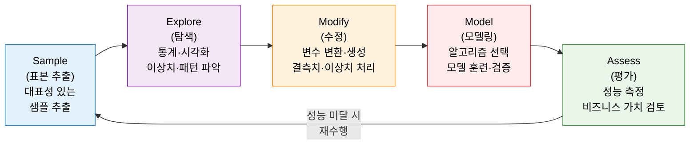
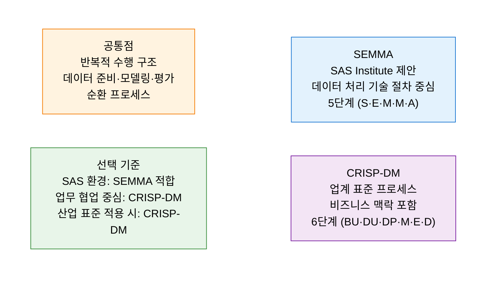

# SEMMA
**Sample · Explore · Modify · Model · Assess**

## 1. 대용량 데이터에서 표본 추출부터 모델 평가까지, SAS 데이터 마이닝 표준 절차 SEMMA의 개요

**개념**: SAS Institute가 제안한 데이터 마이닝 표준 프로세스로, 대용량 데이터에서 **Sample(표본 추출), Explore(탐색), Modify(수정), Model(모델링), Assess(평가)** 의 5단계를 순환 수행하여 예측 모델을 개발·검증하는 방법론.

**특징**:
- 데이터 처리 중심의 **기술적 절차**에 초점 — 비즈니스 이해 단계는 별도 선행 과정으로 분리.
- 각 단계가 독립적으로 반복 가능하여 **대용량 데이터 환경**에서의 분석 효율 극대화.
- SAS Enterprise Miner 도구와 긴밀하게 연동되어 실무 분석 환경에서 널리 적용.

---

## 2. SEMMA의 핵심 구성 체계

### 가. 5단계 분석 절차

| 단계 | 핵심 목적 | 주요 활동 | 주요 기법·도구 |
|---|---|---|---|
| **S — Sample** | 분석 효율을 위한 대표성 있는 표본 추출 | 층화 추출, 무작위 추출, 과표본·저표본 처리 | 랜덤 샘플링, SMOTE, Stratified Sampling |
| **E — Explore** | 데이터 분포·패턴·이상치 파악 | EDA(탐색적 데이터 분석), 상관관계 분석, 시각화 | 히스토그램, 산점도, 상관 행렬 |
| **M — Modify** | 분석에 최적화된 형태로 데이터 변환 | 결측치 대체, 이상치 처리, 피처 엔지니어링, 정규화 | 표준화, 원-핫 인코딩, 파생 변수 생성 |
| **M — Model** | 예측 목적에 맞는 모델 훈련 및 최적화 | 알고리즘 선택, 교차 검증, 하이퍼파라미터 튜닝 | 회귀, 의사결정 트리, SVM, 앙상블 |
| **A — Assess** | 모델 성능 및 비즈니스 가치 최종 평가 | 정확도·AUC·F1 측정, 비즈니스 영향 분석 | ROC Curve, Lift Chart, 이익 행렬 |

---

### 나. CRISP-DM과의 비교 및 적용 방안

| 비교 항목 | SEMMA | CRISP-DM |
|---|---|---|
| **제안 주체** | SAS Institute | SPSS·Daimler·NCR 등 업계 컨소시엄 |
| **단계 수** | 5단계 (S·E·M·M·A) | 6단계 (BU·DU·DP·M·E·D) |
| **비즈니스 이해** | 별도 선행 과정 (포함 안 됨) | 1단계로 명시적 포함 |
| **배포 단계** | 포함 안 됨 | Deployment(배포)로 명시 |
| **도구 연동** | SAS Enterprise Miner 최적화 | 도구 독립적 |
| **적합 환경** | SAS 기반 분석 환경, 기술 중심 프로젝트 | 업무-데이터팀 협업, 전사 분석 표준화 |

---

## 3. SEMMA 방법론 적용의 기대효과 및 활용 방안

| 구분 | 주요 기대효과 | 활용 및 실무 적용 방안 |
|---|---|---|
| **분석 체계화** | 데이터 마이닝 프로젝트의 단계별 표준화 | 금융·통신·유통 분야 고객 이탈 예측, 신용 평가 모델 개발 |
| **품질 확보** | Explore·Modify 단계의 철저한 데이터 준비로 모델 신뢰도 향상 | 샘플링 전략 최적화를 통한 클래스 불균형 문제 해소 |
| **반복 개선** | 평가 결과 기반의 순환 수행으로 모델 성능 점진적 향상 | 성능 미달 모델의 원인 단계 소급 분석 및 재수행 |
| **SAS 생태계 활용** | SAS Enterprise Miner와의 완벽한 프로세스 연동 | SAS 기반 조직에서 자동화된 분석 파이프라인 구축 |
