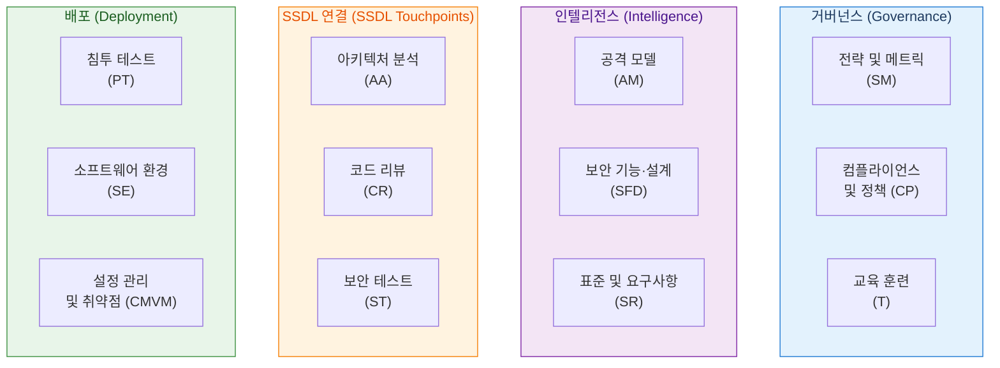
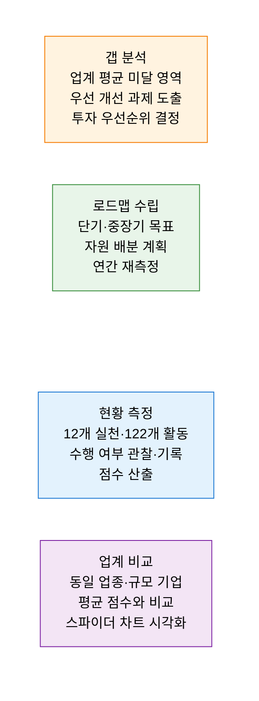

# BSIMM
**Building Security In Maturity Model — SW 보안 성숙도 측정 모델**

## 1. 실제 기업 보안 활동을 측정·비교하는 데이터 기반 보안 성숙도 모델, BSIMM의 개요

**정의**: Synopsys(구 Cigital)가 금융·핀테크·헬스케어·기술 기업 등 수백 개 조직의 **실제 SW 보안 활동을 관찰·측정** 하여 구축한 데이터 기반 성숙도 모델로, 조직의 SW 보안 프로그램을 **4대 영역·12개 실천·122개 활동** 으로 분류하고 업계 평균과 비교하여 현재 수준과 개선 방향을 제시하는 서술적(Descriptive) 프레임워크.

**특징**:  
 **(관찰 기반(Observational))** 이상적 목표가 아닌 업계에서 실제 수행 중인 활동을 측정·비교.  
 **(서술적 벤치마킹)** OWASP SAMM이 규범적(Prescriptive) 로드맵을 제시한다면 BSIMM은 서술적(Descriptive) 벤치마킹에 특화.  
 **(최신 트렌드 반영)** 매년 또는 격년으로 참여 기업 데이터 업데이트 — 최신 업계 트렌드가 자동 반영.  

---

## 2. BSIMM의 핵심 구성 체계

### 가. 4대 영역 및 12개 보안 실천

| 영역 | 실천 코드 | 실천명 | 핵심 목적 |
|---|---|---|---|
| **거버넌스** | SM | 전략 및 메트릭 | SSG(소프트웨어 보안 그룹) 운영·보안 메트릭 수립 |
| | CP | 컴플라이언스 및 정책 | 보안 정책·컴플라이언스 요건 관리 |
| | T | 교육 훈련 | 개발자·보안 팀 역량 강화 교육 |
| **인텔리전스** | AM | 공격 모델 | 위협 인텔리전스·공격 패턴 분석 |
| | SFD | 보안 기능·설계 | 재사용 가능한 보안 컴포넌트·패턴 제공 |
| | SR | 표준 및 요구사항 | 보안 표준·코딩 가이드라인 수립 |
| **SSDL 연결** | AA | 아키텍처 분석 | 설계 단계 아키텍처 보안 리뷰·위협 모델링 |
| | CR | 코드 리뷰 | 보안 코드 리뷰·정적 분석 도구 활용 |
| | ST | 보안 테스트 | 위험 기반 보안 테스트·DAST·퍼징 |
| **배포** | PT | 침투 테스트 | 모의 해킹·레드팀 운영 |
| | SE | 소프트웨어 환경 | 운영 환경 보안 설정·OS 강화 |
| | CMVM | 설정 관리·취약점 | 취약점 관리·패치 프로세스 운영 |

---

### 나. 실측 데이터 기반 벤치마킹

**BSIMM vs OWASP SAMM 비교**

| 비교 항목 | BSIMM | OWASP SAMM |
|---|---|---|
| **접근 방식** | 서술적 — 실제 수행 활동 관찰·측정 | 규범적 — 이상적 목표·로드맵 제시 |
| **데이터 기반** | 수백 개 기업 실측 데이터 기반 | 업계 모범 사례 기반 |
| **벤치마킹** | 업계 평균과 직접 비교 가능 | 절대적 성숙도 수준 측정 |
| **활동 수** | 122개 관찰 가능 활동 | 90개 보안 활동 |
| **라이선스** | 유료 (Synopsys 제공) | 오픈 소스 (무료) |
| **상호 보완** | BSIMM으로 현황 진단 → SAMM으로 개선 로드맵 수립 ||

---

## 3. BSIMM 도입의 기대효과 및 활용 방안

| 구분 | 주요 기대효과 | 활용 및 실무 적용 방안 |
|---|---|---|
| **객관적 진단** | 업계 평균 대비 SW 보안 수준 객관적 파악 | 연간 BSIMM 평가로 보안 성숙도 추이 및 업계 위치 파악 |
| **투자 근거** | 데이터 기반 보안 투자 우선순위 경영진 설득 | "경쟁사 대비 CR(코드 리뷰) 점수 낮음" 근거로 SAST 예산 확보 |
| **SSG 운영** | 소프트웨어 보안 그룹(SSG) 활동의 체계화 | BSIMM SM 실천 기반으로 SSG 역할·KPI·보고 체계 수립 |
| **DevSecOps 연계** | SSDL 연결 영역(AA·CR·ST)을 CI/CD 자동화와 통합 | 코드 리뷰·보안 테스트 활동을 파이프라인 게이트로 내재화 |
