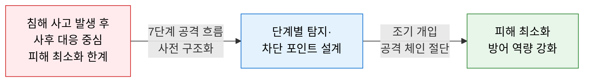
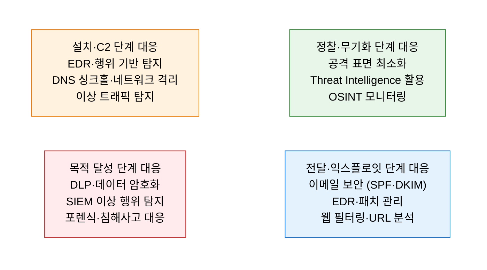

# Cyber Kill Chain
**Lockheed Martin 사이버 킬체인 — 공격 단계별 탐지·차단 프레임워크**

## 1. 사이버 공격의 7단계 흐름을 구조화하여 각 단계에서 조기 탐지·차단하는 방어 전략 프레임워크, Cyber Kill Chain의 개요

**개념**: Lockheed Martin이 군사적 킬체인 개념을 사이버 보안에 적용한 프레임워크로, APT(지능형 지속 위협) 공격자가 목표를 달성하기까지 거치는 **7단계 공격 절차**를 정의하고, 각 단계에서 공격을 탐지·차단하여 공격 체인을 조기에 절단하는 방어 전략 모델.

**특징**:
- **체인(Chain) 개념**: 공격자는 모든 단계를 순서대로 완료해야 목표 달성 — 어느 단계에서든 차단 시 공격 실패.
- 방어자 관점의 **능동적 사이버 방어(Active Cyber Defense)** 전략 수립의 기반.
- MITRE ATT&CK 프레임워크와 상호 보완적으로 활용 — ATT&CK는 더 세분화된 전술·기법 제공.

---

## 2. Cyber Kill Chain의 핵심 구성 체계

### 가. 7단계 공격 체인 구조

```mermaid
flowchart LR
    C1["1. 정찰<br/>Reconnaissance<br/>표적 정보 수집<br/>OSINT·네트워크 스캔"]
    C2["2. 무기화<br/>Weaponization<br/>익스플로잇 탑재<br/>악성 페이로드 제작"]
    C3["3. 전달<br/>Delivery<br/>공격 수단 전달<br/>피싱·USB·웹"]
    C4["4. 익스플로잇<br/>Exploitation<br/>취약점 실행<br/>코드 실행 시작"]
    C5["5. 설치<br/>Installation<br/>백도어·RAT 설치<br/>지속성 확보"]
    C6["6. C2 통신<br/>Command & Control<br/>원격 제어 채널<br/>공격자 명령 수신"]
    C7["7. 목적 달성<br/>Actions on Objectives<br/>데이터 유출·파괴<br/>랜섬웨어·이동"]

    C1 --> C2 --> C3 --> C4 --> C5 --> C6 --> C7

    style C1 fill:#E8F5E9,stroke:#388E3C,color:#000
    style C2 fill:#E3F2FD,stroke:#1976D2,color:#000
    style C3 fill:#FFF3E0,stroke:#F57C00,color:#000
    style C4 fill:#F3E5F5,stroke:#7B1FA2,color:#000
    style C5 fill:#FFEBEE,stroke:#D32F2F,color:#000
    style C6 fill:#B71C1C,stroke:#B71C1C,color:#fff
    style C7 fill:#1E3A5F,stroke:#1E3A5F,color:#fff
```

| 단계 | 공격자 활동 | 사용 도구·기법 |
|---|---|---|
| **1. 정찰** | 표적 조직·시스템·인원 정보 수집 | LinkedIn·Shodan·WHOIS·소셜 엔지니어링 |
| **2. 무기화** | 수집 정보 기반 익스플로잇 탑재 악성 페이로드 제작 | 메타스플로잇·Cobalt Strike·커스텀 악성코드 |
| **3. 전달** | 표적에게 무기화된 파일·링크 전달 | 스피어 피싱·악성 첨부파일·드라이브바이 다운로드 |
| **4. 익스플로잇** | 취약점 트리거로 악성 코드 실행 시작 | 제로데이 취약점·매크로·PDF 익스플로잇 |
| **5. 설치** | 백도어·RAT·웹쉘 설치로 지속성 확보 | 레지스트리 변경·스케줄 작업·DLL 하이재킹 |
| **6. C2 통신** | 원격 제어 채널 수립으로 공격자 명령 수신 | HTTP·DNS 터널링·암호화 C2 서버 |
| **7. 목적 달성** | 데이터 유출·시스템 파괴·내부 이동 | 랜섬웨어·데이터 압축·APT 측면 이동 |

---

### 나. 단계별 탐지 및 대응 전략

**단계별 방어 조치 (Courses of Action Matrix)**

| 단계 | 탐지 방법 | 차단·완화 조치 |
|---|---|---|
| **1. 정찰** | Threat Intelligence·다크웹 모니터링 | 공격 표면 최소화·민감 정보 공개 제한 |
| **2. 무기화** | 악성코드 샘플 수집·분석 (YARA 룰) | 위협 인텔리전스 공유·패치 우선순위 관리 |
| **3. 전달** | 이메일 게이트웨이·URL 평판 검사 | SPF·DKIM·DMARC·악성 첨부파일 샌드박스 |
| **4. 익스플로잇** | EDR·HIDS 이상 프로세스 탐지 | 취약점 패치·마이크로세그멘테이션·제로 트러스트 |
| **5. 설치** | 레지스트리·파일 시스템 변경 탐지 | Application Whitelisting·EDR 차단 |
| **6. C2 통신** | DNS·HTTP 이상 트래픽·비콘 패턴 탐지 | DNS 싱크홀·아웃바운드 필터링·네트워크 격리 |
| **7. 목적 달성** | DLP·UEBA 이상 행위 탐지 | 데이터 분류·암호화·백업·IR 플레이북 실행 |

---

## 3. Cyber Kill Chain 적용의 기대효과 및 활용 방안

| 구분 | 주요 기대효과 | 활용 및 실무 적용 방안 |
|---|---|---|
| **사전 방어** | 공격 초기 단계 탐지·차단으로 피해 최소화 | 정찰 단계 위협 인텔리전스 수집·분석 체계 구축 |
| **방어 우선순위** | 단계별 방어 투자 우선순위 명확화 | SIEM 탐지 룰을 Kill Chain 단계별로 매핑·운영 |
| **APT 대응** | 지능형 지속 위협(APT) 공격 패턴 이해·대응 | Red Team 모의 침투 시 Kill Chain 전 단계 시나리오 적용 |
| **MITRE 연계** | ATT&CK 전술·기법과 결합한 세밀한 위협 분석 | Kill Chain 단계→ATT&CK 전술 매핑으로 탐지 커버리지 측정 |
