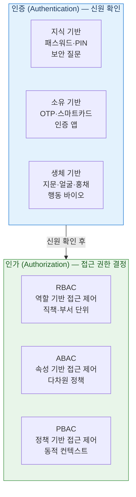
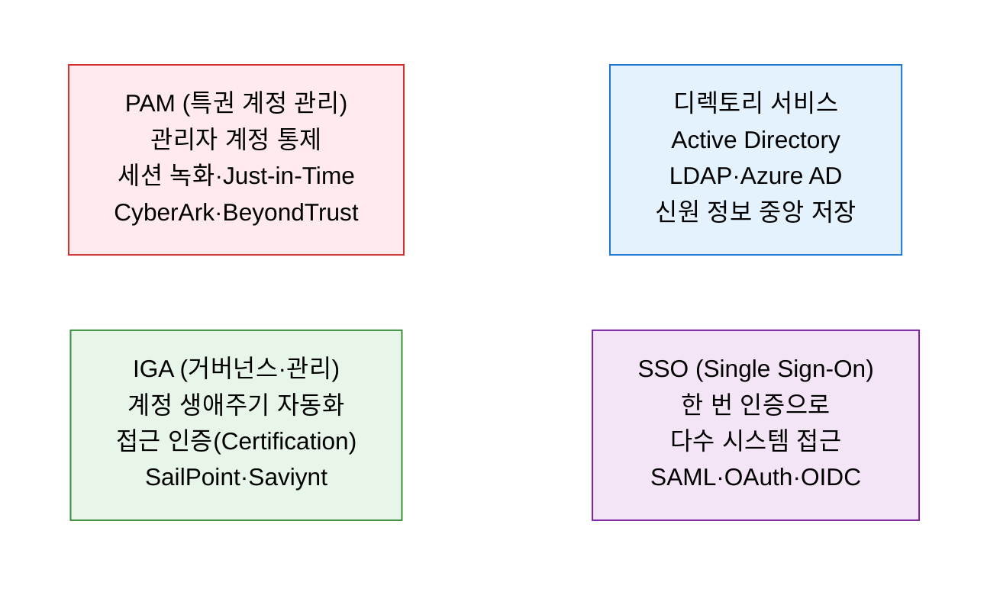

# IAM
**Identity and Access Management — 신원 및 접근 관리**

## 1. 적절한 사용자가 적절한 자원에 적절한 수준으로 접근하도록 보장하는 신원·접근 관리 체계, IAM의 개요

**개념**: 조직의 디지털 신원(Identity)을 관리하고, 사용자·시스템·애플리케이션이 자원에 접근하는 것을 **인증(Authentication)·인가(Authorization)·감사(Auditing)** 의 3A 원칙으로 통제하는 보안 프레임워크로, "올바른 사람이 올바른 자원에 올바른 이유로 접근"하도록 보장하는 체계.

**특징**:
- **최소 권한 원칙(PoLP)**: 업무 수행에 필요한 최소한의 권한만 부여하여 내부자 위협·권한 오남용 방지.
- **단일 신원(Single Identity)**: SSO·디렉토리 통합으로 사용자별 하나의 신원으로 다양한 시스템 접근.
- 제로 트러스트 아키텍처의 **핵심 구성 요소** — "신원이 새로운 경계(Identity is the New Perimeter)".

---

## 2. IAM의 핵심 구성 체계

### 가. 인증(Authentication)과 인가(Authorization) 체계

**인증 강화 — MFA(다중 인증)**

| 인증 요소 | 방식 | 예시 |
|---|---|---|
| **지식 요소** | 알고 있는 것 | 패스워드, PIN, 보안 질문 |
| **소유 요소** | 가지고 있는 것 | OTP 토큰, 스마트카드, 인증 앱(TOTP) |
| **생체 요소** | 본인인 것 | 지문, 안면 인식, 홍채, 정맥 패턴 |
| **위치 요소** | 있는 곳 | IP 범위, GPS 위치, 네트워크 영역 |

**접근 제어 모델 비교**

| 모델 | 특징 | 적합 환경 |
|---|---|---|
| **RBAC** | 역할(Role)에 권한 부여·사용자를 역할에 할당 | 조직 계층이 명확한 엔터프라이즈 |
| **ABAC** | 사용자·자원·환경의 속성(Attribute)으로 정책 결정 | 복잡한 접근 정책·클라우드 환경 |
| **PBAC** | 중앙화된 정책 엔진이 실시간 컨텍스트 기반 결정 | 제로 트러스트·동적 접근 제어 |
| **DAC** | 자원 소유자가 직접 접근 권한 설정 | 소규모·파일 시스템 공유 |
| **MAC** | 보안 등급(레이블) 기반 강제 접근 제어 | 국방·정부·고보안 환경 |

---

### 나. IAM 구현 모델 및 주요 기술

**IAM 핵심 프로토콜 및 표준**

| 프로토콜·표준 | 목적 | 주요 활용 |
|---|---|---|
| **SAML 2.0** | 엔터프라이즈 SSO — XML 기반 인증 어설션 교환 | 기업 내 애플리케이션 SSO, IdP-SP 연동 |
| **OAuth 2.0** | 위임 인가 — 제3자 앱에 자원 접근 권한 위임 | 소셜 로그인, API 접근 토큰 발급 |
| **OpenID Connect** | OAuth 2.0 기반 신원 레이어 — ID 토큰 제공 | 모바일·웹 앱 인증, JWT 기반 신원 확인 |
| **FIDO2·Passkey** | 패스워드리스 인증 — 공개키 기반 생체 인증 | 패스워드 없는 안전한 로그인 |
| **SCIM** | 사용자 계정 프로비저닝 자동화 표준 | IdP와 SaaS 앱 간 계정 동기화 |

---

## 3. IAM 도입의 기대효과 및 활용 방안

| 구분 | 주요 기대효과 | 활용 및 실무 적용 방안 |
|---|---|---|
| **보안 강화** | 계정 탈취·내부자 위협·권한 오남용 리스크 감소 | MFA 전사 적용 및 특권 계정 PAM으로 집중 통제 |
| **운영 효율** | 계정 프로비저닝·해지 자동화로 IT 운영 부담 절감 | HR 시스템 연동으로 입·퇴사자 계정 자동 관리 |
| **제로 트러스트** | 신원 기반 접근 제어로 경계 보안 한계 극복 | ZTNA 구현 시 IAM을 Policy Enforcement Point로 활용 |
| **컴플라이언스** | 접근 이력 감사·정기 접근 인증으로 규제 요건 충족 | ISMS-P·SOX·개인정보 보호법 접근 권한 관리 요건 대응 |
