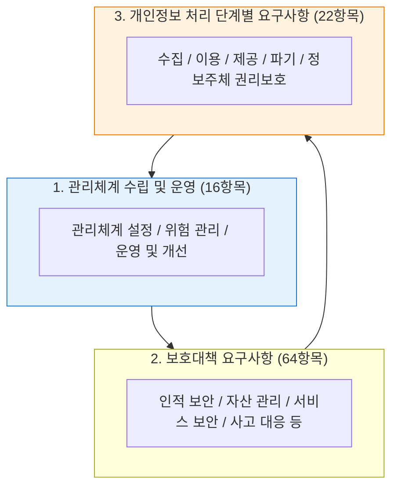
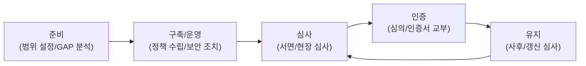

# ISMS-P
**Information Security & Personal Information Management System**

## 1. 한국형 정보보호 및 개인정보 보호 통합 인증, ISMS-P의 개요

**정의**: 정보보호 관리체계(ISMS)와 개인정보 보호 관리체계(PIMS)를 통합하여, 조직이 중요 정보자산을 안전하게 보호하고 개인정보 흐름을 체계적으로 관리하는지 인증하는 제도.

**특징**: **KISA(한국인터넷진흥원)** 주관, 법정 의무 인증 대상 존재, 관리체계 수립/운영부터 개인정보 처리 단계별 보안까지 총 102개 인증 항목 구성.

---

## 2. ISMS-P의 인증 기준 및 거버넌스 체계

### 가. 3개 영역 통합 관리 모델

| 영역 | 주요 내용 | 인증 항목 수 |
|---|---|---|
| **관리체계 수립/운영** | 정책 수립, 조직 구성, 범위 설정, 위험 관리 | 16개 |
| **보호대책 요구사항** | 물리적/기술적 보안, 접근 통제, 암호화, 운영 보안 | 64개 |
| **개인정보 처리 단계** | 수집, 보유, 이용, 제공, 파기 시 보안 조치 | 22개 |

---

### 나. ISMS-P 인증 절차 및 생애주기

| 단계 | 활동 내용 | 비고 |
|---|---|---|
| **위험 평가** | 자산 식별 및 위협/취약점 분석을 통한 위험 수용 수준 결정 | 핵심 단계 |
| **결함 조치** | 심사 시 발견된 부적합 사항에 대한 보완 조치 수행 | 보완 기간 준수 |
| **사후 심사** | 인증 유지 기간(3년) 중 매년 정기적 점검 수행 | 유지 관리 |

---

## 3. ISMS-P 도입의 기대효과 및 활용 방안

| 구분 | 주요 기대효과 | 활용 및 실무 적용 방안 |
|---|---|---|
| **법적 준거성** | 관련 법령(망법, 개법) 준수 입증 | 법정 의무 인증 대상 기업의 과태료 리스크 해소 |
| **보안 수준 제고** | 체계적인 정보보호 관리 프로세스 정착 | 상시적 위험 관리 체계 구축을 통한 보안 사고 예방 |
| **대외 신뢰도** | 기업 이미지 및 고객 신뢰 향상 | 공공기관 및 대기업 협력사 등록 시 보안 증빙으로 활용 |
| **보험료 할인** | 사이버 보험 등 부가 혜택 | 정보보호 공시 및 보험료 감면 혜택 연계 가능 |
