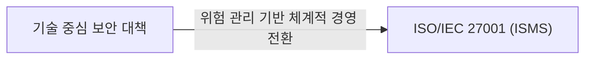
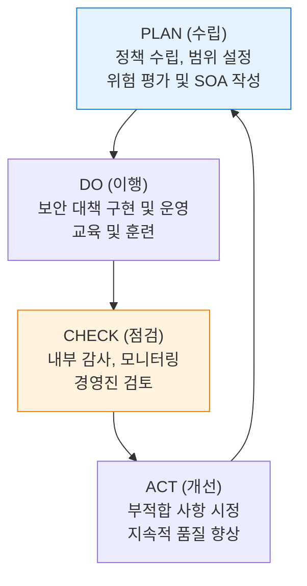
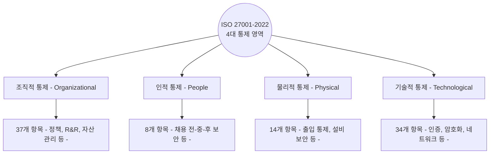

# ISO/IEC 27001
**Information Security Management System (ISMS)**

## 1. 정보보호 관리체계의 국제 표준, ISO/IEC 27001의 개요

**정의**: 조직이 정보자산의 기밀성, 무결성, 가용성을 보호하기 위해 수립·운영하는 정보보호 관리체계(ISMS)에 대한 국제 표준 요구사항.

**특징**: **PDCA(Plan-Do-Check-Act)** 모델 기반의 지속적 개선, 위험 관리 중심의 접근법, Annex A를 통한 상세 통제 항목(Controls) 제시.

---

## 2. ISO/IEC 27001:2022 구성 및 통제 항목

### 가. PDCA 기반의 관리체계 운영 모델

| 단계 | 핵심 활동 | 주요 산출물 |
|---|---|---|
| **Plan** | 정보보호 정책 정의, 위험 식별 및 평가 | 위험관리계획서, 적용선언서(SoA) |
| **Do** | 위험 처리 계획 이행, 보안 통제 적용 | 보안 로그, 교육 이수 기록 |
| **Check** | 효과성 측정, 내부 감사 수행 | 감사 보고서, 성과 지표 |
| **Act** | 발견된 문제점 시정 및 예방 조치 | 개선 조치 보고서 |

---

### 나. Annex A 통제 항목 (2022 개정 버전)

| 변경 핵심 (v2022) | 상세 내용 | 비고 |
|---|---|---|
| **항목 통합/재구성** | 기존 114개 항목에서 93개 항목으로 통합 | 가독성 및 효율성 제고 |
| **신규 항목 도입** | 클라우드 보안, 위협 인텔리전스, 데이터 유출 방지 등 | 최신 IT 환경 반영 |
| **속성(Attribute)** | 각 통제 항목에 해시태그 형태의 속성 부여 | NIST CSF 등 타 표준과 연계 용이 |

---

## 3. ISO/IEC 27001 인증의 기대효과 및 활용 방안

| 구분 | 주요 기대효과 | 활용 및 실무 적용 방안 |
|---|---|---|
| **글로벌 비즈니스** | 대외 신인도 및 경쟁력 확보 | 글로벌 파트너십 체결 및 해외 사업 수주 시 필수 요건 대응 |
| **체계적 리스크 관리** | 정보 유출 및 보안 사고 예방 | 자산 중심의 위험 평가를 통한 효율적 보안 투자 집행 |
| **컴플라이언스** | 국내외 법적 요구사항 충족 | GDPR, ISMS-P 등 타 보안 규제 준수를 위한 기반으로 활용 |
| **지속적 개선** | 보안 성숙도 상향 평준화 | 내부 감사 및 경영진 검토를 통한 실질적 보안 문화 정착 |
