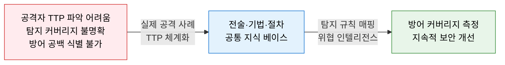
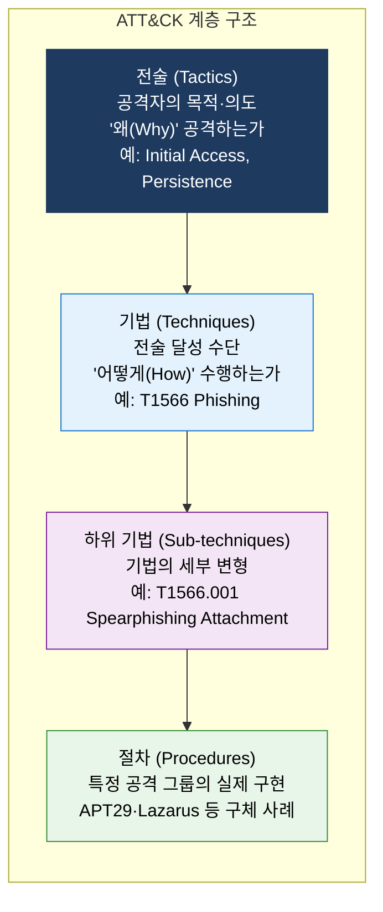
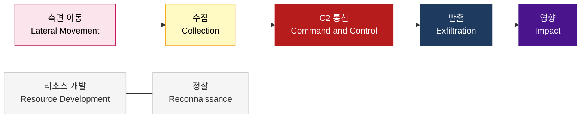
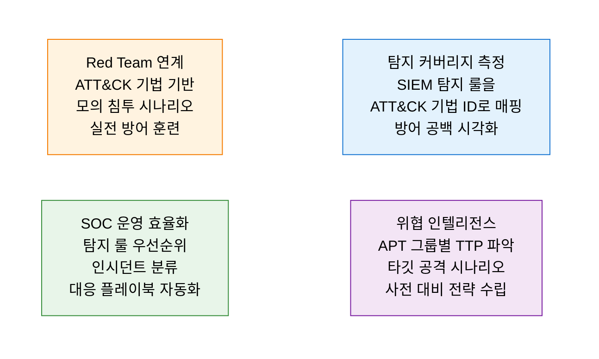

# MITRE ATT&CK
**Adversarial Tactics, Techniques & Common Knowledge**

## 1. 실제 공격자의 전술·기법·절차를 체계적으로 분류하여 방어 역량을 측정하고 개선하는 지식 프레임워크, MITRE ATT&CK의 개요

**개념**: MITRE Corporation이 실제 사이버 공격 사례를 기반으로 공격자의 **전술(Tactics)·기법(Techniques)·절차(Procedures)** 를 체계적으로 분류한 공개 지식 베이스로, 방어자가 공격자 행동을 이해하고 탐지 규칙 매핑·방어 공백 식별·위협 인텔리전스 활용에 활용하는 글로벌 사이버 보안 표준 프레임워크.

**특징**:
- **실증 기반**: 실제 APT 그룹의 공격 사례에서 추출한 130여 개 전술·기법 수록(Enterprise 기준).
- **매트릭스 구조**: 14개 전술(열) × 다수 기법(행)으로 구성된 공격 매트릭스 시각화.
- Cyber Kill Chain보다 **세분화된 전술·기법 수준**의 분석 — 실무 탐지 규칙 작성에 직접 활용.

---

## 2. MITRE ATT&CK의 핵심 구성 체계

### 가. TTP 체계 — 전술(Tactics), 기법(Techniques), 절차(Procedures)

**ATT&CK Enterprise 14대 전술 (Tactics)**

```mermaid
flowchart LR
    T1["초기 접근<br/>Initial Access"]
    T2["실행<br/>Execution"]
    T3["지속성<br/>Persistence"]
    T4["권한 상승<br/>Privilege Escalation"]
    T5["방어 회피<br/>Defense Evasion"]
    T6["자격증명 접근<br/>Credential Access"]
    T7["탐색<br/>Discovery"]

    T1 --> T2 --> T3 --> T4 --> T5 --> T6 --> T7

    style T1 fill:#E8F5E9,stroke:#388E3C,color:#000
    style T2 fill:#E3F2FD,stroke:#1976D2,color:#000
    style T3 fill:#FFF3E0,stroke:#F57C00,color:#000
    style T4 fill:#F3E5F5,stroke:#7B1FA2,color:#000
    style T5 fill:#FFEBEE,stroke:#D32F2F,color:#000
    style T6 fill:#E0F2F1,stroke:#00796B,color:#000
    style T7 fill:#E8EAF6,stroke:#3949AB,color:#000
```

---

### 나. 탐지 규칙 매핑 및 위협 인텔리전스 활용

**주요 활용 도구 및 방법론**

| 활용 영역 | 도구·방법 | 설명 |
|---|---|---|
| **탐지 매핑** | ATT&CK Navigator | 보유 탐지 규칙을 매트릭스에 색상으로 표시하여 커버리지 시각화 |
| **위협 인텔** | MITRE ATT&CK Groups | APT29·Lazarus·Kimsuky 등 200여 개 공격 그룹별 TTP 제공 |
| **SIEM 연계** | Sigma 룰·Elastic SIEM | ATT&CK 기법 ID 태그를 탐지 룰에 부착하여 탐지 커버리지 관리 |
| **Red Team** | Atomic Red Team·Caldera | ATT&CK 기법별 자동화 공격 시뮬레이션으로 탐지 갭 검증 |
| **위협 헌팅** | Hunting Playbook | ATT&CK 전술별 헌팅 가설 수립 및 IOA 기반 사전 탐지 |

**Cyber Kill Chain vs MITRE ATT&CK 비교**

| 비교 항목 | Cyber Kill Chain | MITRE ATT&CK |
|---|---|---|
| **구조** | 7단계 선형 공격 흐름 | 14개 전술 × 다수 기법 매트릭스 |
| **세분화 수준** | 공격 단계 수준 (거시적) | 전술·기법·하위 기법 수준 (세밀) |
| **활용 초점** | 공격 단계별 방어 전략 수립 | 탐지 규칙 작성·위협 인텔리전스·SOC |
| **갱신 주기** | 정적 (7단계 고정) | 지속 갱신 (실제 공격 사례 반영) |
| **상호 보완** | Kill Chain 단계 → ATT&CK 전술 매핑으로 통합 활용 가능 ||

---

## 3. MITRE ATT&CK 적용의 기대효과 및 활용 방안

| 구분 | 주요 기대효과 | 활용 및 실무 적용 방안 |
|---|---|---|
| **방어 공백 식별** | 탐지 커버리지 시각화로 취약 전술·기법 구역 파악 | ATT&CK Navigator로 현재 SIEM 탐지 룰 매핑 후 미탐지 기법 우선 강화 |
| **위협 인텔리전스** | 공격 그룹별 TTP 파악으로 표적 공격 사전 대비 | Kimsuky·Lazarus 등 한국 타깃 APT 그룹 TTP 분석 후 방어 우선순위 설정 |
| **SOC 효율화** | 공통 언어로 인시던트 분류·대응 표준화 | 탐지 알람에 ATT&CK 기법 ID 자동 태깅으로 분류·에스컬레이션 체계화 |
| **규제 대응** | ISMS-P·NIST CSF 위험 관리와 ATT&CK 연계 | 연간 보안 평가 시 ATT&CK 커버리지 지표를 보안 성숙도 측정에 활용 |
